# 樹莓派 400 打印文檔

Ubuntu 打印文檔

[toc]

 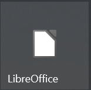

## 文本文檔 （Word.doc.docx） 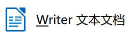

1. 打開文檔

 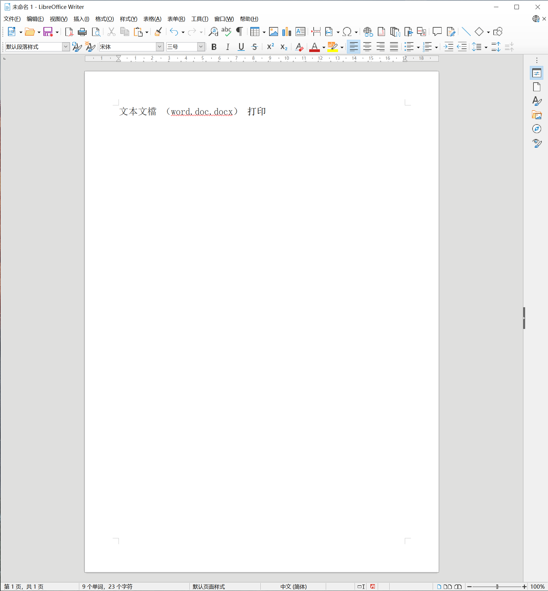

2. ①點擊“菜單欄”->“打印機圖標”，如下圖

 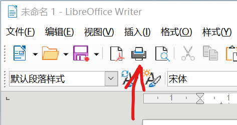

②“文件”->“打印”

 

3. 彈出打印對話窗口，如下圖

 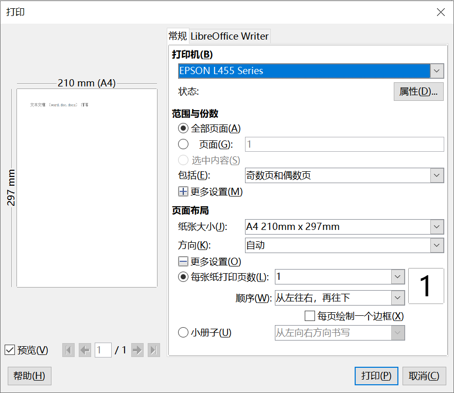

4. 選擇對應打印機，紙張大小，點擊“打印”按鈕，完成打印。

## 電子表格（Execl.xls.xlsx） 

1. 打開文檔

 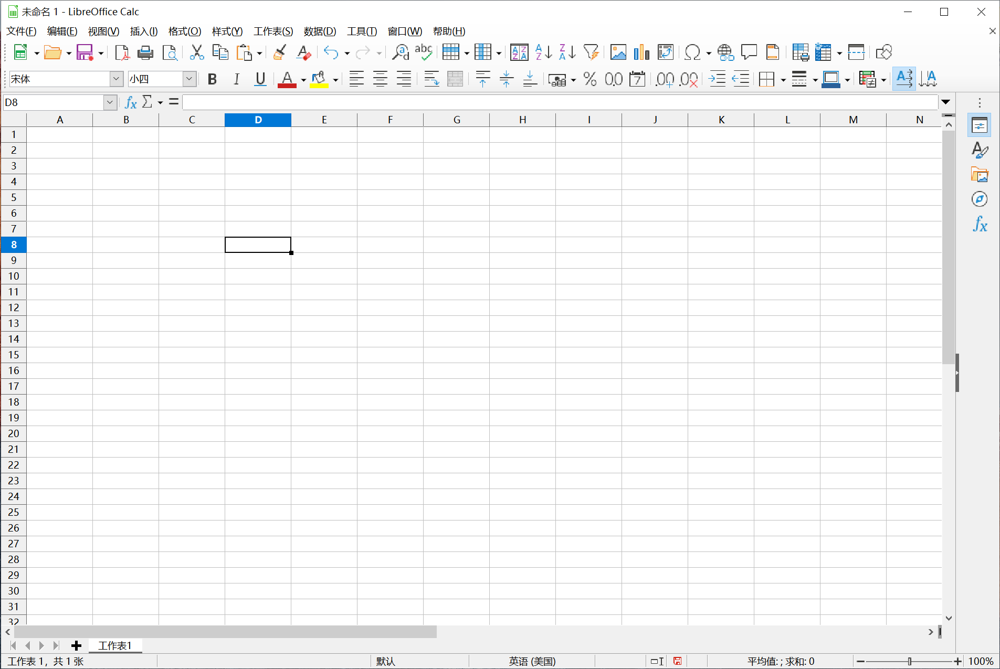

2. ①點擊“菜單欄”->“打印機圖標”，如下圖

 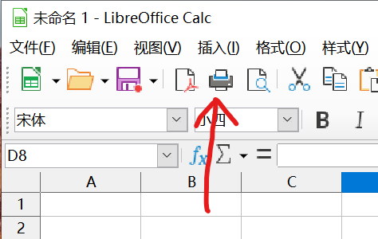

②“文件”->“打印”

 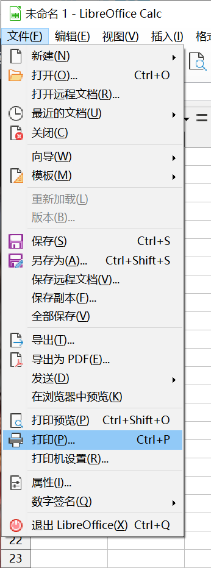

3. 彈出打印對話窗口，如下圖

 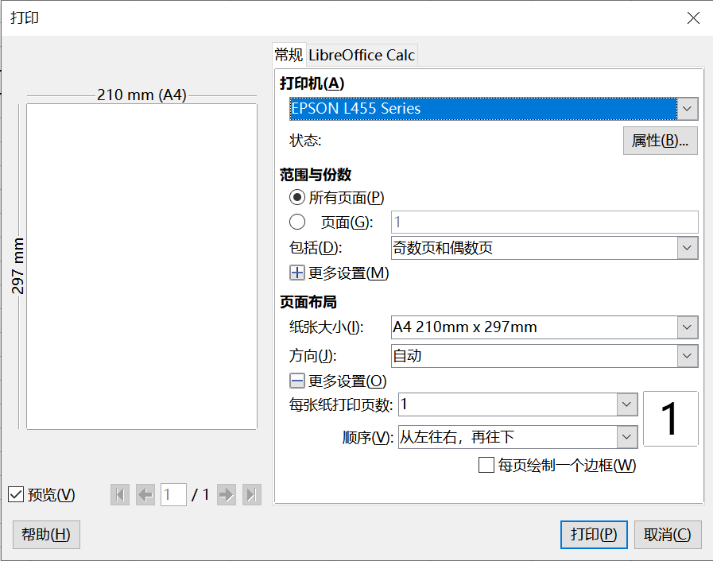

4. 選擇對應打印機，紙張大小，點擊“打印”按鈕，完成打印。

## 演示文稿（PPT.ppt.pptx） 

1. 打開文檔

 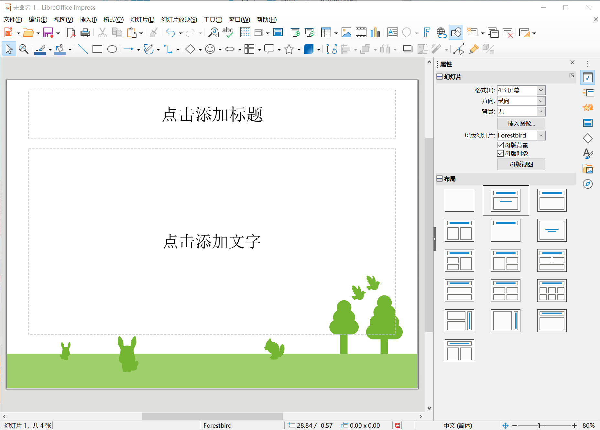

2. ①點擊“菜單欄”->“打印機圖標”，如下圖

 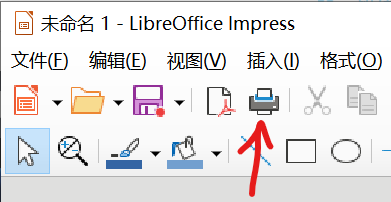

②“文件”->“打印”

 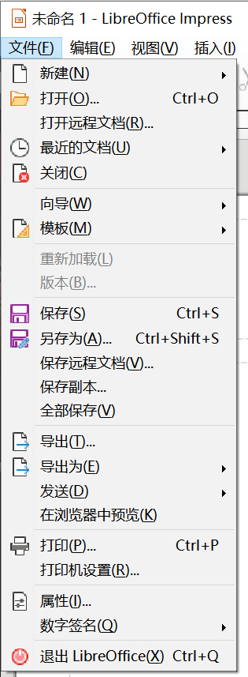

3. 彈出打印對話窗口，如下圖

 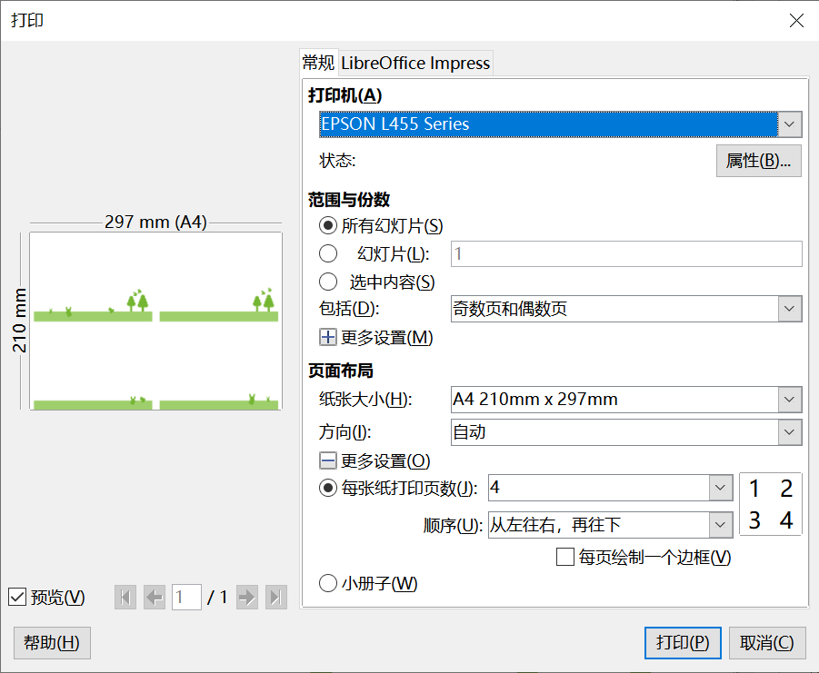

4. 選擇對應打印機，紙張大小，頁數，點擊“打印”按鈕，完成打印。

## Pdf文檔（PDF.pdf）

1. 打開文檔

 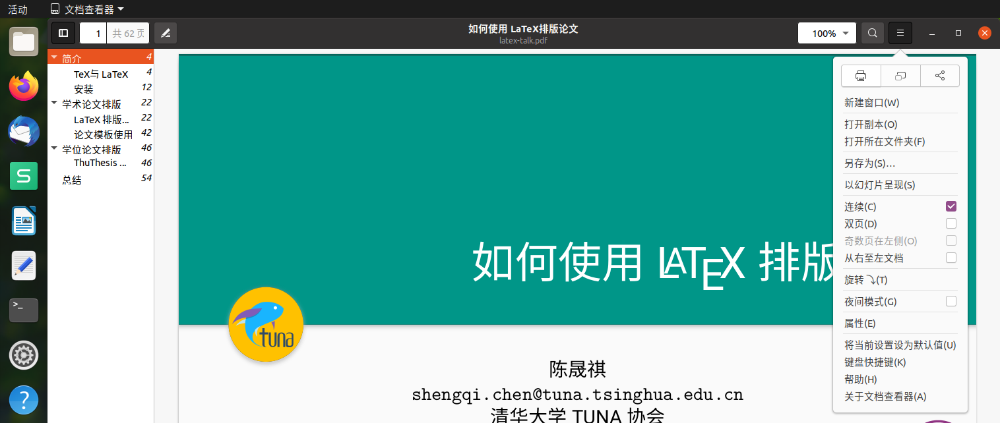

2. ①點擊“菜單欄”->“文件選項”->“打印機圖標”，如上圖

   ②“打印”快捷鍵“Ctrl+P”

3. 彈出打印對話窗口，如下圖

   

4. 選擇對應打印機，紙張大小，頁數，點擊“打印”按鈕，完成打印。

## 圖片

1. 打開圖片

 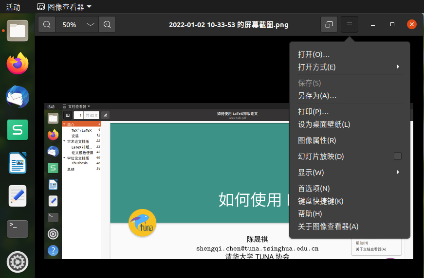

2. ①點擊“菜單欄”->“文件選項”->“打印”，如上圖

   ②“打印”快捷鍵“Ctrl+P”

3. 彈出打印對話窗口，如下圖

   

4. 選擇對應打印機，紙張大小，頁數，點擊“打印”按鈕，完成打印。

