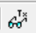
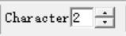
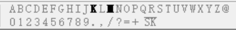
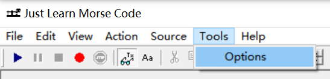
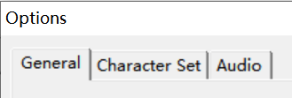
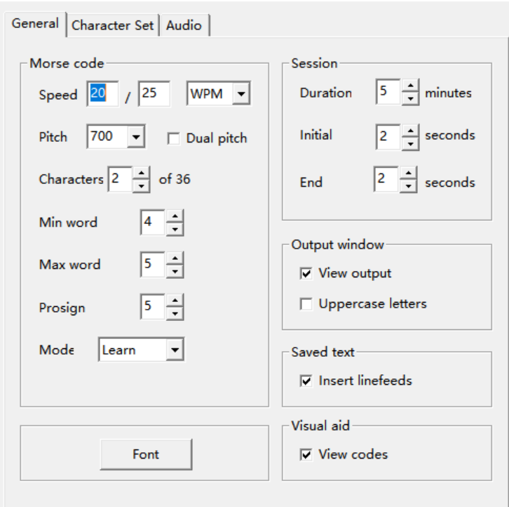
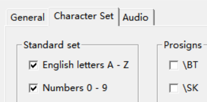
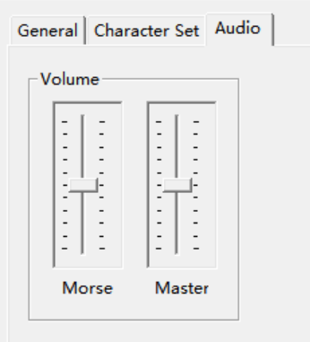
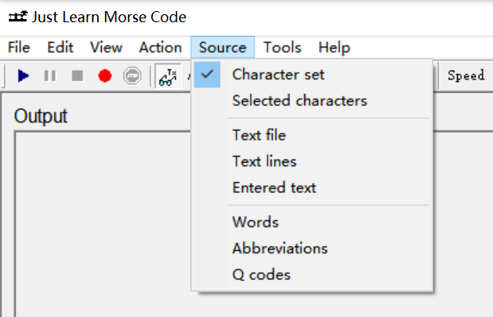

# Just Learn Morse Code

Help-Doc-EN-ZH

[TOC] 

## Introducing Just Learn Morse Code

Just Learn Morse Code is designed to make it easy  to learn Morse code, as well as improve the skills of those who already know the  code. 

The basic methods used to achieve this are [Koch's  method](koch.htm) and [Farnsworth timing](farnsworth.htm). 

**Features**

- Accurate Morse code timing
- Thorough evaluation of code copied
- Customizable character set
- International characters
- Prosigns
- Selectable speed, pitch and volume
- Optional Farnsworth timing
- Creating Morse code audio files
- Generate Morse code from text files
- Practice selected characters
- Practice common words, abbreviations and Q codes
- Optional dual pitch for initial learning
- and more

### Koch's method

Traditionally, Morse code has been taught by struggling  through all the codes at a slow speed and then (slowly) progressing towards  higher speeds. 

Koch's method, on the other hand, dictates that you should start learning  at the desired speed - but you start with only two characters. Each session is  five minutes long, and whenever you get 90% or more correct, you add another  character. 

Just Learn Morse Code utilizes Koch's method for teaching Morse code. 

Koch's method was invented by German psychologist Ludwig Koch in the  1930s. 

For more information about this method, see [David G.  Finley's (N1IRZ) page](http://www.qsl.net/n1irz/finley.morse.html). 

### Farnsworth timing

Traditionally, reducing the speed of Morse code has  been done by making everything take longer, i.e. both the sounds and the silent  periods between them. 

Using Farnsworth timing, characters are sent at the same speed as at  higher speeds, while extra spacing is inserted between characters and words to  slow the transmission down. The advantage of this is that you get used to  recognising characters at a higher speed, and thus it will be easier to increase  the speed later on. 

Using Farnsworth timing is optional in Just Learn Morse Code. 

The [ARRL](http://www.arrl.org) uses Farnsworth  timing for transmissions, practice and test tapes up to 18 WPM (90 CPM). 

Farnsworth timing was invented by Donald R. Farnsworth (W6TTB) in the  late 1950s. 

## Getting started

First of all, read about [Koch's  method](koch.htm) and [Farnsworth timing](farnsworth.htm) if you haven't  already. 

Click the Play  button. 

Adjust the speed  to your desired level. For now, you should do this by changing the first of the  two numbers. If you're uncertain about what speed to use, just use the default  setting of 12/18 WPM. 

If you want  to see the text that is being sent, click the View Output button. Click the same  button again to hide the output. 

Click the Stop  button. 

Now you're ready for [Your first session](1stsession.htm). 

### Your first session

 
Set the  number of characters used to two. 

 
You will  see that two characters are emphasized. Click on either one to listen to what  that character sounds like. Do this a few times for each of the two characters,  so that you get used to them. 

Your first session will last for five minutes, and you are supposed to  enter as many of the characters that are sent as you possibly can. If you make a  mistake, don't worry about it, everybody makes mistakes and it is not necessary  to copy 100% in order to learn Morse code effectively. 

 
Click the Play  button, and get ready to type. 

When your session is over, you may want to read about how to interpret  your [Session results](sessionresults.htm). 

 
You might also  click the Stop button at any time to have your performance evaluated  immediately. 

### Dual pitch

For initial learning, there is an option for using two  different pitches - one for the dits and one for the dahs. If you think this  might be helpful, enable dual pitch in the [General  options](generaloptions.htm) dialog. 

### Visual aid

You can show or hide the Morse codes for each character with  the View Codes setting in the [General options](generaloptions.htm)  dialog. 

## Session results

When you've completed a session, your results will be  presented on screen. There is a short delay between the last character  transmitted and the appearance of the results. This is by design, and is  intended to give you time to enter the last couple of characters transmitted. 

Your overall score is presented, along with the score of each individual  character. [Koch's method](koch.htm) dictates that whenever you score  90% or better, you should add another character. This is somewhat ambiguous, as  it is possible to get an overall score of more than 90% and at the same time get  less than 90% on some of the individual characters. 

When beginning to learn, the recommended way to interpret this is that if  everything (the overall score as well as the individual character scores) is 90%  or above you move on. Also, missing a few spaces is hardly a big deal if you  score above 90% on everything else, so you could settle for a lower score on the  spaces. 

As you add more characters, the individual percentages get less  important. For instance, when dealing with 30 different characters, some  characters might only occur one or two times in a session. If you miss one of  them, the percentage for that character will look rather bad even though you got  everything else 100%. 

So, at some point you should ignore the individual percentages. When the  overall percentage is good (well above 90%), make an intelligent decision based  on the number of hits and misses for the seemingly worst characters. 

## Changing settings

All Just Learn Morse Code settings can be changed in  the [Tools Options dialog](toolsoptions.htm) and the [Source menu](sourcemenu.htm). 

### Tools Options dialog

Most Just Learn Morse Code settings can be changed  in the Tools Options dialog. 

 
Select Options  in the Tools menu. 

 
Settings are  divided into three different categories : [General  options](generaloptions.htm), [Character set options](charactersetoptions.htm) and [Audio options](audiooptions.htm). 

#### General options

These options are accessed through the [Tools Options dialog](toolsoptions.htm). 

##### Morse code settings

Speed settings consist of two numbers and a speed unit. The first  number is the word speed, or overall transmit speed. The second number is the  character speed. The speed unit is either WPM (words per minute) or CPM  (characters per minute). 

The pitch  (tone) of the Morse code. 

If selected,  Morse code will be generated with a higher pitch (tone) for dits than for dahs.  The difference in pitch is rather big while working on just a few characters,  and then gradually decreases as you approach 20 characters. At 20 characters and  above, this setting has no effect. 

The number  of different characters used in the generated Morse code. 

The  length of each word of generated Morse code will vary between these two values. 

The  number of spaces sent after a prosign in the generated Morse code. Increasing  this value will yield more time for [typing the  prosign](enteringprosigns.htm). 

There is two  different modes - Learn and Practice. 

In Learn mode, the last character added is highlighted on the screen.  Also, the last two added characters are more likely to occur in the generated  Morse code in this mode. 

In Practice mode, all characters are treated equal. 

##### Session settings

The length of each session. [Koch's method](koch.htm)  dictates that this should be 5 minutes. 

The  amount of time from when the Start button is clicked until the session starts. 

The amount  of time from when the last character is sent until the system stops waiting for  characters to be entered. Subsequently, the [Session  results](sessionresults.htm) dialog will appear on the screen. 

##### Output window settings

If checked, the Morse code that is sent will be displayed on the  screen. 

If checked, the  Morse code that is sent will be in uppercase when displayed on the screen. 

##### Saved text setting

If checked, text files saved when creating Morse audio files will  contain multiple lines of text rather than just one line of text. 

##### Font setting

The  font used for text in the input and output windows. 

##### Visual aid setting

If checked, Morse codes will be displayed next to each character. 

#### Character set options

These options are accessed through the [Tools Options dialog](toolsoptions.htm). 

Check the characters that should be included in the generated Morse code. 

#### Audio options

These options are accessed through the [Tools Options dialog](toolsoptions.htm). 

 

These sliders control the volume of the generated Morse code. The slider  on the right controls the range for the slider on the left, and should only be  used if necessary. 

### Source menu

The source of Morse code generation can be selected in the  Source menu. 

**NOTE**: You should not change the default setting until you know all  the characters. 

#### Character set

This is the default setting. Characters are taken from the  set selected in the [Character set options](charactersetoptions.htm),  and [Koch's method](koch.htm) is used for learning the  characters.

All the other Source menu settings allow for any character to be used. 

#### Selected characters

This setting allows you to practice selected  characters, and might be useful for any trouble spots you've noticed. 

#### Text file

Whenever you click the Play or Record button, you will be  asked to specify a text file to be used for generating Morse code. 

#### Text lines

Similar to the Text file option, except random lines from the  text file are used for generating Morse code.
Possible uses include practice  QSOs, custom word lists and sentences in any language. 

#### Entered text

This setting allows you to enter a different text every  time you click the Play or Record button. 

#### Words

Produces a mix of words selected from the most common words in the  English language. 

#### Abbreviations

Random abbreviations typical to real life Morse code. 

#### Q codes

Q codes used in real life Morse code. 

**Note**: Words, abbreviations and Q codes may be combined. 

## Entering prosigns

All prosigns except **+** and **=** are entered  with a backslash in front of the letters, e.g. \BT \CL etc. 

You can adjust the silent period after a prosign is sent with the Prosign  Spacing setting in the [General options](generaloptions.htm) dialog. 

You should always enter one space after entering the prosign, regardless  of this setting. 

## Creating audio files

 
Click the Record button. 

You will be asked for a file name for the audio, and also get the option  of creating a text file containing the sent text. 

## Becoming proficient

Once you know all the characters, turn on [Practice  mode] in the [General options](generaloptions.htm) dialog. 

The following steps will help you gain proficiency : 
[Step 1: Bridge the gap](profstep1.htm)
[Step  2: Add meaning](profstep2.htm)
[Step 3: Lose the keyboard](profstep3.htm)

[Staying proficient](stayingproficient.htm)

### Step 1: Bridge the gap

If you've been using [Farnsworth timing](farnsworth.htm) up to now, it's time to head towards  standard timing. 

Add 1-2 WPM (5-10 CPM) to the word speed at a time, and then practice  until you're satisfied with your results. 

Repeat this until the word speed matches the character speed, and then go  to [Step 2: Add meaning](profstep2.htm)

**Note**: You may find it helpful to reduce the session duration when  increasing the speed. It's better to perform great for 1-2 minutes than getting  mediocre results after 5 minutes. 

### Step 2: Add meaning

Now that you're at your target speed with random  code, it's time to start practicing code that you might come across in the real  world. 

Start out practicing just a few common words, then add more words as you  get better at recognising the words while you copy. Just Learn Morse Code lets  you choose how many of the 1,000 most common words in the English language to  use, e.g. you could start with the top 25, then use the top 50 and so on. 

You may also want to practice common Morse code abbreviations and Q  codes. 

For even more meaning, use text files or entered text of your choice for  practicing. 

You can specify how code is to be generated in the [Source menu](sourcemenu.htm). 

When you're satisfied with your ability to become aware of words and  sentences while copying, go to [Step 3: Lose the  keyboard](profstep3.htm)

### Step 3: Lose the keyboard

Now that you're used to becoming aware of  words and sentences while copying, practice copying without using the keyboard. 

If you use words, abbreviations and Q codes for this, you should use  pencil and paper. 

Using text files or entered text, you could practice without writing at  all - just sit back, relax, and listen to the text. 

Reducing the speed might prove helpful for the initial attempts to copy  on paper. 

[Staying proficient](stayingproficient.htm)

### Staying proficient

Once proficient, you may still want to practice every  once in a while, even if you're actively using Morse code on the air. 

You may have identified a few trouble spots, i.e. characters that  sometimes make you stop for a moment while copying. 

Some characters are not encountered as often as others on the air and  these are also candidates for practice. 

Typically, these characters will include the @, punctuation, prosigns and  any non-english characters you'd like to remember. 

You can practice these characters by using the [Selected characters]  option in the [Source menu](sourcemenu.htm). 

Copyright © 2005-2006 Sigurd Stenersen, LB3KB. All rights  reserved. 

