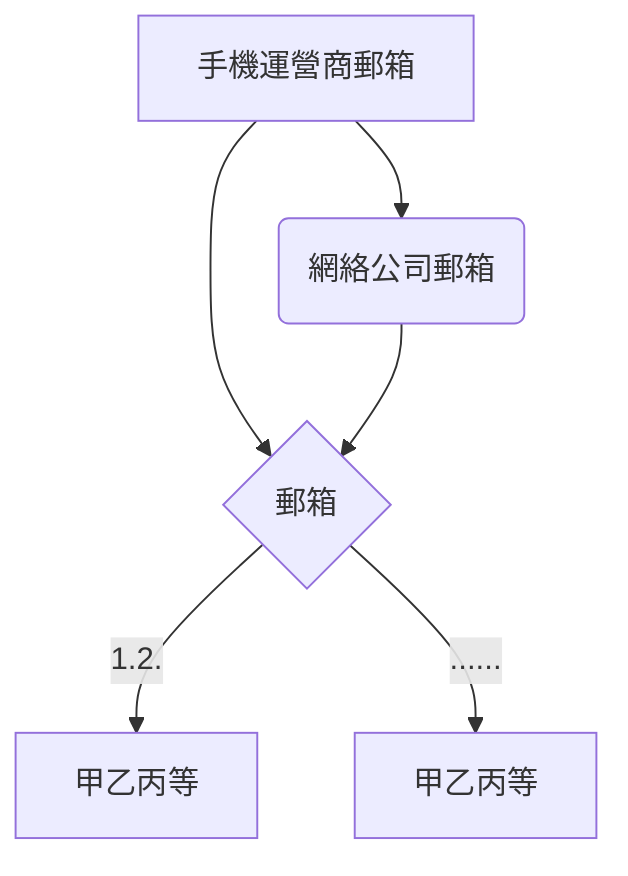

# 中文互聯網入門

[TOC]

## 國内網絡

1. 手機號
	現在各種綁定手機號，要注冊網絡賬號，一個手機號是必須的。
	- 附帶的就有了**運營商的郵箱**（移動139，聯通wo，電信189）
2. 網絡公司郵箱
    通過手機號注冊的**網絡公司賬戶郵箱**（新浪、網易、騰訊）
3. 國内的網絡服務公司賬戶，均可通過上述**手機和郵箱**注冊了。

## 國外網絡

國外網絡公司可直接注冊郵箱賬號，但也推薦綁定手機號。

1. 直接注冊郵箱賬戶
  - Google、Yandex、MS、
2. 其他專業郵箱賬號
    - ProntnMail
3. 其他網絡服務公司賬戶

推薦：國内郵箱用於注冊國内公司賬戶，國外郵箱用於注冊國外公司賬戶，互相分開。

