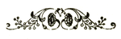

春秋大义
===
The Spirit of the Chinese People
---

《**中国人的精神**》（英语：***The Spirit of the Chinese People***），又名《**春秋大义**》，是[国学](https://zh.wikipedia.org/wiki/国学)大师[辜鸿铭](https://zh.wikipedia.org/wiki/辜鸿铭)的一部英文作品。该书由一系列关于中国人精神论文集结而成，文中阐释中国人的精神生活，宣扬[中国传统文化](https://zh.wikipedia.org/wiki/中国传统文化)的价值，并主张用[儒家](https://zh.wikipedia.org/wiki/儒家)思想对西方社会进行改造。

### 序言

通过与[美国人](https://zh.wikipedia.org/wiki/美国人)、[英国人](https://zh.wikipedia.org/wiki/英国人)、[德国人](https://zh.wikipedia.org/wiki/德国人)、[法国人](https://zh.wikipedia.org/wiki/法國人)对比，指出[中国人](https://zh.wikipedia.org/wiki/中国人)深刻（depth），博大（broadness）、简朴（simplicity）并具有灵性（delicacy）。

| 国民性                                         | 深刻（depth）  | 博大（broadness） | 简朴（simplicity） | 灵性（delicacy） |
| ---------------------------------------------- | -------------- | ----------------- | ------------------ | ---------------- |
| [美国人](https://zh.wikipedia.org/wiki/美国人) | **缺乏**       | 有                | 有                 | 缺乏             |
| [英国人](https://zh.wikipedia.org/wiki/英国人) | 有             | **缺乏**          | 有                 | 缺乏             |
| [德国人](https://zh.wikipedia.org/wiki/德国人) | 有             | 有                | **缺乏**           | 缺乏             |
| [法国人](https://zh.wikipedia.org/wiki/法國人) | 有但不如德国人 | 有但不如美国人    | 有但不如英国人     | **有**           |
| [中国人](https://zh.wikipedia.org/wiki/中国人) | 有             | 有                | 有                 | 有               |

### 导论

善良公民的信仰（Introduction: The Religion of Good-citizenship） 

### 正文

- 第一章 中国人的精神（The Spirit of the Chinese People）
- 第二章 中国妇女（The Chinese Woman）
- 第三章 中国语言（The Chinese Language）
- 第四章 约翰·斯密斯在中国（John Smith in China）
- 第五章 一位著名[汉学](https://zh.wikipedia.org/wiki/汉学)家（A Great Sinologue）
- 第六章 汉学，第一部分（Chinese Scholarship, Part I）
- 第七章 汉学，第二部分（Chinese Scholarship, Part II）

### 附录

"崇拜群众的宗教"或名"战争与出路"（Appendix: The Religion of Mob-Worship or The War and the Way out）

## 原文

**The Spirit of the Chinese People**  (1915) 
*by* *[Gu Hongming](https://en.wikisource.org/wiki/Author:Gu_Hongming)*

First edition.

THE SPIRIT OF THE CHINESE PEOPLE.

**WITH AN ESSAY**

ON

"The War and the Way out"

BY

**KU HUNG-MING, M.A.** (**Edin.**)

------

Es giebt zwei friedliche Gewalten:
 das Recht und die Schicklichkeit.

Goethe

**PEKING,**

**THE PEKING DAILY NEWS.**

------

**1915.**

 

CONTENTS.

[Preface](https://en.wikisource.org/wiki/The_Spirit_of_the_Chinese_People/Preface) [Introduction](https://en.wikisource.org/wiki/The_Spirit_of_the_Chinese_People/Introduction)

1. [The Spirit of the Chinese People](https://en.wikisource.org/wiki/The_Spirit_of_the_Chinese_People/1).
2. [The Chinese Woman](https://en.wikisource.org/wiki/The_Spirit_of_the_Chinese_People/2).
3. [The Chinese Language](https://en.wikisource.org/wiki/The_Spirit_of_the_Chinese_People/3).
4. [John Smith in China](https://en.wikisource.org/wiki/The_Spirit_of_the_Chinese_People/4).
5. [A Great Sinologue](https://en.wikisource.org/wiki/The_Spirit_of_the_Chinese_People/5).
6. [Chinese Scholarship Part I](https://en.wikisource.org/wiki/The_Spirit_of_the_Chinese_People/6).
7. [Chinese Scholarship Part II](https://en.wikisource.org/wiki/The_Spirit_of_the_Chinese_People/7).

DEDICATED

 TO

 L. SOYKA, ESQUIRE,

 AN AUSTRIAN GENTLEMAN,

 AS

 A Token of Gratitude

 FOR

 His chivalrous and great kindness to me

 and my family during the Revolution

 in

China in 1911.

### PREFACE.

 THE object of this book is an attempt to interpret the spirit and show the  value of the Chinese civilisation. Now in order to estimate the value of a civilisation, it seems to me, the question we must finally ask is not what great cities, what magnificent houses, what fine roads it has  built and is able to build; what beautiful and comfortable furniture,  what clever and useful implements, tools and instruments it has made and is able to make; no, not even what imstitutions, what arts and sciences it has invented: the question we must ask, in order to estimate the value of a civilisation,—is, *what type of humanity*, what kind of men and women it has been able to produce. In fact, the  man and woman,—the type of human beings—which a civilisation produces,  it is this which shows the essence, the personality, so to speak, the  soul of that civilisation. Now if the men and women of a civilisation  show the essence, the personality and soul of that civilisation, the  language which a man and woman speak, shows the essence, the  personality, the soul of the man and woman. The French say of literary  composition, "*Le style, c'est l'homme*." I have therefore taken  these three things, the Real Chinaman, the Chinese woman and the Chinese language,—as the subjects of the first three essays in this volume to  illustrate the spirit and show the value of the Chinese civilisation.

 I have added to these, two essays in which I have tried to show how and  why men, foreigners who are looked upon as authorities on the subject,  do not really understand the real Chinaman and the Chinese language. The Rev. Arthur Smith, who wrote the Chinese Characteristics, I have tried  to show, does not understand the real Chinaman, because, being an  American,—he is not deep enough to understand the real Chinaman. Dr.  Giles again, who is considered a great sinologue, I have tried to show  does not really understand the Chinese language, because, being an  Englishman, he is not broad enough,—he has not the philosophic insight  and the broadness which that insight gives, I have wanted to include in  this volume an essay I wrote on J. B. Bland and Backhouse's book on the  famous late Empress Dowager, but unfortunately I have not been able to  find a copy of that essay which was published in the "National Review"  in Shanghai some four years ago. In that essay, I have tried to show  that, such men as J. B. Bland and Backhouse do not and cannot understand the real Chinese woman,—the highest type of woman produced by the  Chinese civilisation viz the late Empress Dowager, because such men as  J. B. Bland and Backhouse are not simple,—have not the simplicity of  mind, being too clever and having, like all modern men, a distorted  intellect.[[1\]](https://en.wikisource.org/wiki/The_Spirit_of_the_Chinese_People/Preface#cite_note-1) In fact, in order to understand the real Chinaman and the Chinese civilisation, a man must be deep, broad and simple, for the three characteristics of  the Chinese character and the Chinese civilisation are: depth, broadness and simplicity. 

The American people, I may be permitted to  say here, find it difficult to understand the real Chinaman and the  Chinese civilisation, because the American people, as a rule, are broad, simple, but not deep. The English cannot understand the real Chinaman  and Chinese civilisation because the English, as a rule, are deep,  simple, but not broad.  The Germans again cannot understand the real  Chinaman and the Chinese civilisation because the Germans, especially  the educated Germans, as a rule, are deep, broad, but not simple. The  French,—well the French are the people, it seems to me, who can  understand and has understood the real Chinaman and  the Chinese civilisation best.[[2\]](https://en.wikisource.org/wiki/The_Spirit_of_the_Chinese_People/Preface#cite_note-2) The French, it is true, have not the depth of nature of the Germans nor the broadness of mind of the Americans nor the simplicity of mind of  the English,—but the French, the French people have to a preeminent  degree a quality of mind such as all the people I have mentioned above  as a rule, have not,—a quality of mind which, above all things, is  necessary in order to understand the real Chinaman and the Chinese  civilisation; a quality of mind viz: *delicacy*, For, in addition to the three characteristics of the real Chinaman and Chinese civilisation which I have already  mentioned, I must here add one more, and that the chief characteristic,  namely delicacy; delicacy to a preeminent degree such as you will find  nowhere else except perhaps among the ancient Greeks and their  civilisation.

It will be seen from what I have said above that the American  people if they will study the Chinese civilisation, will get depth; the  English, broadness; and the Germans, simplicity; and all of them,  Americans, English and Germans by the study of the Chinese civilisation, of Chinese books and literature, will get a quality of mind which, I  take the liberty of saying here that it seems to me, they all of them,  as a rule, have not to a preeminent degree, namely, *delicacy*. The French people finally, by the study of the Chinese civilisation, will  get all,—depth, broadness, simplicity and a still finer delicacy than  the delicacy which they now have. Thus the study of the Chinese  civilisation, of Chinese books and literature will, I believe, be of  benefit to all the people of Europe and America. I have therefore added  to this volume an essay on Chineses scholarship,—the sketch of a  programme how to study Chinese, which I made for myself when I made up  my mind and began, after my return from Europe, to study the  civilisation of my own country, exactly now thirty years ago; this  sketch of a programme how to study Chinese which I hope will be of help  to those who want to study Chinese and the Chinese civilisation.

 Last of all, I have included as an appendix an essay on practical  politics,—an essay on "The War and the Way out." Knowing full well the  danger of entering into the arena of practical politics, I nevertheless  do it, because in order to prove the value of the Chinese civilisation, I want to show how the study of the Chinese civilisation can help to  solve the problem facing the world to-day,—the problem of saving the  civilisation of Europe from bankruptcy. In fact I want to show that the  study of Chinese, of Chinese books and Chinese literature is not only a  hobby for sinologues. 

In this essay, I have tried to show the moral  causes which have brought on this war; for until the true moral causes  of this war are understood and remedied, there can be no hope of finding a way out of it. The moral causes of this war, I have tried in my essay to show, are the *worship of the mob* in Great  Britain and the *worship of might* in Germany. I have, in my essay, laid emphasis more upon the worship of the mob in Great Britain, than  the worship of might in Germany, because looking impartially upon the  question, it seems to me that it is the worship of the mob in Great  Britain, which is responsible for the worship of might in Germany; in  fact, the worship of  the mob in all European countries and especially in Great Britain, it  was this which has created the enormous German Militarism which  everybody now hates  and denounces. 

Now let me first of all say here that it is the moral fibre in the German nation, their intense love of righteousness and, as a consequence, their equally intense hatred of unrighteousness, hatred of all untidiness and disorder (Unzucht und Unordnung), which  makes the German people believe in and worship might. All men who  intensely love righteousness, who intensely hate unrighteousness are  inclined to believe in and worhip might. The Scotch Carlyle, for instance, believed in and worshipped  might. Why? Because Carlyle with the German moral fibre in him intensely hated unrighteousness. Now the reason why I say that it is the worship  of the mob in Great Britain which is responsible for the worship of  might in Germany, is because, the *moral fibre*—the intense hatred  of unrighteousness, of untidiness and disorder in the German nation  makes them hate the mob, the worship of the mob and the mob worshippers  in Great Britain. After the German nation saw how the mob and the  mob-worshipping politicians of Great Britain made the Boer war in  Africa, their *instinctive* intense hatred[[3\]](https://en.wikisource.org/wiki/The_Spirit_of_the_Chinese_People/Preface#cite_note-3) for the mob, the mob-worship and the mob-worshippers in Great Britain  made the German nation willing to make heavy sacrifices, made the *whole German nation ready to starve themselves to create a Navy* with the hope to put down the mob, the mob-worship and the  mob-worshippers in Great Britain. In fact, the German nation, I may say, found themselves surrounded on all sides by the mob, mob-worship and  mobworshippers encouraged by Great Britain in all Europe and this made the German  nation believe more and more in might, made the German nation worship  might as the only salvation for mankind. This worship of might in  Germany created by the hatred for the Religion of mob worship in Great  Britain, thus created the enormous monstrous German Militarism which  everybody now hates and denounces. 

Thus, I say again, it is the worship of the mob, the Religion of  the worship of the mob in all European countries, especially in Great  Britain, which is responsible for the worship of might in Germany; which has created the abnormous enormity and monstrosity of German Militarism in Europe to-day. If therefore the people in Great Britain and the  people in all European countries and America want to put down German  Militarism,—they must try first to put down the mob, the mob-worshippers and the Religion of mob-worship in their own countries.[[4\]](https://en.wikisource.org/wiki/The_Spirit_of_the_Chinese_People/Preface#cite_note-4) To the people of Europe and America, and in Japan and China too, to-day who speak of and want liberty, I will venture here to say that the only way, it seems to me, to get liberty, true liberty is to  behave  themselves; to learn to behave themselves properly. Look at China before this Revolution. There was more liberty among the Chinese people,—no  priest, no policeman, no Municipal tax, no income tax to bother  them—more liberty among the Chinese than among any other people in the world; and why?  Because the Chinese people before this Revolution behaved themselves;  knew how to behave themselves; knew how to behave themselves as *good citizens*. But now after this Revolution—there is less liberty in China, and why?  Because the modern queueless, up-to-date Chinamen, the returned students have learnt from the people of Europe and America,—learnt from the  European mob in Shanghai how to *misbehave themselves*; to behave themselves not as good citizens, but as a *mob*—a mob encouraged, coddled and worshipped by the British diplomats and the British Inspector General of Customs in Peking.[[5\]](https://en.wikisource.org/wiki/The_Spirit_of_the_Chinese_People/Preface#cite_note-5) In fact, what I want to say here is, that if the people in Europe, the  people in Great Britain want to put down German Militarism, Prussian  Militarism, they must keep the mob in their own countries in order; they must make the mob in their own countries behave themselves properly; in fact they must put down the Religion of mob-worship, and the  mob-worshippers in their own countries.

But now while I say that the British people with their mob worship and encouragement of mob-worship are responsible for the worship of might in Germany, for German Militarism, I must at the same time say here that, looking again impartially upon  the question, it seems to me that the *direct* responsibility for this war rests more heavily upon the German people, upon the German nation, than upon anybody else.

In order to understand this, let me first of all here give the  history of German Militarism in Europe. After the Reformation and the  Thirty Years War, the Germanic nations, the people of the Germanic race  with their *moral fibre*, with their intense love of righteousness  and their intense hatred of unrighteousness, hatred of all untidiness  and disorder, the German people, with Militarism as a sword in their  hand, became the rightful guardian of civilisation in Europe. In other  words, the responsibility for putting order and tidiness (Zucht und  Ordnung) in Europe; in fact, the *moral hegemony* so to speak of  Europe came into the hands of the German people. After the Reformation,  Frederick the Great, like Cromwell in England, had to take up and use  the sword of German Militarism to put order and tidiness in Europe and  he succeeded in putting order and tidiness at any rate in the Northern  part of Europe. Now see what happened after Frederick the Great's death. His successor did not know how to use the sword of German Militarism in order to guard and protect the civilisation of Europe; in fact, he was  unfit to hold the moral hegemony of Europe. The result was, the whole of Europe, even the courts in Germany became a bottomless pit of abominations covered up only with the veneer of civilisation; so much so that at last the suffering population, the  plain men and women in France rose up with pikes to protest against the  abominations. The plain men and women in France who rose up to protest  against the abominations very soon became a *mob*, and this mob finally found a great and able leader, Napoleon Buonaparte,[[6\]](https://en.wikisource.org/wiki/The_Spirit_of_the_Chinese_People/Preface#cite_note-6) who led them to rob, murder, kill and ravage all Europe uutil the nations in Europe rallying round the small necleus of *sound* German Militarism left in Europe, put an end to the career of the great leader of the mob at Waterloo. After this the moral hegemony of Europe  should have returned to the people of the Germanic race, to the  Prussians, the back bone of the German nations. But the jealousy of the  other races which formed the Austrian Empire prevented this. The result  was that without the German nation with its moral fibre and the sword of German Militarism to keep down the mob, the mob in 1848 again rose up  furiously to break the civilisation of Europe. Then again the German  nation—the backbone of the Germanic nations, the Prussians with their  moral fibre and the sword of German Militarism, saved Europe,—saved  Kingship, (Bismarck called it the dynasty), saved civilisation in Europe from the mob.

But now the Austrians,—the other races forming the Austrian Empire again became jealous and would not allow the German nation,—the backbone of the  Germanic natious, Prussia to take over the moral hegemony of Europe until 1866 when the  Prussian King Wilhelm with Bismarck and Moltke had to put down the  Austrian jealousy by force and took over the hegemony into their hands.  After this, Louis Napoleon, not like his great uncle a leader, but a  swindler of the mob or, as Emerson calls him, a successful thief, tried  with the mob of Paris behind him, to dispute and wrest the moral  hegemony of Europe from the German nation. The result was that the  Emperor Wilhelm with the sharp sword of German militarism in his hand  had to march to Sedan and put down the poor successful thief and  swindler of the mob. The plain men and women of Paris who put their  trust in the mob and the swindler of the mob had their houses sacked and burnt *not by the German*  Militarism*, not by the Germans and Prussians, but*  by the very mob in whom they put their trust. After 1872,—not only the  moral, but the actual political hegemony of Europe passed finally into  the hands of the German nation with the moral fibre of the Germanic race in their soul and the sword of German Militarism in their hand, to hold down the mob and keep the peace in Europe and thanks to the moral fibre in the German nation and the sword of German Militarism, Europe since  1872 has now enjoyed peace for 43 years. Thus people who abuse and  denounce German Militarism and Prussian Militarism should remember how much Europe owes to this very German, this Prussian Militarism which they now abuse and denounce.

I have in the above taken the trouble to give this rough short  sketch of the German Militarism in Europe in order to make the German  people see that I am not prejudiced against them in saying what I am  going to say to show that the actual *direct* responsibility for  this war rests more heavily upon them, upon the German people and German nation than upon anybody else. I say that the actual *direct* responsibility for this war rests more heavily upon the German people and German nation than upon anybody else; and why?—*Because power means responsibility*.[[7\]](https://en.wikisource.org/wiki/The_Spirit_of_the_Chinese_People/Preface#cite_note-7) 

I say that it is the intense love of righteousness, the intense  hatred of unrighteousness, intense hatred of all untidiness and disorder (Unzucht und Unorduung) in the German people which makes them believe in and worship might. Now I want to say here that this hatred of unrighteousness, hatred of  untidiness and disorder, when it becomes over-intense, when it is  carried to excess becomes also an *unrighteonsness*,  becomes a frightful and terrible unrighteousness, something more sinful  and wrong even than untidiness and disorder. It was this over intense  hatred of  unrighteousness which came from their intense love of righteousness, the intense, narrow, hard, rigid hatred of unrighteousness carried to  excess in the old Hebrew people—the Hebrew people to whom the people of  Europe owe their knowledge and love of righteousness, it was this which  destroyed the Jewish nation. It was from this over-intense narrow, hard, rigid hatred of unrighteousness that Jesus Christ came to save His  people. Christ, with what Matthew Arnold calls his unspeakable sweet  reasonableness said to his own people: "Learn of me, that I am *mild* and lowly and ye shall have peace in your souls." But the Jews—his own  people would not listen to him; they, instead of listening to him,  crucified him and the consequence was—the Jewish nation perished. To the Romans who were then the guardians of civilisation in Europe, Christ  said, "All they that take the sword shall perish with the sword!"[[8\]](https://en.wikisource.org/wiki/The_Spirit_of_the_Chinese_People/Preface#cite_note-8) But the Romans would not listen, but instead, allowed the Jews to  crucify him. The consequence was—the Roman Empire and the old  civilisation of Europe perished and passed away. Goethe says: "What a  long way mankind must have travelled before they came to know how to  deal gently even with sinners, to be merciful to law-breakers, *and to be human even to the inhuman*. Truly they were men of Divine nature who first taught this and who gave their lives for it in order to make the realisation of this possible  and to hasten the practice of it. "(Welchen Weg musste nicht die  Menschheit machen, bis sic dahin gelangte, auch gegen Schuldige gelind, gegen Verbrecher  schonend, gegen auch Unmenschliche menschlich zu sein. Gewiss waren as  Manner gottlicher Natur, die dies zuerst lehrten, die ihr Leben damit  zubrachten, die Ausubung moglich zu machen und zu beschleunigen.)" 

With those words of their great Goethe I will  enture here to appeal to the German people, to the German nation and say to them that, unless they find a way to put down their narrow, hard,  rigid, excessive hatred of unrighteousness which makes them believe so  absolutely in and worship might, unless they put away their absolute  belief in and worship of might—they, the German nation, like the Jewish  nation, will perish and what is more, the modern civilisation of Europe  for want of a strong guardian, will collapse and pass  away just as the ancient civilisation of Europe passed away. For it is  this over-intense, narrow hard, rigid hatred of unrighteousness which matkes the German people, the German nation believe in and worship might; and  it is this absolute belief in and worship of might which makes the  German nation, the German diplomats, German officials and the German  people so inconsiderate and tactless in their behaviour towards other  people. When my German friends have asked me to show them a proof of the German worship of might, of German tactlessness, I have simply pointed  the Kettler memorial in Peking to them. The Kettler memorial in Peking is a standing monument of the German worship of might, of the  tactlessness of the German diplomacy, the tactlessness of the German  nation in their international dealings with other nations.[[9\]](https://en.wikisource.org/wiki/The_Spirit_of_the_Chinese_People/Preface#cite_note-9) It was this worship of might of the German nation, this tactlessness of the German diplomacy of which the Kettler memorial is a standing  monument, which made the Emperor of Russia say: "We have stood this for  seven years; now it must finish;" this tactlessness of the German  diplomacy which made the really peace-loving Emperor of Russia and the  best people in Europe, the soundest, most loveable, kindest and most  generous-hearted people in Europe the Russians take the side of the mob  and mob-worshippers in Great Britain and in France, which created the  Triple-Entente; which made the Russians finally take the side even of  the anarchic mob in Servia and thus brought on this war. In one word it  is this tactlessness of the German diplomacy, of the German people, o the German nation which is *directly* reponsible for this war. 

I say therefore, if the German nation at this moment the true,  rightful and legitimate guardian of the modern civilisation of Europe  to-day, is not to perish and the modern European civilisation is to be saved,—the German nation, the German people must find a way to put down their over-intense,  narrow, hard, rigid hatred of unrighteousness which makes them believe  so absolutely in and worship might; in fact they must find a way to put  down their absolute belief in and worship of might which makes them so  inconsiderate and tactless. But then, where are the German nation, the  German people to find a way to put down their absolute belief in and  worship of might? The German nation, the German people, I say, will find this in hese words of their great Goethe. Goethe says: "*There are two peaceful powers in this world: Right and Tact*. (Es gibt zwei friedliche Gewalten auf der Welt: Das Recht und die Schicklichkit.)

Now this Right and Tact, *das Recht und die Schicklichkeit*, is the essence of the Religion of good citizenship which Confucius gave to us Chinese here in China; this Tact, this *Schicklichkeit*, especially, is the essence of the Chinese civilisation. The Religion in the civilisation of the Hebrew people taught the people of Europe the  knowledge of Right, but it did not teach Tact. The civilisation of  Greece taught the, people of Europe the knowledge of Tact but it did not teach Right. But  the Religion in the civilisation of China teaches us Chinese both Right  and Tact,—das Recht und die Schicklichkeit. The Hebrew Bible, the plan  of civilisation according to which the people of Europe have built their present modern civilisation, teaches the people of Europe to love  righteousness, to be righteous men, to do right. But the Chinese  Bible—the Five Canons and Four Books in China, the plan of civilisation  which Confucius saved for us the Chinese nation, teaches us Chinese also to love righteousness; to be righteous men; to do right, but it adds:  "Love righteousness, be righteous men, do right—*but with good taste*" In short, Religion in Europe says: " Be a good man." But the Religion in China says: "Be a good man *with good taste*." Christianity says: "Love Mankind." But Confucius says: "Love Mankind *with good taste*" This Religion of righteousness with good taste, which I have called the Religion of good citizenship, is the new religion I believe, which the  people of Europe, especially the people of the countries now at war,  want at this moment not only to put an end to this war, but to save the  civilisation of Europe, to save the civilisation of the world. This new  Religion, the people of Europe will find here in China,—in the Chinese  civilisation. I have therefore in this little book made the attempt to  interpret and show the value of this,—the Chinese civilisation. I do  this with the hope that all educated serious thinking people, who read  this book of mine will, by reading this book, better understand the  moral causes of this war and understanding the moral causes of this war, will all help to put an end to this cruel, inhuman, useless and most  monstrous war which the world has ever seen.

 Now if we want to help to put an end to this war, we must, all of us, try  to put down first the worship of the mob and then the worship of might  in the world to-day, which, as I have said, are the cause of this war.  We can put down the worship of the mob, only when in our daily life, in  everything we say and do, every one of us will think, not of interests,  of expediency—*of what will pay*, but think of that word in Goethe's saying—*Right*. Confucius says: "The gentleman understands *right*; the cad understands *interests*,—*what will pay*." Further we can only put down the worship of the mob in the world when  we have the courage, even if it does not pay to do so, to refuse to join and go in with the crowd—with the *mob*. Voltaire says: "C'est le malheur des gens honnêtes qu'ils sont des laches. It is the mirfortune of so-called good people that they are cowards." For it is the  selfishness and cowardice in all of us, I want to say here, selfishness  which makes us think of interests, of expediency, of what will pay,  instead of right, and cowardice which makes us afraid to stand up alone  against the crowd, against the mob,—it is this selfishness and cowardice in all of us which has given rise and created the mob and the worship  of the mob in the world to-day. People say German Militarism is the  enemy and danger of the world to-day. But I say it is the selfishness  and cowardice in all of us which is the real enemy of the world to-day:  selfishness and cowardice in all of us, which, when combined, becomes  Commercialism. It is this spirit of Commercialism, in all countries of the world, especially in Great Britain and America, which is the real enemy of the world to-day. It is, I say, this spirit  of Commercialism in all of us and not Prussian Militarism which is the  real, the greatest enemy of the world to-day. For it is this  Commercialism, a combination of selfishness and cowardice which has  created the Religion of the worship of the mob and it is this Regigion of the worship of the mob in Great Britain which has created the  Religion of the worship of might in Germany, created the German  Militarism which, as I said, finally brought on this war. *The fons et origo* of this war, I say, therefore is not militarism, but *Commercialism*, which, as I said, is a combination of selfishness and cowardice in all  of us. Thus, if we want to help to put an end to this war, we must, all  of us, first put down the spirit of Commercialism, the combination of  selfishness and cowardice in us; in short, we must first of all, think  of *right* and not of interests and then have the courage to stand up against the crowd, against the mob. In this way, I say, and *only in this way* we can help to put down the worship of the mob, the Religion of the  worship of the mob and in putting down this worship of the mob, this  Religion of the worship of the mob, we can help to put an end to this  war.

Now as soon as we have put down the worship of the mob, it will  then be very easy to put down the worship of might, easy to put down  German Militarism, put down Prussian Militarism. The only thing we will have to do, in order  to put down the worship of might, to put down German, Prussian or any  Militarism in the world, is to think of the other word in that saying of Goethes—*Schicklichkeit, Tact, Good Taste* and, in thinking of that, to behave  with tact and good taste, in short to behave  properly; for might, Militarism, even Prussian Militarism can do nothing and will soon find itself useless and unnescessary against people who know how to behave themselves properly. This then is the  essence of the Religion of good citizenship; this is the secret of the  Chinese civilisation. This is also the secret of the new civilisation of Europe which the  German Goethe gave to the people of Europe and the secret of this  civilisation is: to put down force, not by force, but by *right and tact*; in fact to put down force  and everything that is evil in this world, not by force, but by ordering our conversation aright and behaving ourselves properly; and ordering  our conversation aright and behaving properly means to do *right and to behave with tact and good taste.*[[10\]](https://en.wikisource.org/wiki/The_Spirit_of_the_Chinese_People/Preface#cite_note-10) This is the secret, the  soul of the Chinese civilisation, the essence  of the spirit of the Chinese people, which I have tried in this book to  interpret and explain. 

Finally I will here conclude with the words with which I  concluded the book "Papers from a Viceroy's Yamen" which I wrote after  the Boxer trouble in China. They are the words of the French poet  [Béranger](https://en.wikisource.org/w/index.php?title=Author:Pierre_Jean_de_Béranger&action=edit&redlink=1) and I think they are very appropriate at the present moment. 

KU HUNG-MING

*Peking, 20th April, 1915.*

1. [↑](https://en.wikisource.org/wiki/The_Spirit_of_the_Chinese_People/Preface#cite_ref-1) Mencius says, "What I hate in your clever men is that they always distort things. 所惡於智者為其鑿也" Bk IV. Part II. 26,
2. [↑](https://en.wikisource.org/wiki/The_Spirit_of_the_Chinese_People/Preface#cite_ref-2) The best book written in any European language on the spirit of the Chinese civilisation is a book called "La Cité Chinoise" by G.—Eug. Simon who was once French Consul in China. It was from this book that Prof. Lowes Dickinson of Cambridge, as he himself told me, drew his inspiration in writing his famous "Letters from John Chinaman."
3. [↑](https://en.wikisource.org/wiki/The_Spirit_of_the_Chinese_People/Preface#cite_ref-3) The famous telegram of the German Emperor to President Kruger was an *instinctive* outsburst of indignation of the true Germanic soul with its moral fibre against Joseph Chamberlain and his Cockney class in England, who manipulated the Boer War.
4. [↑](https://en.wikisource.org/wiki/The_Spirit_of_the_Chinese_People/Preface#cite_ref-4) Confucius said to a disciple "when outside nations are dissatisfied with you, you should cultivate *civil* or *Civic* virtues (遠人不服則修文德)" The British aristocracy, however, like the Manchu aristocracy in China, are now helpless against the mob and mob worshippers in England. But it is, I must say, a great credit to the British aristocracy that not one of them as far as I know, has joined the mob in England in their shout, howl and yell in this war.
5. [↑](https://en.wikisource.org/wiki/The_Spirit_of_the_Chinese_People/Preface#cite_ref-5) To show what a mob the Chinese returned students have become, I may mention here that some of these students in Peking last year actually wrote letters to the "Peking Gazette," a newspaper conducted by a clever Chinese "Babu" by the name of Eugene Chen, openly threatening to organise and carry out a public assault upon me for criticsing the new Chinese woman in my essay on "the Chinese woman." This clever Chinese "Babu" Eugene Chen the instigator of the contemplated piece of rowdyism now is a respected member of the Committee of the Anglo-Chinese Friendship Bureau under the patronage of the British Minister and the I. G. of the Chinese Customs!
6. [↑](https://en.wikisource.org/wiki/The_Spirit_of_the_Chinese_People/Preface#cite_ref-6) Emerson with great insight, says, "What sent Napoleon to St. Helena, was not loss of battles, but the *parvenu*, the vulgar ambition in him—the vulgar ambition to marry a real Princess, to found a dynasty."
7. [↑](https://en.wikisource.org/wiki/The_Spirit_of_the_Chinese_People/Preface#cite_ref-7) Confucius says, "Possession of power without leniency and generosity is a thing which I never can bear to see. (居上不寬吾何以觀之) Shakespeare says:
   "Oh, it is glorious
   ⁠To have a giant's strength: but it is tyrannous
   ⁠To use it like a giant." See note p. 15.
8. [↑](https://en.wikisource.org/wiki/The_Spirit_of_the_Chinese_People/Preface#cite_ref-8) That is to say, all who depend and put their faith solely upon material brute force or as Emerson says, who believe in the vulgar musket worship.
9. [↑](https://en.wikisource.org/wiki/The_Spirit_of_the_Chinese_People/Preface#cite_ref-9) The German Minister Baron Kettler during the fanatic Boxer out break in China was accidentally killed by a madman from the fanatic soldiery. As a punishment for this act of a mad man, the German diplomats insisted upon branding the whole Chinese nation on the forehead with an indelible mark of humiliation, by having this Kettler memorial erected in the principal street of the Chinese Capital. See note on Page 12. The late Count Cassini, Russian Minister in Peking just before the Boxer out break, said in a interview with an American journalist, "The Chinese are a *polite people*, but the impoliteness of the British and German Ministers, especially of the German Minister in Peking is something outrageous."
10. [↑](https://en.wikisource.org/wiki/The_Spirit_of_the_Chinese_People/Preface#cite_ref-10) Confucius says, "The moral man, the gentleman by living a life of simple truth and earnestness can bring peace to the world (君子篤恭而天下平)

### INTRODUCTION.

*The Religion of Good-citizenship*

Sage, thun wir nicht recht? Wir üssen den Pöbel betrügen,
 ⁠Sich nur, wie ungeschickt, sich nur wie wild er sich zeight!
Ungeschick und wild sind alle rohen Betrogenen;
 ⁠Seid nur redlich und fuhrt ihn zum Menschlichen an.[[1\]](https://en.wikisource.org/wiki/The_Spirit_of_the_Chinese_People/Introduction#cite_note-1)

Goethe. 

 THE great war at the present moment is absorbing all the attention of the  world exclusive of everything else. But then I think this war itself  must make serious thinking people turn their attention to the great  problem of civilisation. All civilisation begins by the conquest of  Nature, i.e. by subduing and controlling the terrific physical forces in Nature so that they can do no harm to men. The modern civilisation of  Europe to-day has succeeded in the conquest of Nature with a success, it must be admitted, hitherto not attained by any other civilisation. But  there is in this world a force more terrible even than the terrific  physical forces in Nature and that is the passions in the heart of man.  The harm which the physical forces of Nature can do to mankind, is  nothing compared with the harm which human passions can do. Until  therefore this terrible force,—the human passions—is properly regulated  and controlled, there can be, it is evident, not only no civilisation,  but even no life possible for human beings.

In the first early and rude stage of society, mankind had to use physical force to subdue and  subjugate human passions. Thus hordes of savages had to be subjugated by sheer  physical force. But as civilisation advances, mankind discovers a force  more potent and more effective for subduing and controlling human  passions than physical force and this force is called *moral force*. The moral force which in the past has been effective in subduing and  controlling the human passions in the population of Europe, is  Christianity. But now this war with the armament preceding it, seems to  show that Christianity has become ineffective as a moral force. Without  an effective moral force to control and restrain human passions, the  people of Europe have had again to employ physical force to keep civil  order. As Carlyle truly says, “Europe is Anarchy plus a constable.” The  use of physical force to maintain civil order leads to militarism. In  fact militarism is necessary in Europe to-day because of the want of an  effective moral force. But militarism leads to war and war means  destruction and waste. Thus the people of Europe are on the horns of a  dilemma. If they do away with militarism, anarchy will destroy their  civilisation, but if they keep up militarism, their civilisation will  collapse through the waste and destruction of war. But Englishmen say  that they are determined to put down Prussian militarism and Lord  Kitchner belives that he will be able to stamp out Prussian militarism with three  million drilled and armed Englishmen. But then it seems to me when  Prussian militarism is thus stamped out, there will then arise another  militarism,—the British militarism which again will have to be stamped out. Thus there seems to be no way of escape out of this vicious circle.

But is there really no way of escape? Yes, I believe there is.  The American Emerson long ago said, "I can easily see the bankruptcy of  the vulgar musket worship,—though great men be musket-worshippers; and  'tis certain, as God liveth, the gun that does need another gun, the law of love and justice alone can effect a clean revolution." Now if the  people of Europe really want to put down militarism, there is only one  way of doing it and that is, to use what Emerson calls the gun that does not need another gun, the law of love and justice,—in fact, moral  force, With an effective moral force, militarism will become unnecesary and disappear of itself. But now, that Christianity has become  ineffective as a moral force the problem is where are the people of  Europe to find this new effective moral force which will make militarism unnecessary?

I believe the people of Europe will find this new moral force in  China,—in the Chinese civilisation. The moral force in the Chinese  civilisation which can make militarism unnecessary is the Religion of  good citizenship. But people will say to me, "There have also been wars  in China." It is true there have been wars in China; but, since the time of Confucius 2,500 years age, we Chinese have had no militarism such as that we see in Europe to-day. In China war is an accident, whereas in Europe war has become a  necessity. We Chinese are liable to have wars, but we do not live in constant expectation of war. In fact the one thing  intolerable in the state of Europe, it seems to me, is not so much war  as the fact that every body is constantly afraid that his neighhbour as  soon as he gets strong enough to be able to do it, will come to rob and  murder him and he has therefore to arm himself or pay for an armed  policeman to protect him. Thus what weighs upon the people of Europe is  not so much the accident of war, but the constant necessity to arm  themselves, the absolute neccessity to use physical force to protect themselves.

Now in China because we Chinese have the Religion of good  citizenship a man does not feel the need of using physical force to  protect himself; he has seldom the need even to call in and use the  physical force of the policeman, of the State to protect him. A man in  China is protected by the sense of justice of his neighbour; he is  protected by the readiness of his fellow men to obey the sense of moral  obligation. In fact, a man in China does not feel the need of using  physical force to protect himself because he is sure that right and  justice is recognised by every body as a force higher than physical  force and moral obligation is recognised by every body as something  which must be obeyed. Now if you can get all mankind to agree to  recognise right and justice, as a force higher than physical force, and  moral obligation as something which must be obeyed, then the use of  physical force will become unnecessary; then there will be no militarism in the world. But of course there will be in every country a few people, criminals, and in the world, a few savages who  will not or are not able to recognise right and justice as a force  higher than physical force and moral obligation as something which must  be obeyed. Thus against criminals and savages a certain amount of  physical or police force and militarism will always be necessary in  every country and in the world.

But people will say to me how are you to make mankind recognise  right and justice as a force higher than physical force. I answer the  first thing you will have to do is to convince mankind of the efficacy  of right and justice, convince them that right and justice is a power;  in fact, convince them of the *power of goodness*. But then again  how are you to do this? Well,—in order to do this, the Religion of good  citizenship in China teaches every child as soon as he is able to  understand the meaning of words, that *the Nature of man is good*.[[2\]](https://en.wikisource.org/wiki/The_Spirit_of_the_Chinese_People/Introduction#cite_note-2)

Now the fundamental unsoundness of the civilisation of Europe  to-day, it seems to me, lies in its wrong conception of human nature;  its conception that human nature is evil and because of this wrong  conception, the whole structure of society in Europe has always rested  upon force. The two things which the people of Europe have depended upon to maintain civil order are Religion and Law. In other words, the  population of Europe have been kept in order by the fear of God and the  fear of the Law. Fear implies the use of force. Therefore in order to keep up the fear of  God, the people of Europe had at first to maintain a large number of  expensive idle persons called *priests*. That, to speak of nothing  else, meant so much expense, that it at last became an unbearable burden upon the people. In fact in the thirty years war of the Reformation,  the people of Europe tried to get rid of the priest. After having got  rid of the priests who kept the population in order by the fear of God,  the people of Europe tried to maintain civil order by the fear of the  Law. But to keep up the fear of the Law, the people of Europe have had  to maintain another class of still more expensive idle persons called *policemen and soldiers*. Now the people of Europe are beginning to find out that the maintainence of policemen and soldiers to keep civil order, is still more ruinously  expensive than even the maintainence of priests. In fact, as in the  thirty years war of the Reformation, the people of Europe wanted to get  rid of the priest, so in this present war, what the people of Europe  really want, is to get rid of the soldier. But the alternatives before  the people of Europe if they want to get rid of the policeman and  soldier, is either to call back the priest to keep up the fear of God or to find something else which, like the fear of God and the fear of the  Law, will help them to maintain civil order. That, to put the question  broadly, I think, everybody will admit, is the great problem of  civilisation before the people of Europe after this war.

 Now after the experience which they have had with the priests, I do not  think the people of Europe will want to call back the priests. Bismarck  has said, "We will never go back to Canossa." Besides, even if the  priests are now called back, they would be useless, for the fear of God  is gone from the people of Europe. The only other alternative before the people of Europe therefore, if they want to get rid of the policeman  and soldier, is to find something else, which, like the fear of God and  the fear of the Law, can help them to maintain civil order. Now this  something, I believe, as I have said, the people of Europe will find in  the Chinese civilisation. This something is what I have called the  Religion of good citizenship. This Religion of good citizenship in China is a religion which can keep the population of a country in order  without priest and without policeman or soldier. In fact with this  Religion of good citizenship, the population of China, a population as  large, if not larger than the whole population of the Continent of  Europe, are actually and practically kept in peace and order without  priest and without policeman or soldier. In China, as every one who has  been in this country knows, the priest and the policeman or soldier,  play a very subordinate, a very insignificant part in helping to  maintain public order. Only the most ignorant class in China require the priest and only the worst, the criminal class in China, require the  policeman or soldier to keep them in order. Thus I say if the people of  Europe really want to get rid of Religion and Militarism, of the priest and soldier which have caused  them so much trouble and bloodshed, they will have to come to China to  get this, what I have called the Religion of good citizenship.

In short what I want to call the attention of the people of  Europe and America to, just at this moment when civilisation seems to be threatened with bankruptcy, is that there is an invaluable and hitherto unsuspected asset of civilisation here in China. The asset of  civilisation is not the trade, the railway, the mineral weath, gold, silver, iron or coal in this country. The asset of civilisation  of the world to-day, I want to say here, is the Chinaman,—*the unspoilt real Chinaman* with his Religion of good citizenship. The real Chinaman, I say, is an invaluable asset of civilisation, because *he is a person who costs the world little or nothing to keep him in order*. Indeed I would like here to warn the people of Europe and America not  to destroy this invaluable asset of civilisation, not to change and  spoil the real Chinaman as they are now trying to do with their New  Learning. If the people of Europe and America succeed in destroying the  real Chinaman, the Chinese type of humanity; succeed in transforming the real Chinaman into a European or American, i.e., to say, a person who  will require a priest or soldier to keep him in order, then surely they  will increase the burden either of Religion or of Militarism of the  world,—this last item at this moment already becoming a danger and  menace to civilisation and humanity. But on the other hand, suppose one  could by some means or other change the European or American type of humanity,  transform the European or American into a real Chinaman who will then  not require a priest or soldier to keep him in order,—just think what a  burden will be taken off from the world.

But now to sum up in a few plain words the great problem of  civilisation in Europe arising out of this war. The people of Europe, I  say, at first tried to maintain civil order by the help of the priest.  But after a while, the priest cost too much expense and trouble. The  people of Europe then, after the thirty years war, sent away the priest  and called in the policeman and soldier to maintain civil order. But now they find the policeman and soldier are causing more expense and  trouble even than the priests. Now what are the people of Europe to do?  Send away the soldier and call back the priest? No, I do not believe the people of Europe will want to call back the priest. Besides the priest  now would be useless. But then what are the people of Europe to do? I  see [Professor Lowes Dickinson](https://en.wikisource.org/wiki/Author:Goldsworthy_Lowes_Dickinson) of Cambridge in an article in the Atlantic Monthly, entitled "The War and the Way out," says: "Call in the *mob*." I am afraid the mob when once called in to take the place of the priest and soldier, will give more trouble than even the priest and the  soldier  The priests and soldiers in Europe have caused wars, but the  mob will bring revolution and anarchy and then the state of Europe will  be worse than before. Now my advice to the people of Europe is: Do not  call back the priest, and for goodness sake don't call in the mob,—but call in the Chinaman; *call in the real Chinaman with his Religion of good citizenship and his  experience of 2,500 years how to live in peace without priest and  without soldier.*

In fact I really believe that the people of Europe will find the solution of the great problem of civilisation after this war,—here in China. There is, I say here again, an invaluable, but hitherto unsuspected asset of civilisation here in China, and the asset of civilisation is the real Chinaman. The real Chinaman is an asset of civilisation because he has the secret of a new civilisation which the people of Europe will want after this great war, and the secret of that new civilisation is what I have called the Religion of good citizenship. The first principle of this Religion of good citizenship is to believe that the *Nature of Man is good*; to believe in the power of goodness; to believe in the power and efficacy of what the American Emerson calls the law of love and justice. But what is the law of love? The Religion of good citizenship teaches that the law of love means to *love your father and mother.* And what is the law of justice? The Religion of good citizenship teaches that the law of justice means to be true, to be faithful, to be loyal; that the woman in every country must be selflessly, absolutely loyal to her husband, that the man in every country must be selflessly, *absolutely loyal to his sovereign*, to his King or Emperor. In fact the highest duty in this Religion of good citizenship I want to say finally here is the *Duty of Loyalty*, loyalty not only in deed, but loyalty in spirit or as [Tennyson](https://en.wikisource.org/wiki/Author:Alfred_Tennyson) puts it,

To reverence the King as he were
Their conscience and their conscience as their King,
To break the heathen and uphold the Christ.

1. [↑](https://en.wikisource.org/wiki/The_Spirit_of_the_Chinese_People/Introduction#cite_ref-1) Arein't we just doing the right thing? the mob we must befool them;
   ⁠See, now, how shiftless! and look now how wild! for such is the mob!
   Shiftless and wild all sons of Adam are when you be fool them;
   ⁠Be but honest and true, and thus make human, them all.
2. [↑](https://en.wikisource.org/wiki/The_Spirit_of_the_Chinese_People/Introduction#cite_ref-2) The first sentence of the first book that is put into the hands of every child in China when he goes to school

### **The Spirit of the Chinese People.**

(*A Paper that was to have been read before the Oriental Society of Peking*.)

 LET me first of all explain to you what I propose, with you permission, this afternoon to discuss. The subject of our paper I have  called "The Spirit of the Chinese people." I do not mean here merely to  speak of the character or characteristics of the Chinese people. Chinese characteristics have often been described before, but I think you will  agree with me that such description or enumeration of the  characteristics of the Chinese people hitherto have given us no picture  at all of the inner being of the Chinaman. Besides, when we speak of the character or characteristics of the Chinese, it is not possible to  generalize. The character of the Northern Chinese, as you know, is as  different from that of the Southern Chinese as the character of the  Germans is different from that of the Italians.

But what I mean by the spirit of the Chinese people, is the  spirit by which the Chinese people live, something constitutionally  distinctive in the mind, temper and sentiment of the Chinese people  which distinguishes them from all other people, especially from those of modern Europe and America. Perhaps I can best express what I mean by  calling the subject of our discussion the Chinese type of humanity, or,  to put it in plainer and shorter words, the real Chinaman.

  Now, what is the real Chinaman? That, I am sure, you will all agree with me, is a very interesting subject, especially at the present moment,  when from what we see going on around us in China today, it would seem  that the Chinese type of humanity — the real Chinaman — is going to  disappear and, in his place, we are going to have a new type of  humanity — the progressive or modern Chinaman. In fact I propose that  before the real Chinaman, the old Chinese type of humanity, disappears  altogether from the world we should take a good last look at him and see if we can find anything organically distinctive in him which makes him  so different from all other people and from the new type of humanity  which we see rising up in China today.

Now the first thing, I think, which will strike you in the old  Chinese type of humanity is that there is nothing wild, savage or  ferocious in him. Using a term which is applied to animals, we may say  of the real Chinaman that he is a domesticated creature. Take a man of  the lowest class of the population in China and, I think, you will agree with me that there is less of animality in him, less of the wild  animal, of what the Germans call *Rohheit*, than you will find in a man of the same class in a European society. In fact, the one word, it  seems to me, which will sum up the impression which the Chinese type of  humanity makes upon you is the English word "gentle." By gentleness I do not mean softness of nature or weak submissiveness. "The docility of  the Chinese," says the late Dr. D. J. Macgowan, "is not the docility of a broken-hearted, emasculated  people." But by the word "gentle" I mean absence of hardness, harshness, roughness, or violence, in fact of anything which jars upon you. There  is in the true Chinese type of humanity an air, so to speak, of a quiet, sober, chastened mellowness, such as you find in a piece of  well-tempered metal. Indeed the very physical and moral imperfections of a real Chinaman are, if not redeemed, at least softened by this quality of gentleness in him. The real Chinaman may be coarse, but there is no  grossness in his coarseness. The real Chinaman may be ugly, but there is no hideousness in his ugliness. The real Chinaman may be vulgar, but  there is no aggressiveness, no blatancy in his vulgarity. The real  Chinaman may be stupid, but there is no absurdity in his stupidity. The  real Chinaman may be cunning, but there is no deep malignity in his  cunning. In fact what I want to say is, that even in the faults and  blemishes of body, mind and character of the real Chinaman, there is  nothing which revolts you. It is seldom that you will find a real  Chinaman of the old school, even of the lowest type, who is positively  repulsive.

I say that the total impression which the Chinese type of  humanity makes upon you is that he is gentle, that he is inexpressibly  gentle. When you analyse this quality of inexpressible gentleness in the real Chinaman, you will find that it is the product of a combination of two things, namely, sympathy and intelligence. I have compared the Chinese type of humanity to a domesticated animal.  Now what is that which makes a domesticated animal so different from a  wild animal? It is something in the domesticated animal which we  recognise as distinctively human. But what is distinctively human as  distinguished from what is animal? It is intelligence. But the  intelligence of a domesticated animal is not a thinking intelligence. It is not an intelligence which comes to him from reasoning. Neither does  it come to him from instinct, such as the intelligence of the fox,—the  vulpine intelligence which knows where eatable chickens are to be found. This intelligence which comes from instinct, of the fox, all,—even  wild, animals have. But this, what may be called *human*  intelligence of a domesticated animal is something quite different from  the vulpine or animal intelligence. This intelligence of a domesticated  animal is an intelligence which comes not from reasoning nor from  instinct, but from sympathy, from a feeling of love and attachment. A  thorough-bred Arab horse understands his English master not because he  has studied English grammar nor because he has an instinct for the  English language, but because he loves and is attached to his master.  This is what I call human intelligence, as distinguished from mere  vulpine or animal intelligence. It is the possession of this human  quality which distinguishes domesticated from wild animals. In the same  way, I say, it is the possession of this sympathetic and true human  intelligence, which gives to the Chinese type of humanity, to the real  Chinaman, his inexpressible gentleness.

 I once read somewhere a statement made by a foreigner who had lived in  both countries, that the longer a foreigner lives in Japan the more he  dislikes the Japanese, whereas the longer a foreigner lives in China the more he likes the Chinese. I do not know if what is said of the  Japanese here, is true. But, I think, all of you who have lived in China will agree with me that what is here said of the Chinese is true. It is well-known fact that the liking—you may call it the taste for the  Chinese—grows upon the foreigner the longer he lives in this country.  There is an indescribable something in the Chinese people which, in  spite of their want of habits of cleanliness and refinement, in spite of their many defects of mind and character, makes foreigners like them as foreigners like no other people. This indescribable something which I  have defined as gentleness, softens and mitigates, if it does not  redeem, the physical and moral defects of the Chinese in the hearts of  foreigners. This gentleness again is, as I have tried to show you, the  product of what I call sympathetic or true human intelligence—an  intelligence which comes not from reasoning nor from instinct, but from  sympathy—from the power of sympathy. Now what is the secret of the power of sympathy of the Chinese people?

I will here venture to give you an explanation—a hypothesis, if  you like to call it so—of the secret of this power of sympathy in the  Chinese people and my explanation is this. The Chinese people have this  power, this strong power of sympathy, because they live wholly, or almost wholly, a life of the heart. The whole life of Chinaman is a  life of feeling—not feeling in the sense of sensation which comes from  the bodily organs, nor feeling in the sense of passions which flow, as  you would say, from the nervous system, but feeling in the sense of  emotion or *human affection* which comes from the deepest part of  our nature—the heart or soul. Indeed I may say here that the real  Chinaman lives so much a life of emotion or human affection, a life of  the soul, that he may be said sometimes to neglect more than he ought to do, even the necessary requirements of the life of the senses of a man  living in this world composed of body and soul. That is the true  explanation of the insensibility of the Chinese to the physical  discomforts of unclean surroundings and want of refinement. But that is  neither here nor there.

The Chinese people, I say, have the power of sympathy because  they live wholly a life of the heart—a life of emotion or human  affection. Let me here, first of all, give you two illustrations of what I mean by living a life of the heart. My first illustration is this.  Some of you may have personally known an old friend and colleague of  mine in Wuchang—known him when he was Minister of the Foreign Office  here in Peking—Mr. Liang Tun-yen, Mr. Liang told me, when he first  received the appointment of the Customs Taotai of Hankow, that what made him wish and strive to become a great mandarin, to wear the red button, and what gave him pleasure then in receiving this appointment, was not  because he cared for the red button, not because he would henceforth be rich and independent,—and we were all of us very poor  then in Wuchang,—but because he wanted to rejoice, because this  promotion and advancement of his would gladden the heart of his old  mother in Canton. That is what I mean when I say that the Chinese people live a life of the heart—a life of emotion or human affection.

My other illustration is this. A Scotch friend of mine in the  Customs told me he once had a Chinese servant who was a perfect scamp,  who lied, who "squeezed," and who was always gambling, but when my  friend fell ill with typhoid fever in an out-of-the-way port where he  had no foreign friend to attend to him, this awful scamp of a Chinese  servant nursed him with a care and devotion which he could not have  expected from an intimate friend or near relation. Indeed I think what  was once said of a woman in the Bible may also be said, not only of the  Chinese servant, but of the Chinese people generally:—"Much is forgiven  them, because they love much." The eyes and understanding of the  foreigner in China see many defects and blemishes in the habits and in  the character of the Chinese, but his heart is attracted to them,  because the Chinese have a heart, or, as I said, live a life of the  heart—a life of emotion or human affection.

Now we have got, I think, a clue to the secret of sympathy in the Chinese people—the power of sympathy which gives to the real Chinaman  that sympathetic or true human intelligence, making him so inexpressibly gentle. Let us next put this clue or hypothesis to the  test. Let us see whether with this clue that the Chinese people live a  life of the heart we can explain not only detached facts such as the two illustrations I have given above, but also general characteristics  which we see in the actual life of the Chinese people.

First of all let us take the Chinese language. As the Chinese  live a life of the heart, the Chinese language, I say, is also a  language of the heart. Now it is a well-known fact that children and  uneducated persons among foreigners in China learn Chinese very easily,  much more so than grown-up and educated persons. What is the reason of  this? The reason, I say, is because children and uneducated persons  think and speak with the language of the heart, whereas educated men,  especially men with the modern intellectual education of Europe, think  and speak with the language of the head or intellect. In fact, the  reason why educated foreigners find it so difficult to learn Chinese, is because they are too educated, too intellectually and scientifically  educated. As it is said of the Kingdom of Heaven, so it may also be said of the Chinese language:—"Unless you become as little children, you  cannot learn it."

Next let us take another well-known fact in the life of the Chinese  people. The Chinese, it is well-known, have wonderful memories. What is  the secret of this? The secret is: the Chinese remember things with the  heart and not with the head. The heart with 

**ERRATA**

------

Page 9 line 12

For "*Peculiarly people*" read
 peculiarly polite people.

 its power of sympathy, acting as glue, can retain things much better than  the head or intellect which is hard and dry. It is, for instance, also  for this reason that we; all of us, can remember things which we learnt  when we were children much better than we can remember things which we  learnt in mature life. As children, like the Chinese, we remember things with the heart and not with the head.

Let us next take another generally admitted fact in the life of  the Chinese people—their politeness. The Chinese are, it has often been  remarked, a peculiarly polite people. Now what is the essence of true  politeness? It is consideration for the feelings of others. The Chinese  are polite because, living a life of the heart, they know their own  feelings and that makes it easy for them to show consideration for the  feelings of others. The politeness of the Chinese, although not  elaborate like the politeness of the Japanese, is pleasing because it  is, as the French beautifully express it, *la politesse du coeur*,  the politeness of the heart. The politeness of the Japanese, on the  other hand, although elaborate, is not so pleasing, and I have heard  some foreigners express their dislike of it, because it is what may be  called a rehearsal politeness—a politeness learnt by heart as in a  theatrical piece. It is not a spontaneous politeness which comes direct  from the heart. In fact the politeness of the Japanese is like a flower  without fragrance, whereas the politeness of a really polite Chinese has a perfume like the aroma of a precious ointment—*instar unguenti fragrantis*—which comes from the heart.

 Last of all, let us take another characteristic of the Chinese people, by  calling attention to which the Rev. Arthur Smith has made his  reputation, viz.:—want of exactness. Now what is the reason for this  want of exactness in the ways of the Chinese people? The reason, I say  again, is because the Chinese live a life of the heart. The heart is a  very delicate and sensitive balance. It is not like the head or  intellect, a hard, stiff, rigid instrument. You cannot with the heart  think with the same steadiness, with the same rigid exactness as you can with the head or intellect. At least, it is extremely difficult to do  so. In fact, the Chinese pen or pencil which is a soft brush, may be  taken as a symbol of the Chinese mind. It is very difficult to write or  draw with it, but when you have once mastered the use of it, you will,  with it, write and draw with a beauty and grace which you cannot do with a hard steel pen.

Now the above are a few simple facts connected with the life of  the Chinese people which anyone, even without any knowledge of Chinese,  can observe and understand, and by examining these facts, I think, I  have made good my hypothesis that the Chinese people live a life of the  heart.

Now it is because the Chinese live a life of the heart, the life  of a child, that they are so primitive in many of their ways. Indeed, it is a remarkable fact that for a people who have lived so long in the  world as a great nation, the Chinese people should to this day be so  primitive in many of their ways. It is this fact which has made superficial foreign students of China think that the  Chinese have made no progress in their civilisation and that the Chinese civilisation is a stagnant one. Nevertheless, it must be admitted that, as far as pure intellectual life goes, the Chinese are, to a certain  extent, a people  of arrested development. The Chinese, as you all know, have made little  or no progress not only in the physical, but also in the pure abstract  sciences such as mathematics, logic and metaphysics. Indeed the very  words "science" and "logic" in the European  languages have no exact equivalent in the Chinese language. The Chinese, like children who live a life of the heart, have no taste for the  abstract sciences, because in these the heart and feelings are not  engaged. In  fact, for everything which does not engage the heart and feelings, such  as tables of statistics, the Chinese have dislike amounting to aversion. But if tables of statistics and the pure abstract sciences fill the  Chinese with aversion, the physical sciences as they are now pursued in  Europe, which require you to cut up and mutilate the body of a living  animal in order to verify a scientific theory, would inspire the Chinese with repugnance and horror. 

The Chinese, I say, as far as pure intellectual life goes, are to a certain extent, a people of arrested development. The Chinese to this day live the life of a child, a life of the heart. In this respect, the Chinese people, old as they are as a nation, are to the present day, a  nation of children. But then it is important you should remember that this nation of children, who live a life of the  heart, who are so primitive in many of their ways, have yet a *power of mind and rationality* which you do not find in a primitive people, a power of mind and  rationality which has enabled them to deal with the complex and  difficult problems of social life, government and civilisation with a  success which, I will venture to say here, the ancient and modern  nations of Europe have not been able to attain—a success so signal that  they have been able practically and actually to keep in peace and order a greater portion of the population of the Continent of Asia under a  great Empire. 

In fact, what I want to say here, is that the wonderful  peculiarity of the Chinese people is not that they live a life of the  heart. All primitive people also live a life of the heart. The Christian people of medieval Europe, as we know, also lived a life of the heart.  Matthew Arnold says:—"The poetry of medieval Christianity lived by the  heart and imagination." But the wonderful peculiarity of the Chinese  people, I want to say here, is that, while living a life of the heart,  the life of a child, they yet have a power of mind and rationality which you do not find in the Christian people of medieval Europe or in any  other primitive people. In other words, the wonderful peculiarity of the Chinese is that for a people, who have lived so long as a grown-up  nation, as a nation of adult reason, they are yet able to this day to  live the life of a child & life of the heart. 

 Instead, therefore, of saying that the Chinese are a people of arrested  development, one ought rather to say that the Chinese are a people who  never grow old. In short the wonderful peculiarity of the Chinese people as a race, is that they possess the secret of perpetual youth.

Now we can answer the question which we asked in the  beginning:—What is the real Chinaman? The real Chinaman, we see now, is a man who lives the life of a man of adult reason with the heart of a  child. In short the real Chinaman is a person *with the head of a grown-up man and the heart of a child*. The Chinese spirit, therefore, is a spirit of perpetual youth, the  spirit of national immortality. Now what is the secret of this national  immortality in the Chinese people? You will remember that in the  beginning of this discussion I said that what gives to the Chinese type  of humanity—to the real Chinaman—his inexpressible gentleness is the  possession of what I called sympathetic or true human intelligence. This true human intelligence, I said, is the product of a combination of two things, sympathy and intelligence. It is a working together in harmony  of the heart and head. In short it is a happy union of soul with  intellect. Now if the spirit of the Chinese people is a spirit of  perpetual youth, the spirit of national immortality, the secret of this  immortality is this happy union of soul with intellect.

You will now ask me where and how did the Chinese people get this secret of national immortality— this happy union of soul with intellect, which has enabled them as a race  and nation to live a life of perpetual youth? The answer, of course, is  that they got it from their civilisation. Now you will not expect me to  give you a lecture on Chinese civilisation within the time at my  disposal. But I will try to tell you something of the Chinese  civilisation which has a bearing on our present subject of discussion. 

Let me first of all tell you that there is, it seems to me, one  great fundamental difference between the Chinese civilisation and the  civilisation of modern Europe. Here let me quote an admirable saying of a famous living art critic, [Mr. Bernard Berenson](https://en.wikisource.org/wiki/Author:Bernard_Berenson). Comparing European with Oriental art, Mr. Berenson says:—"Our European  art has the fatal tendency to become science and we hardly possess a  masterpiece which does not bear the marks of having been *a battlefield for divided interests*." Now what I want to say of the European civilisation is that it is, as  Mr. Berenson says of European art, a battlefield for divided interests; a continuous warfare for the divided interests of science and art on the  one hand, and of religion and philosophy on the other; in fact a  terrible battlefield where the head and the heart—the soul and the  intellect—come into constant conflict. In the Chinese civilisation, at  least for the fast 2,400 years, there is no such conflict. That, I say, is the one great  fundamental difference between the Chinese civilisation and that of  modern Europe.

In other words, what I want to say, is that in modern Europe, the people have a religion which satisfies their heart, but not their head, and a philosophy which satisfies their head but not their heart. Now let us look at China. Some people say  that the Chinese have no religion. It is certainly true that in China  even the mass of the people do not take seriously to religion. I mean  religion in the European  sense of the word. The temples, rites and ceremonies of Taoism and  Buddhism in China are more objects of recreation than of edification;  they touch the aesthetic sense, so to speak, of the Chinese people  rather than their moral or religious sense; in fact, they appeal more to their imagination than to their heart or soul. But instead of saying  that the Chinese have no religion, it it perhaps more correct to say that the Chinese do not want—do not feel the need of religion. 

Now what is the explanation of this extraordinary fact that the  Chinese people, even the mass of the population in China, do not feel  the need of religion? It is thus given by an Englishman. Sir Robert K.  Douglas, Professor of Chinese in the London University, in his study of  Confucianism, says:—"Upwards of forty generations of Chinamen have been  absolutely subjected to the dicta of one man. Being a Chinaman of  Chinamen the teachings of Confucius were specially suited to the nature  of those he taught. *The Mongolian mind being eminently phlegmatic and unspeculative*, naturally rebels against the idea of investigating matters beyond its  experiences. With the idea of a future life still unawakened, a plain,  matter-of-fact system of morality, such as that enunciated by Confucius, was sufficient for all the wants of the Chinese."

That learned English professor is right, when he says that the  Chinese people do not feel the need of religion, because they have the  teachings of Confucius, but he is altogether wrong, when he asserts that the Chinese people do not feel the need of religion because the  Mongolian mind is phlegmatic and unspeculative. In the first place  religion is not a matter of speculation. Religion is a matter of  feeling, of emotion; it is something which has to do with the human  soul. The wild, savage man of Africa even, as soon as he emerges from a  mere animal life and what is called the soul in him, is awakened,—feels  the need of religion. Therefore although the Mongolian mind may be  phlegmatic and unspeculative, the Mongolian Chinaman, who, I think  it must be admitted, is a higher type of man than the  wild man of Africa also has a soul, and, having a  soul, must feel the need of religion unless he has  something which can take for him the place of religion.

The truth of the matter is,—the reason why the Chinese people do  not feel the need of religion is because they have in Confucianism a  system of philosophy and ethics, a synthesis of human society and  civilisation which can take the place of religion. People say that  Confucianism is not a religion. It is perfectly true that Confucianism  is not a religion in the ordinary European sense of the word. But then I say the greatness of Confucianism lies even in *this*, that it is *not* a religion. In fact, the greatness of Confucianism is that, without being a religion, it can take the place of religion; it can make men do without religion. 

Now in order to understand how Confucianism can take the place of religion we must try and find out the reason why mankind, why men feel  the need of religion. Mankind, it seems to me, feel the need of religion for the same reason that they feel the need of science, of art and of  philosophy. The reason is because man is a being who has a soul. Now let us take science, I mean physical science. What is the  reason which makes men take up the study of science? Most people now  think that men do so, because they want to have railways and aeroplanes. But the motive which impels the true men of science to pursue its study is not because they want to have railways and aeroplanes. Men like the  present progressive Chinamen, who take up the study of science, because  they want railways and aeroplanes, will never get science. The true men  of science in Europe in the past who have worked for the advancement of  science and brought about the possibility of building railways and  aeroplanes, did not think at all of railways and aeroplanes. What  impelled those true men of science in Europe and what made them succeed  in their work for the advancement of science, was because they *felt in their souls* the need of understanding the awful mystery of the wonderful universe  in which we live. Thus mankind, I say, feel the need of religion for the same reason that they feel the need of science, art and philosophy; and the reason is because man is a being who has a  soul, and because the soul in him, which looks into the past and future  as well as the present—not like animals which live only in the  present—feels the need of understanding the mystery of this universe in  which they live. Until men understand something of the nature, law,  purpose and aim of the things which they see in the universe, they are  like children in a dark room who feel the danger, insecurity and  uncertainty of everything. In fact, as an English poet says, the burden  of the mystery of the universe weighs upon them. Therefore mankind want  science, art and philosophy for the same reason that they want religion, to lighten for them "the burden of the mystery, ....

The heavy and the weary weight of
 All this unintelligible world."

Art and poetry enable the artist and poet to see beauty and order in  the universe and that lightens for them the burden of this mystery.  Therefore poets like Goethe, who says: "He who has art, has religion,"  do not feel the need of religion. Philosophy also enables the  philosophers to see method and order in the universe, and that lightens  for them the burden of this mystery. Therefore philosophers, like  Spinoza, "for whom," it has been said, "the crown of the intellectual  life is a transport, as for the saint the crown of the religious life is a transport," do not feel the need of religion. Lastly, science also  enables the scientific men to see law and order in the universe, and that lightens for them the burden of this mystery. Therefore scientific men like Darwin and Professor Haeckel do not feel the need of religion.

But for the mass of mankind who are not poets, artists,  philosophers or men of science; for the mass of mankind whose lives are  full of hardships and who are exposed every moment to the shock of  accident from the threatening forces of Nature and the cruel merciless  passions of their fellow-men, what is it that can lighten for them the  "burden of the mystery of all this unintelligible world?" It is  religion. But how does religion lighten for the mass of mankind the  burden of this mystery? Religion, I say, lightens this burden by giving  the mass of mankind a sense of *security* and a sense of *permanence*. In presence of the threatening forces of Nature and the cruel merciless passions of their fellowmen and the mystery and terror which these  inspire, religion gives to the mass of mankind a refuge—a refuge in  which they can find a sense of *security*; and that refuge is a  belief in some supernatural Being or beings who have absolute power and  control over those forces which threaten them. Again, in presence of the constant change, vicissitude and transition of things in their own  lives—birth, childhood, youth, old age and death, and the mystery and  uncertainty which these inspire, religion gives to the mass of mankind  also a refuge—a refuge in which they can find a sense of *permanence*; and that refuge is the belief in a future life. In this way, I say, religion lightens for the mass of mankind who are not poets, artists, philosophers or  scientific men, the burden of the mystery of all this unintelligible  world, by giving them a sense of security and a sense of permanence in  their existence. Christ said: "Peace I give unto you, peace which the  world cannot give and which the world cannot take away from you." That  is what I mean when I say that religion gives to the mass of mankind a  sense of security and a sense of permanence. Therefore, unless you can  find something which can give to the mass of mankind the same peace, the same sense of security and of permanence which religion affords them,  the mass of mankind will always feel the need of religion.

But I said Confucianism, without being a religion can take the  place of religion. Therefore, there must be something in Confucianism  which can give to the mass of mankind the same sense of security and  permanence which religion affords them. Let us now find out what this  something is in Confucianism which can give the same sense of security  and sense of permanence that religion gives.

I have often been asked to say what Confucius has done for the  Chinese nation. Now I can tell you of many things which I think  Confucius has accomplished for the Chinese people. But, as today I have  not the time, I will only here try to tell you of one principal and most important thing which Confucius has done for the Chinese nation—the one thing he did in his life by which, Confucius himself said, men in after ages would know him, would know what he had done for them. When I have explained to you this one principal thing, you will then understand what that something  is in Confucianism which can give to the mass of mankind the same sense  of security and sense of permanence which religion affords them. In  order to explain this, I must ask you to allow me to go a little more  into detail about Confucius and what he did.

Confucius, as some of you may know, lived in what is called a  period of expansion in the history of China—a period in which the feudal age had come to an end; in which the feudal, the semi-patriarchal  social order and form of government had to be expanded and  reconstructed. This great change necessarily brought with it not only  confusion in the affairs of the world, but also confusion in men's  minds. I have said that in the Chinese civilisation of the last 2,500  years there is no conflict between the heart and the head. But I must  now tell you that in the period of expansion in which Confucius lived  there was also in China, as now in Europe, a fearful conflict between  the heart and the head. The Chinese people in Confucius's time found  themselves with an immense system of institutions, established facts,  accredited dogmas, customs, laws—in fact, an immense system of society  and civilisation which had come down to them from their venerated  ancestors. In this system their life had to be carried forward; yet they began to feel—they had a sense that this system was not of their  creation, that it by no means corresponded with the wants of their actual life; that, for them, it was customary, not rational.  Now the awakening of this sense in the Chinese people 2,500 years ago  was the awakening of what in Europe to-day is called the modern  spirit—the spirit of liberalism, the spirit of enquiry, to find out the  why and the wherefore of things. This modern spirit in China then,  seeing the want of correspondence of the old order of society and  civilisation with the wants of their actual life, set itself not only to reconstruct a new order of society and civilisation, but also to find a basis for this new order of society and civilisation. But all the  attempts to find a new basis for society and civilisation in China then  failed. Some, while they satisfied the head—the intellect of the Chinese people, did not satisfy their heart; others, while they satisfied their heart, did not satisfy their head. Hence arose, as I said, this  conflict between the heart and the head in China 2,500 years ago, as we  see it now in Europe. This conflict of the heart and head in the new  order of society and civilisation which men tried to reconstruct made  the Chinese people feel dissatisfied with all civilisation, and in the  agony and despair which this dissatisfaction produced, the Chinese  people wanted to pull down and destroy all civilisation. Men, like  Laotzu, then in China as men like Tolstoi in Europe to-day, seeing the  misery and suffering resulting from the conflict between the heart and  the head, thought they saw something radically wrong in the very nature  and constitution of society and civilisation. Laotzu and Chuang-tzu, the most brilliant of Laotzu's disciples, told the Chinese people to throw away all civilisation. Laotzu said to  the people of China: "Leave all that you have and follow me; follow me  to the mountains, to the hermit's cell in the mountains, there to live a true life—a life of the heart, a life of immortality."

But Confucius, who also saw the suffering and misery of the then  state of society and civilisation, thought he recognised the evil was  not in the nature and constitution of society and civilisation, but in  the wrong track which society and civilisation had taken, in the wrong  basis which men had taken for the foundation of society and  civilisation. Confucius told the Chinese people not to throw away their  civilisation. Confucius told them that in a true society and true  civilisation—in a society and civilisation with a *true* basis men  also could live a true life, a life of the heart. In fact, Confucius  tried hard all his life to put society and civilisation on the right  track; to give it a true basis, and thus prevent the destruction of  civilisation. But in the last days of his life, when Confucius saw that  he could not prevent the destruction of the Chinese civilisation—what  did he do? Well, as an architect who sees his house on fire, burning and falling over his head, and is convinced that he cannot possibly save  the building, knows that the only thing for him to do is to save the  drawings and plans of the building so that it may afterwards be built  again; so Confucius, seeing the inevitable destruction of the building  of the Chinese civilisation which he could not prevent, thought he would save the drawings and plans, and he accordingly saved  the drawings and plans of the Chinese civilisation, which are now  preserved in the Old Testament of the Chinese Bible—the five Canonical  Books known as the *Wu Ching*, five Canons. That, I say, was a  great service which Confucius has done for the Chinese nation—he saved  the drawings and plans of their civilisation for them.

Confucius, I say, when he saved the drawings and plans of the  Chinese civilisation, did a great service for the Chinese nation. But  that is not the principal, the greatest service which Confucius has done for the Chinese nation. The greatest service he did was that, in saving the drawings and plans of their civilisation, he made a new synthesis, a new interpretation of the plans of that civilisation, and in that new  synthesis he gave the Chinese people the true idea of a State—a true,  rational, permanent, absolute basis of a State.

But then Plato and Aristotle in ancient times, and Rousseau and  Herbert Spencer in modern times also made a synthesis of civilisation,  and tried to give a true idea of a State. Now what is the difference  between the philosophy, the synthesis of civilisation made by the great  men of Europe I have mentioned, and the synthesis of civilisation—the  system of philosophy and morality now known as Confucianism? The  difference, it seems to me, is this. The philosophy of Plato and  Aristotle and of Herbert Spencer has not become a religion or the  equivalent of a religion, the accepted faith of the masses of a people or nation, whereas Confucianism has  become a religion or the equivalent of a religion to even the mass of  the population in China. When I say religion here, I mean religion, not  in the narrow European sense of the word, but in the broad universal  sense. Goethe says:—"*Nur saemtliche Menschen erkennen die Natur; nur saemtliche Menschen leben das Menschliche*. Only the mass of mankind know what is real life; only the mass of  mankind live a true human life." Now when we speak of religion in its  broad universal sense, we mean generally a system of teachings with  rules of conduct which, as Goethe says, is accepted as true and binding  by the mass of mankind, or at least, by the mass of the population in a  people or nation. In this broad and universal sense of the word  Christianity and Buddhism are religions. In this broad and universal  sense, Confucianism, as you know, has become a religion, as its  teachings have been acknowledged to be true and its rules of conduct to  be binding by the whole Chinese race and nation, whereas the philosophy  of Plato, of Aristotle and of Herbert Spencer has not become a religion  even in this broad universal sense. That, I say, is the difference  between Confucianism and the philosophy of Plato and Aristotle and of  Herbert Spencer—the one has remained a philosophy for the learned,  whereas the other has become a religion or the equivalent of a religion  for the mass of the whole Chinese nation as well as for the learned of  China.

 In this broad universal sense of the word, I say Confucianism is a  religion just as Christianity or Buddhism is a religion. But you will  remember I said that Confucianism is not a religion in the European  sense of the word. What is then the difference between Confucianism and a religion in the European sense of the word? There is, of course, the  difference that the one has a supernatural origin and element in it,  whereas the other has not. But besides this difference of supernatural  and non-supernatural, there is also another difference between  Confucianism and a religion in the European sense of the word such as  Christianity and Buddhism, and it is this. A religion in the European  sense of the word teaches a man to be a good *man*. But Confucianism does more than this; Confucianism teaches a man to be a good *citizen*. The Christian Catechism asks:—"What is the chief end of *man*?" But the Confucian Catechism asks:—"What is the chief end of a *citizen*?" of man, not in his individual life, but man in his relation with his  fellowmen and in his relation to the State? The Christian answers the  words of his Catechism by saying: "The chief end of man is to glorify  God." The Confucianist answers the words of his Catechism by saying:  "The chief end of man is to live as a dutiful son and a good citizen."  Tzü Yu, a disciple of Confucius, is quoted in the Sayings and Discourses of Confucius, saying: "A wise man devotes his attention to the  foundation of life—the chief end of man. When the foundation is laid, wisdom, religion will come. Now to live as a dutiful son and good  citizen, is not that the foundation—the chief end of man as a moral  being?" In short, a religion in the European sense of the word makes it  its object to transform man into a perfect ideal man by himself, into a  saint, a Buddha, an angel, whereas Confucianism limits itself to make  man into a good citizen—to live as a dutiful son and a good citizen. In  other words, a religion in the European sense of the word says:—"If you  want to have religion, you must be a saint, a Buddha, an angel;" whereas Confucianism says:—"If you live as a dutiful son and a good citizen,  you *have* religion."

In fact, the real difference between Confucianism and religion in the European sense of the word, such as Christianity or Buddhism, is  that the one is a personal religion, or what may be called a Church  religion, whereas the other is a social religion, or what may be called a State religion. The greatest service, I say, which Confucius has done  for the Chinese nation, is that he gave them a true idea of a State. Now in giving this true idea of a State, Confucius made that idea a  religion. In Europe politics is a science, but in China, since,  Confucius' time, politics is a religion. In short, the greatest service  which Confucius has done for the Chinese nation, I say, is that he gave  them a Social or State religion. Confucius taught this State religion in a book which he wrote in the very last days of his life, a book to  which he gave the name of *Ch'un Ch'iu*, (春秋) Spring and Autumn. Confucius gave the name of Spring and Autumn to this book  because the object of the book is to give the real moral causes which  govern the rise and fall—the Spring and Autumn of nations. This book  might also be called the Latter Day Annals, like the Latter Day  Pamphlets of Carlyle. In this book Confucius gave a résumé of the  history of a false and decadent state of society and civilisation in  which he traced all the suffering and misery of that false and decadent  state of society and civilisation to its real cause—to the fact that men had not a true idea of a State; no right conception of the true nature  of the duty which they owe to the State, to the head of the State, their ruler and Sovereign. In a way Confucius in this book taught the divine  right of kings. Now I know all of you, or at least most of you, do not  now believe in the divine right of kings. I will not argue the point  with you here. I will only ask you to suspend your judgment until you  have heard what I have further to say. In the meantime I will just ask  your permission to quote to you here a saying of Carlyle. Carlyle says:  "The right of a king to govern us is either a divine right or a diabolic wrong." Now I want you, on this subject of the divine right of kings,  to remember and ponder over this saying of Carlyle.

In this book Confucius taught that, as in all the ordinary  relations and dealings between men in human society, there is, besides  the base motives of interest and of fear, a higher and nobler motive to influence them in their conduct, a higher and nobler motive which rises above all considerations of  interest and fear, the motive called *Duty;* so in this important  relation of all in human society, the relation between the people of a  State or nation and the Head of that State or nation, there is also this higher and nobler motive of Duty which should influence and inspire  them in their conduct. Bnt what is the rational basis of this duty which the people in a State or  nation owe to the head of the State or nation? Now in the feudal age  before Confucius' time, with its semi-patriarchal order of Society and  form of Government, when the State was more or less a family, the poeple did not feel so much the need of having a clear and firm basis for the  duty which they owe to the Head of the State, because, as they were all  members of one clan or family, the tie of kinship or natural affection  already, in a way, bound them to the Head of the State, who was also the senior member of their clan or family. But in Confucius' time the  feudal age, as I said, had come to an end; when the State had outgrown  the family, when the citizens of a State were no longer composed of the  members of a clan or family. It was, therefore, then necessary to find a new, clear, rational and firm basis for the duty which the people in a  State or nation owe to the Head of the State—their ruler and sovereign.  Now what new basis did Confucius find for this duty? Confucius found the new basis for this duty in the word *Honour*.

 When I was in Japan last year the ex-Minister of Education, Baron Kikuchi,  asked me to translate four Chinese characters taken from the book in  which, as I said, Confucius taught this State religion of his. The four  characters were *Ming fen ta yi*. (名分大義) I translated them as the  Great Principle of Honour and Duty. It is for this reason that the  Chinese make a special distinction between Confucianism and all other  religions by calling the system of teaching taught by Confucius not a *chiao* (教)—the general term in Chinese for religion with which they designate  other religions, such as Buddhism, Mohammedanism and Christianity—but  the *ming chiao* (教名)—the religion of Honour. Again the term *chun tzu chih tao* (君子之道) in the teachings of Confucius, translated by Dr. Legge as "the  way of the superior man," for which the nearest equivalent in the  European languages is moral law—means literally, the way—*the Law of the Gentleman*. In fact, the whole system of philosophy and morality taught by  Confucius may be summed up in one word: the Law of the Gentleman. Now  Confucius codified this law of the gentleman and made it a Religion,—a  State religion. The first Article of Faith in this State Religion is *Ming fen ta yi*—the Principle of Honour and Duty —which may thus be called: A Code of Honour.

In this State religion Confucius taught that the only true,  rational, permanent and absolute basis, not only of a State, but of all  Society and civilisation, is this law of the gentleman, the sense of  honour in man. Now you, all of you, even those who believe that there is no morality in  politics—all of you, I think, know and will admit the importance of this sense of honour in men in human society. But I am not quite sure that  all of you are aware of the *absolute* necessity of this sense of  honour in men for the carrying on of every form of human society; in  fact, as the proverb which says: "There must be honour even among  thieves," show—even for the carrying on of a society of thieves. Without the sense of honour in men, all society and civilisation would on the  instant break down and become impossible. Will you allow me to show you  how this is so? Let us take, for example, such a trivial matter as  gambling in social life. Now unless men when they sit down to gamble all recognise and feel themselves bound by the sense of honour to pay when a certain colour of cards or dice turns up, gambling would on the instant become impossible. The merchants again—unless merchants recognise and  feel themselves bound by the sense of honour to fulfil their contracts,  all trading would become impossible. But you will say that the merchant  who repudiates his contract can be taken to the law-court. True, but if  there were no law-courts, what then? Besides, the law-court—how can the  law-court make the defaulting merchant fulfil his contract? By force. In fact, without the sense of honour in men, society can only be held  together for a time by force. But then I think I can show you that force alone cannot hold society permanently together. The policeman who compels the merchant to fulfill his contract, uses force. But the  lawyer, magistrate or president of a republic—how does he make the  policeman do his duty? You know he cannot do it by force; but then by  what? Either by the sense of honour in the policemen or by *fraud*. 

In modern times all over the world to-day—and I am sorry to say  now also in China—the lawyer, politician, magistrate and president of a  republic make the policeman do his duty by fraud. In modern times the  lawyer, politician, magistrate and president of a republic tell the  policeman that he must do his duty, because it is for the good of  society and for the good of his country; and that the good of society  means that he, the policeman, can get his pay regularly, without which  he and his family would die of starvation. The lawyer, politician or  president of a republic who tells the policeman this, I say, uses *fraud*. I say it is fraud, because the good of the country, which for the  policeman means fifteen shillings a week, which barely keeps him and his family from starvation, means for the lawyer, politician, magistrate  and president of a republic ten to twenty thousand pounds a year, with a fine house, electric light, motor cars and all the comforts and  luxuries which the life blood labour of ten thousands of men has to  supply him. I say it is fraud because without the recognition of a sense of honour—the sense of honour which makes the gambler pay the last  penny in his pocket to the player who wins from him, *without this sense of honour*, all transfer and possession of property which makes the inequality of the rich and  poor in society, as well as the transfer of money on a gambling table,  has no justification whatever and no binding force. Thus the lawyer,  politician, magistrate or president of a republic, although they talk of the good of society and the good of the country, really depend upon the policeman's unconscious sense of honour which not only makes him do his duty, but also makes him respect the right of property and be satisfied with fifteen shillings a week, while the lawyer, politician and  president of a republic receive an income of twenty thousand pounds a  year. I, therefore, say it is fraud because while they thus demand the  sense of honour from the policeman; they, the lawyer, politician,  magistrate and president of a republic in modern society believe, openly say and act on the principle that there is no morality, no sense of  honour in politics. 

You will remember what [Carlyle](https://en.wikisource.org/wiki/Author:Thomas_Carlyle), I told you, said—that the right of a king to govern us is either a  divine right or a diabolic wrong. Now this fraud of the modern lawyer,  politician, magistrate and president of a republic is what Carlyle calls a diabolic wrong. It is this fraud, this Jesuitism of the public men in modern society, who say and act on the principle that there is no  morality, no sense of honour in politics and yet plausibly talk of the  good of society and the good of the country; it is this Jesuitism which, as Carlyle says, gives rise to "the widespread suffering, mutiny,  delirium, the hot rage of sansculottic insurrections, the cold rage of resuscitated tyrannies, brutal degradation of the millions, the pampered frivolity of the units" which we see in modern society to-day. In short, it is this combination of fraud and force, Jesuitism and  Militarism, lawyer and policeman, which has produced Anarchists and  Anarchism in modern society, this combination of force and fraud  outraging the moral sense in man and producing madness which makes the  Anarchist throw bomb and dynamite against the lawyer, politician,  magistrate and president of a republic. 

In fact, a society without the sense of honour in men, and  without morality in its politics, cannot, I say, be held together, or at any rate, cannot last. For in such a society the policeman, upon whom  the lawyer, politician, magistrate and president of a republic depend to carry out their fraud, will thus argue with himself. He is told that he must do his duty for the good of society. But he, the poor policeman,  is also a part of that society—to himself and his family, at least, the  most important part of that society. Now if by some other way than by  being a policeman, perhaps by being an anti-policeman, he can get better pay to improve the condition of himself and his family, that also means the good of society. In that way the policeman must sooner or later  come to the conclusion that, as there is no such thing as a sense of  honour and morality in politics, there is then no earthly reason why, if he can get better pay, which means also the good of society—no reason  why, instead of being a policeman, he should not become a revolutionist or anarchist. In a society when  the policeman once comes to the conclusion that there is no reason why,  if he can get better pay, he should not become a revolutionist or  anarchist—that society is doomed. Mencius said:—"When Confucius  completed his Spring and Autumn Annals"—the book in which he taught the  State religion of his and in which he showed that the society of his  time—in which there was then, as in the world to-day, no sense of honour in public men and no morality in politics—was doomed; when Confucius  wrote that book, "the Jesuits and anarchists (lit. bandits) of his time, became afraid." (亂臣賊子懼)[[1\]](https://en.wikisource.org/wiki/The_Spirit_of_the_Chinese_People/1#cite_note-1)

But to return from the digression. I say, a society without the sense of honour cannot be held together,  cannot last. For if, as we have seen, even in the relation between men  connected with matters of little or no vital importance such as gambling and trading in human society, the recognition of the sense of honour is so important and necessary, how much more so it must be in the  relations between men in human society, which establish the two most  essential institutions in that society, the Family and the State. Now,  as you all know, the rise of civil society in the history of all nations begins always with the institution of marriage. The Church religion in  Europe makes marriage a *sacrament*, *i.e.*, something sacred  and inviolable. The sanction for the sacrament of marriage in Europe is  given by the Church and the authority for the sanction is God. But that is only an outward, formal, or so to speak, legal  sanction. The true, inner, the really binding sanction for the  inviolability of marriage—as we see it in countries where there is no  church religion, is the sense of honour, the law of the gentleman in the man and woman. Confucius says, "The recognition of the law of the  gentleman begins with the recognition of the relation between husband  and wife."[[2\]](https://en.wikisource.org/wiki/The_Spirit_of_the_Chinese_People/1#cite_note-2) In other words, the recognition of the sense of honour—the law of the  gentleman—in all countries where there is civil society, establishes the institution of marriage. The institution of marriage establishes the *Family*. 

I said that the State religion which Confucius taught is a Code  of Honour, and I told you that Confucius made this Code out of the law  of the gentleman. But now I must tell you that long before Confucius'  time there existed already in China an undefined and unwritten code of  the law of the gentleman. This undefined and unwritten code of the law  of the gentleman in China before Confucius' time was known as *li*  (禮) the law of propriety, good taste or good manners. Later on in  history before Confucius' time a great statesman arose in China—the man  known as the great Law-giver of China, generally spoken of as the Duke  of Chou (周公) (B.C. 1135)—who first defined, fixed, and made a written code of the law of the gentleman, known then in China as *li*, the law of propriety, good taste or good manners. This first written code of the gentleman in China, made by the Duke of Chou, became known as *Chou li*—the laws of good manners of the Duke of Chou. This Code of the laws of good manners of the Duke of Chou may be consideral as the pre-Confucian religion in China,  or, as the Mosaic law of the Jewish nation before  Christianity is called, the Religion of the Old Dispensation of the  Chinese people. It was this religion of the old dispensation—the first  written code of the law of the gentleman called the Laws of good manners of the Duke of Chou—which first gave the sanction for the sacrament and inviolability of marriage in China. The Chinese to this day therefore  speak of the sacrament of marriage as *Chou Kung Chih Li* (周公之禮)—the law of good manners of the Duke of Chou. By the institution of the sacrament of  marriage, the pre-Confucian or Religion of the Old  Dispensation in China established the Family. It  secured once for all the stability and permanence of  the family in China. This pre-Confucian or Religion  of the Old Dispensation known as the laws of good  manners of the Duke of Chou in China might thus be  called a *Family* religion as distinguished from the  *State* religion which Confucius afterwards taught.

Now Confucius in the State religion which he taught, gave a new  Dispensation, so to speak, to what I have called the Family religion  which existed before his time. In other words, Confucius gave a new,  wider and more comprehensive application to the law of the gentleman in  the State religion which he taught; and as the Family religion, or  Religion of the Old Dispensation in China before his time instituted the sacrament  of marriage, Confucius, in giving this new, wider, and more  comprehensive application to the law of the gentleman in the State  religion which he taught, instituted a new sacrament. This new sacrament which Confucius instituted, instead of calling it *li*—the Law of good manners, he called it *ming fen ta yi*, which I have translated as the Great Principle of Honour and Duty or Code of Honour. By the institution of this *ming fen ta yi* or Code of Honour Confucius gave the Chinese people, instead of a Family religion, which they had before—a State religion. 

Confucius, in the State religion which he now gave, taught that,  as under the old dispensation of what I have called the Family religion  before his time, the wife and husband in a family are bound by the  sacrament of marriage, called *Chou Kung Chih Li*, the Law of good  manners of the Duke of Chou—to hold their contract of marriage  inviolable and to absolutely abide by it, so under the new dispensation  of the State religion which he now gave, the people and their sovereign  in every State, the Chinese people and their Emperor in China, are bound by this new sacrament called *ming fen ta yi*—the Great Principle  of Honour and Duty or Code of Honour established by this State  religion—to hold the contract of allegiance between them as something  sacred and inviolable and absolutely to abide by it. In short, this new  sacrament called *ming fen ta yi*, or Code of Honour which Confucius instituted, is a Sacrament of the Contract of Allegiance, as the old sacrament called *Chou Kung Chih Li*, the Law of Good Manners of the Duke of Chou which was instituted before his time, is a sacrament of marriage. In this way Confucius, as I said, gave a new, wider, and more comprehensive application to the law of the gentleman, and thus gave a new dispensation to what I have called the  Family religion in China before his time, and made it a State religion. 

In other words, this State religion of Confucius makes a  sacrament of the contract of allegiance as the Family Religion in China  before his time, makes a sacrament of the contract of marriage. As by  the sacrament of marriage established by the Family Religion the wife is bound to be absolutely loyal to her husband, so by this sacrament of  the contract of allegiance called *ming fen ta yi*, or Code of  Honour established by the State religion taught by Confucius in China,  the people of China are bound to be absolutely loyal to the Emperor.  This sacrament of the contract of allegiance in the State religion  taught by Confucius in China might thus be called the *Sacrament or Religion of Loyalty*. You will remember what I said to you that Confucius in a way taught the Divine right of kings. But instead of saying that Confucius taught the  Divine right of kings I should properly have said that Confucius taught  the *Divine duty of Loyalty*. This Divine or absolute duty of loyalty to the Emperor in China which Confucius taught derives its sanction, not as the theory of the Divine right of kings in Europe derives its sanction from the  authority of a supernatural Being called God or from some abstruse  philosophy, but from the law of the gentleman—the sense of honour in  man, the same sense of honour which in all countries makes the wife  loyal to her husband. In fact, the absolute duty of loyalty of the  Chinese people to the Emperor which Confucius taught, derives its  sanction from the same simple sense of honour which makes the merchant  keep his word and fulfil his contract, and the gambler play the game and pay his gambling debt. 

Now, as what I have called the Family religion, the religion, the religion of the old dispensation in China and the Church religion in  all countries, by the institution of the sacrament and inviolability of  marriage establishes the Family, so what I have called the State  religion in China which Confucius taught, by the institution of this new sacrament of the contract of allegiance, establishes the State. If you  will consider what a great service the man who first instituted the  sacrament and established the inviolability of marriage in the world has done for humanity and the cause of civilisation, you will then, I  think, understand what a great work this is which Confucius did when he  instituted this new sacrament and established the inviolability of the  contract of allegiance. The institution of the sacrament of marriage  secures the stability and permanence of the Family, without which the human race would become extinct. The institution of  this sacrament of the contract of allegiance secures the stability and  permanence of the State, without which human society and civilisation  would all be destroyed and mankind would return to the state of savages  or animals. I therefore said to you that the greatest thing which  Confucius has done for the Chinese people is that he gave them the true  idea of a State—a true, rational, permanent, and absolute basis of a  State, and in giving them that, he made it a religion,—a State religion. 

Confucius taught this State religion in a book which, as I told  you, he wrote in the very last days of his life, a book to which he gave the name of Spring and Autumn. In this book Confucius first instituted  the new sacrament of the contract of allegiance called *ming fen ta yi*, or the Code of Honour. This sacrament is therefore often and generally spoken of as *Chun Chiu ming fen ta yi*, (春秋名分大義) or simpyl *Chun Chiu ta yi*—(春秋大義) *i.e.*, the Great Principle of Honour and Duty of the Spring and Autumn Annals, or simply the Great Principle or Code of the Spring and Autumn Annals.  This book in which Confucius taught the Divine duty of loyalty is the  Magna Charta of the Chinese nation. It contains the sacred covenant, the sacred social contract by which Confucius bound the whole Chinese  people and nation to be absolutely loyal to the Emperor, and this  covenant or sacrament, this Code of Honour, is the one and only true  Constitution not only of the State and Government in China, but also of the Chinese civilisation. Confucius  said it is by this book that after ages would know him—know what he had  done for the world. 

I am afraid I have exhausted your patience in taking such a very  long way to come to the point of what I want to say. But now we have got to the point where I last left you. You will remember I said that the  reason why the mass of mankind will always feel the need of religion—I  mean religion in the European sense of the word—is because religion  gives them a refuge, one refuge, the belief in an all powerful Being  called God in which they can find a sense of permanence in their  existence. But I said that the system of philosophy and morality which  Confucius taught, known as Confucianism, can take the place of religion, can make men, even the mass of mankind do without religion. Therefore,  there must be, I said, something in Confucianism which can give to men,  to the mass of mankind, the same sense of security and sense of  permanence which religion gives. Now, I think we have found this  something. This something is the *Divine duty of loyalty to the Emperor* taught by Confucius in the State religion which he has given to the Chinese nation. 

Now, this absolute Divine duty of loyalty to the Emperor of every man, woman, and child in the whole Chinese Empire gives, as you can  understand, in the minds of the Chinese population, an absolute,  supreme, transcendent, almighty power to the Emperor; and this belief in the absolute, supreme, transcendent, almighty power of the  Emperor it is which gives to the Chinese people, to the mass of the  population in China, the same sense of security which the belief in God  in religion gives to the mass of mankind in other countries. The belief  in the absolute, supreme, transcendent, almighty power of the Emperor  also secures in the minds of the Chinese population the absolute  stability and permanence of the State. This absolute stability and  permanence of the State again secures the infinite continuance and  lastingness of society. This infinite continuance and lastingness of  society finally secures in the minds of the Chinese population the  immortality of the race. Thus it is this belief in the immortality of  the race, derived from the belief in the almighty power of the Emperor  given to him by the Divine duty of loyalty, which gives to the Chinese  people, the mass of the population in China, the same sense of  permanence in their existence which the belief in a future life of  religion gives to the mass of mankind in other countries. 

Again, as the absolute Divine duty of loyalty taught by Confucius secures the immortality of the race in the nation, so the cult of  ancestor-worship taught in Confucianism secures the immortality of the  race in the family. Indeed, the cult of ancestor-worship in China is not founded much on the belief in a future life as in the belief of the  immortality of the race. A Chinese, when he dies, is not consoled by the belief that he will live a life hereafter, but by the belief that his children, grandchildren, great-grand-children, all those  dearest to him, will remember him, think of him, love him, to the end of time, and in that way, in his imagination, dying, to a Chinese, is like going on a long, long journey, if not with the hope, at least with a  great "perhaps" of meeting again. Thus this cult of ancestor-worship,  together with the Divine duty of loyalty, in Confucianism gives to the  Chinese people the same sense of permanence in their existence while  they live and the same consolation when they die which the belief in a  future life in religion gives to the mass of mankind in other countries. It is for his reason that the Chinese people attach the same importance to this cult of ancestor-worship as they do to the principle of the  Divine duty of loyalty to the Emperor. Mencius said: "Of the three great sins against filial piety the greatest is to have no posterity." Thus  the whole system of teaching of Confucius which I have called the State  religion in China consists really only of two things, loyalty to the  Emperor and filial piety to parents—in Chinese, *Chung Hsiao*. (忠孝) In fact, the three Articles of Faith, called in Chinese the *san kang*, (三綱) three cardinal duties in Confucianism or the State religion of  China, are, in their order of importance first, absolute duty of loyalty to the Emperor; second, filial piety and ancestor-worship; third,  inviolability of marriage and absolute submission of the wife to the  husband. The last two of the three Articles were already in what I have  called the Family religion, or religion of the old dispensation in China before Confucius' time; but the first Article—absolute duty of  loyalty to the Emperor—was first taught by Confucius and laid down by  him in the State religion or religion of the new dispensation which he  gave to the Chinese nation. This first Article of Faith —absolute duty  of loyalty to the Emperor —in Confucianism takes the place and is the  equivalent of the First Article of Faith in all religions—the belief in  God. It is because Confucianism has this equivalent for the belief in  God of religion that Confucianism, as I have shown you, can take the  place of religion, and the Chinese people, even the mass of the  population in China, do not feel the need of religion. 

But now you will ask me how without a belief in God which  religion teaches, how can one make men, make the mass of mankind, follow and obey the moral rule which Confucius teaches, the absolute duty of  loyalty to the Emperor, as you can by the authority of God which the  belief in God gives, make men follow and obey moral rules given by  religion? Before I answer your question, will you allow me first to  point out to you a great mistake which people make in believing that it  is the sanction given by the authority of God which makes men obey the  rules of moral conduct. I told you that the sanction for the sacrament  and inviolability of marriage in Europe is given by the Church, and the  authority for the sanction, the Church says, is from God. But I said  that was only an outward formal sanction. The real true inner sanction  for the inviolability of marriage as we see it in all countries where there is no Church religion, is the sense of  honour, the law of the gentleman in the man and woman. Thus the real  authority for the obligation to obey rules of moral conduct is the moral sense, the law of the gentleman, in man. The belief in God is,  therefore, not necessary to make men obey rules of moral conduct. 

It is this fact which has made sceptics like [Voltaire](https://en.wikisource.org/wiki/Author:Voltaire) and [Tom Paine](https://en.wikisource.org/wiki/Author:Thomas_Paine) in the last century, and rationalists like Sir [Hiram Maxim](https://en.wikisource.org/wiki/Author:Hiram_Percy_Maxim) today, say, that the belief in God is a fraud or imposture invented by  the founders of religion and kept up by priests. But that is a gross and preposterous libel. All great men, all men with great intellect, have  all always believed in God. Confucius also believed in God, although he  seldom spoke of it. Even [Napoleon](https://en.wikisource.org/wiki/Author:Napoleon_Bonaparte) with his great, practical intellect believed in God. As the [Psalmist](https://en.wikisource.org/wiki/Psalms_(Bible)) says: "Only the fool—the man with a vulgar and shallow intellect—has  said in his heart, 'There is no God.'" But the belief in God of man of  great intellect is different from the belief in God of the mass of  mankind. The belief in God of men of great intellect is that of Spinoza: a belief in the Divine Order of the Universe. Confucius said: "At fifty I knew the Ordinance of God"[[3\]](https://en.wikisource.org/wiki/The_Spirit_of_the_Chinese_People/1#cite_note-3)—i.e., the Divine Order of the Universe. Men of great intellect have given  different names to this Divine Order of the Universe. The German [Fichte](https://en.wikisource.org/wiki/Author:Johann_Gottlieb_Fichte) calls it the Divine idea of the Universe. In philosophical language in China it is called *Tao*—the Way. But whatever name men of great intellect may give to this Divine  Order of the Universe, it is the knowledge of this Divine Order of the  Universe which makes men of great intellect see the *absolute* necessity of obeying rules of moral conduct or moral laws which form part of that Divine Order of the Universe. 

Thus, although the belief in God is not necessary to make men  obey the rules of moral conduct, yet the belief in God is necessary to  make men see the *absolute* necessity of obeying these rules. It is the knowledge of the absolute necessity of obeying the rules of moral  conduct which enables and makes all men of great intellect follow and  obey those rules. Confucius says: "A man without a knowledge of the  Ordinance of God, *i.e.*, the Divine Order of the Universe, will not be able to be a gentleman or moral man"[[4\]](https://en.wikisource.org/wiki/The_Spirit_of_the_Chinese_People/1#cite_note-4) But then, the mass of mankind, who have not great intellect, cannot  follow the reasoning which leads men of great intellect to the knowledge of the Divine Order of the Universe and cannot therefore understand the absolute necessity of obeying moral laws. Indeed, as [Matthew Arnold](https://en.wikisource.org/wiki/Author:Matthew_Arnold) says: "Moral rules, apprehended as ideas first, and then rigorously  followed as laws are and must be for the sage only. The mass of mankind  have neither force of intellect enough to apprehend them as ideas nor  force of character enough to follow them strictly as laws." It is for  this reason that the philosophy and morality taught by [Plato](https://en.wikisource.org/wiki/Author:Plato), [Aristotle](https://en.wikisource.org/wiki/Author:Aristotle) and [Herbert Spencer](https://en.wikisource.org/wiki/Author:Herbert_Spencer) have a value only for scholars. 

 But the value of religion is that it enables men, enables and can make even the mass of mankind who have not force of intellect nor force of  character, to strictly follow and obey the rules of moral conduct. But  then how and by what means does religion enable and make men do this?  People imagine that religion enables and makes men obey the rules of  moral conduct by teaching men the belief in God. But that, as I have  shown you, is a great mistake. The one and sole authority which makes  men really obey moral laws or rules of moral conduct is the moral sense, the law of the gentleman in them. Confncius said: "A moral law which is outside of man is not a moral law." Even  Christ in teaching His religion says: "The Kingdom of God is within  you." I say, therefore, the idea which people have that religion makes  men obey the rules of moral conduct by means of teaching them the belief in God is a mistake. [Martin Luther](https://en.wikisource.org/wiki/Author:Martin_Luther) says admirably in his commentary on the Book of Daniel: "A God is simply that whereon the human heart *rests* with trust, faith, hope and love. If the resting is right, then the  God, too, is right; if the resting is wrong, then the God, too, is  illusory." This belief in God taught by religion is, therefore, only a *resting*, or, as I call it, a refuge. But then Luther says: "The resting, i.e.  the belief in God, must be true, otherwise the resting, the belief, is  illusory. In other words, the belief in God must be a true knowledge of God, a  real knowledge of the Divine Order of the Universe, which, as we know,  only men of great intellect can attain and which the mass of manking cannot attain. Thus see the belief in God taught by religion, which  people imagine enables the mass of mankind to follow and obey the rules  of moral conduct, is illusory. Men rightly call this belief in God—in  the Divine Order of the Universe taught by religion—a faith, a trust,  or, as I called it, a refuge. Nevertheless, this refuge, the belief in  God, taught by religion, although illusory, an illusion, helps towards  enabling men to obey the rules of moral condcct, for, as I said, the belief in God gives to men, to the mass of mankind, a sense of security end a sense of permanence in their existence. Goethe says: "Piety, (Frommigkeit) *i.e.*, the belief in God, taught by religion, is not an end in itself but only a means by which, through the complete and perfect calmness of mind and temper ([Gemuethsruehe](https://en.wiktionary.org/wiki/Gemütsruhe)) which it gives, to attain the highest state of culture or human  perfection." In other words, the belief in God taught by religion, by  giving men a sense of security and a sense of permanence in their  existence, calms them, gives them the necessary calmness of mind and  temper to feel the law of the gentleman or moral sense in them, which, I say again, is the one and sole authority to make men really obey the  rules of moral conduct or moral laws. 

But if the belief in God taught by religion only helps to make  men obey the rules of moral conduct, what is it then upon which Religion depends principally to make men, to make the mass of mankind, obey the  rules of moral conduct? It is *inspiration*. Matthew Arnold truly says: "The noblest souls of whatever creed, the pagan Empedocles as well as the Christian Paul, have insisted on  the necessity of inspiration, a living emotion to make moral actions  perfect." Now what is this inspiration or living emotion in Religion,  the parmount virtue of Religion upon which, as I said, Religion principally depends  to make men, to enable and make even the mass of mankind obey the rules  of moral conduct or moral laws? 

You will remember I told you that the whole system of the  teachings of Confucius may be summed up in one word: the Law of the  Gentleman, the nearest equivalent for which in the European languages, I said, is moral law. Confucius calls this law of the gentleman a secret.[[5\]](https://en.wikisource.org/wiki/The_Spirit_of_the_Chinese_People/1#cite_note-5) Confucius says: "The law of the gentleman is to be found everywhere,  and yet it is a secret." Nevertheless Confucius says: "The simple  intelligence of ordinary men and women of the people even can know  something of this secret. The ignoble nature of ordinary men and women  of the people, too, can carry out this law of the gentleman." For this  reason Goethe, who also knew this secret—the law of the gentleman of  Confucius, called it an "open secret." Now where and how did mankind  come to discover this secret? Confucuis said, you will remember, I told you that the recognition of the law of  the gentleman began with the recognition of the relation of husband and  wife—the true relation between a man and woman in marriage. Thus the  secret, the open secret of Goethe, the law of the gentleman of  Confucius, was first discovered by a man and woman. But now, again, how did the man and the  woman discover this secret—the law of the gentleman of Confucius? 

I told you that the nearest equivalent in the European languages  for the law of the gentleman of Confucius, is moral law. Now what is the difference between the law of the gentleman of Confucius and moral  law—I mean the moral law or law of morality  of the philosopher and moralist as distinguished from religion or law of morality taught by religious teachers. In order to understand this  difference  between the law of the gentleman of Confucius and the moral law of the  philosopher and moralist, let us first find out the difference that  there is between religion and the moral law of the philosopher and  moralist. Confucius says: "The Ordinance of God is what we call the law  of our being. To fulfil the law of our being is what we call the Moral  Law. The Moral Law when refined and put into proper order is what we  call Religion."[[6\]](https://en.wikisource.org/wiki/The_Spirit_of_the_Chinese_People/1#cite_note-6) Thus, according to Confucius, the difference between Religion and moral law—the moral law of the philosopher and moralist—is that Religion is a refined and well ordered moral law, a deeper or higher standard of  moral law. 

The moral law of the philosopher tells us we must obey the law of our being called Reason. But Reason,  as it is generally understood,  means our reasoning power, that slow process of mind or intellect which  enables us to distinguish and recognise the definable properties and qualities of the outward forms of things. Reason, our reasoning  power, therefore, enables us to see in moral relations only the  definable properties and qualities, the *mores*, the morality, as  it is rightly called, the outward manner and dead form, the body, so to  speak, of right and wrong, or justice. Reason, our reasoning power  alone, cannot make us see the undefinable, living, absolute essence of  right and wrong, or justice, the life or soul, so to speak, of justice.  For this reason [Laotzu](https://en.wikisource.org/wiki/Author:Laozi) says: "The moral law that can be expressed in language is not the  absolute moral law. The moral idea that can be defined with words is not the absolule moral idea."[[7\]](https://en.wikisource.org/wiki/The_Spirit_of_the_Chinese_People/1#cite_note-7) The moral law of the moralist again tells us we must obey the law of our being, called Conscience, *i.e.*, our heart. But then, as the Wise Man in the Hebrew Bible says, there  are many devices in a man's heart. Therefore, when we take Conscience,  our heart, as the law of our being and obey it, we are liable and apt to obey, not the voice of what I have called the soul of justice, the  indefinable absolute essence of justice, but the many devices in a man's heart. 

In other words Religion tells us in obeying the law of our being we must obey the *true* law of our being, not the animal or carnal law of our being called by [St. Paul](https://en.wikisource.org/wiki/Author:Paul_of_Tarsus) the *[law of the mind of the flesh](https://en.wikisource.org/wiki/Bible_(American_Standard)/Romans#Chapter_8)*, and very well defined by the famous disciple of [Auguste Comte](https://en.wikisource.org/wiki/Author:Isidore_Auguste_Marie_François_Xavier_Comte), [Monsieur Littre](https://en.wikisource.org/wiki/Author:Émile_Littré), as the law of self-preservation and reproduction; but the true law of our being called by St. Paul the *law of the mind of the Spirit*, and defined by Confucius as the law of the gentleman. In short, this  true law of our being, which Religion tells us to obey, is what Christ  calls the Kingdom of God within us. Thus we see, as Confucius says,  Religion is a refined, spiritualized, well-ordered moral law, a deeper  higher standard of moral law than the moral law of the philosopher and  moralist. Therefore, Christ said: "Except your righteousness (or  morality) exceed the righteousness (or morality) of the Scribes and  Pharisees (*i.e.*, philosopher and moralist) ye shall in no wise enter into the Kingdom of Heaven." 

Now, like Religion, the law of the gentleman of  Confucius is also a refined, well-ordered moral law—a  deeper higher standard of moral law than the moral law of the  philosopher and moralist. The moral law of the philosopher and moralist  tells us we must obey the law of our being called by the philosopher,  Reason, and by the moralist, Conscience. But, like Religion, the law of  the gentleman of Confucius tells us we must obey the *true* law of our being, not the law of being of the average man in the street or of the vulgar aud impure person, but the law of being of what Emerson calls "the simplest and purest minds" in the world. In fact, in order to know what the law  of being of the gentleman is, we must first *be a gentleman* and  have, in the words of Emerson, the simple and pure mind of the gentleman developed in him. For this reason Confucius says: "It is the man that  can raise the standard of the moral law, and not the moral law that can  raise the standard of the man."[[8\]](https://en.wikisource.org/wiki/The_Spirit_of_the_Chinese_People/1#cite_note-8)

 Nevertheless Confucius says we can know what the law of the gentleman is, if we will study and try to acquire the fine feeling or *good taste* of the gentleman. The word in Chinese *li* (禮) for good taste in the teaching of Confucius has been variously  translated as ceremony, propriety, and good manners, but the word means  really *good taste*. Now this good taste, the fine feeling and good taste of a gentleman, when applied to moral action, is what, in  European language, is called the sense of honour. In fact, the law of  the gentleman of Confucius is nothing else but the sense of honour. This sense of honour, called by Confucius the law of the gentleman, is not  like the moral law of the philosopher and moralist, a dry, dead  knowledge of the form or formula of right and wrong, but like the  Righteousness of the Bible in Christianity, an instinctive, living,  vivid perception of the indefinable, absolute essence of right and wrong or justice, the life and soul of justice called Honour.

Now, we can answer the question: How did the man and woman who  first recognised the relation of husband and wife, discover the secret,  the secret of Goethe, the law of the gentleman of Confucius? The man and woman who discovered this secret, discovered it because they had the  fine feeling, the good taste of the gentleman, called when applied to  moral action the sense of honour, which made them see the undefinable,  absolute essence of right and wrong or justice, the life and soul of  justice called Honour. But then what gave, what inspired the man and  woman to have this fine feeling, this good taste or sense of honour which made them see  the soul of justice called Honour? This beautiful sentence of Joubert  will explain it. Joubert says: "Les hommes no sont justes qu'envers ceux qu'ils aiment. Man cannot be truly just to his neighbour unless he *loves* him." Therefore the inspiration which made the man and woman see what  Joubert calls true justice, the soul of justice called Honour, and thus  enable them to discover the secret—the open secret of Goethe, the law of the gentleman of Coufucius—is Love—the love between the man and the  woman which gave birth, so to speak, to the law of the gentleman; that  secret, the possession of which has enabled mankind not only to build up society and civilisation, but also to establish religion—to find God.  You can now understand Goethe's confession of faith which he puts into  the mouth of Faust, beginning with the words:

Lifts not the Heaven its dome above? 
 Doth not the firm-set Earth beneath us lie?

Now, I told you that it is not the belief in God taught by religion,  which makes men obey the rules of moral conduct. What really makes men  obey the rules of moral conduct is the law of the gentleman—the Kingdom  of Heaven within us—to which religion appeals. Therefore the law of the  gentleman is really the life of religion, whereas the belief in God  together with the rules of moral conduct which religion teaches, is only the body, so to speak, of religion. But if the life of religion is the  law of the gentleman, the *soul* of religion, the source of inspiration in religion,—is Love. This love does not  merely mean the love between a man and a woman from whom mankind only  first learn to know it. Love includes all true human affection, the  feelings of affection between parents and children as well as the  emotion of love and kindness, pity, compassion, mercy towards all  creatures; in fact, all true human emotions contained in that Chinese  word *Jen*, (仁), for which the  nearest equivalent in the European languages is, in the old dialect of  Christianity, godliness, because it is the most godlike quality in man,  and in modern dialect, humanity, love of humanity, or, in one word,  love. In short, the soul of religion, the source of inspiration in  religion is this Chinese word *Jen*, love—or call it by what name  you like—which first came into the world as love between a man and a  woman. This, then, is the inspiration in religion, the paramount virtue  in religion, upon which religion, as I said, depends principally to make men, to enable and make even the mass of mankind obey the rules of  moral conduct or moral laws which form part of the Divine Order of the  universe. Confucius says: "The law of the gentleman begins with the  recognition of husband and wife; but in its utmost reaches, it reigns  and rules supreme over heaven and earth—the whole universe."

We have now found the inspiration, the living emotion that is in  religion. But this inspiration or living emotion in religion is found  not only in religion—I mean Church religion. This inspiration or living emotion is known to everyone who has ever felt an impulse which makes him obey  the rules of moral conduct above all considerations of self-interest or  fear. In fact, this inspiration or living emotion that is in religion is found in every action of men which is not prompted by the base motive  of self-interest or fear, but by the sense of duty and honour. This  inspiration or living emotion in religion, I say, is found not only in  religion. But the value of religion is that the words of the rules of  moral conduct which the founders of all great religions have left behind them have, what the rules of morality of philosophers and moralists  have not, this inspiration or living emotion which, as Matthew Arnold  says, *lights* up those rules and makes it easy for men to obey  them. But this inspiration or living emotion in the words of the rules  of conduct of religion again is found not only in religion. All the  words of really great men in literature, especially poets, have also  this inspiration or living emotion that is in religion. The words of  Goethe, for instance, which I have just quoted, have also this  inspiration or living emotion. But the words of great men in literature, unfortunately, cannot reach the mass of mankind because all great men  in literature speak the language of educated men, which the mass of  mankind cannot understand. The founders of all the great religions in  the world have this advantage, that they were mostly uneducated men,  and, speaking the simple language of uneducated men, can make the mass  of mankind understand them. The real value, therefore, of religion, the real value of all the great  religions in the world, is that it can convey the inspiration or living  emotion which it contains even to the mass of mankind. In order to  understand how this inspiration or living emotion came into religion,  into all the great religions of the world, let us find out how these  religions came into the world,

Now, the founders of all the great religions in the world, as we  know, were all of them men of exceptionally or even abnormally strong  emotional nature. This abnormally strong emotional nature made them feel intensely the emotion of love or human affection, which, as I have  said, is the source of the inspiration in religion, the soul of  religion. This intense feeling or emotion of love or human affection  enabled them to see what I have called the indefinable, absolute essence of right and wrong or justice, the soul of justice which they called  righteousness, and this vivid perception of the absolute essence of  justice enabled them to see the unity of the laws of right and wrong or  moral laws. As they were men of exceptionally strong emotional nature,  they had a powerful imagination, which unconsciously personified this  unity of moral laws as an almighty supernatural Being. To this  supernatural almighty Being, the personified unity of moral laws of  their imagination, they gave the name of God, from whom they also  believed that the intense feeling or emotion of love or human affection, which they felt, came. In this way, then, the inspiration or living  emotion that is in religion came into religion; the inspiration that lights up the rules of moral conduct of religion and  supplies the emotion or motive power needful for  carrying the mass of mankind, along the straight and  narrow way of moral conduct. But now the value of  religion is not only that it has an inspiration or living emotion in its rules of moral conduct which lights up these rules and makes it easy  for men to obey them. The value of religion, of all the great religions  in the world, is that they have an organisation for awakening, exciting, and kindling the inspiration or living emotion in men necessary to make them obey the rules of moral conduct. This organisation in all the  great religions of the world is called the Church. 

The Church, many people believe, is founded to teach men the  belief in God. But that is a great mistake. It is this great mistake of  the Christian Churches in modern times which has made honest men like  the late Mr. J. A Froude feel disgusted with the modern Christian  Churches. Mr. Froude says: "Many a hundred sermons have I heard in  England on the mysteries of the faith, on the divine mission of the  clergy, on apostolic succession, etc., but never one that I can  recollect on common honesty, on those primitive commandments, 'Thou  shalt not lie' and 'Thou salt not steal.'" But then, with all deference to Mr. Froude, I think he is  also wrong when he says here that the Church, the Christian Church,  ought to teach morality. The aim of the establishment of the Church no  doubt is to make men moral, to make men obey the rules of moral conduct  such as "Thou shalt not lie" and "Thou shalt not steal." But the function, the true  function of the Church in all the great religions of the world, is not  to teach morality, but to teach *religion*, which, as I have shown  you, is not a dead square rule such as "Thou shalt not lie" and "Thou  shalt not steal," but an inspiration, a living emotion to make men obey  those rules. The true function of the Church, therefore, is not to teach morality, but to *inspire* morality, to inspire men to be moral;  in fact, to inspire and fire men with a living emotion which makes them  moral. In other words, the Church in all the great religions of the  world is an organisation, as I said, for awakening and kindling an  inspiration or living emotion in men necessary to make them obey the  rules of moral conduct. But how does the Chcrch awaken and kindle this inspiration in men? 

Now, as we all know, the founders of all the great religions of  the world not only gave an inspiration or living emotion to the rules of moral conduct which they taught, but they also inspired their immediate disciples with a feeling and emotion of unbounded admiration, love, and enthusiasm for their person and character. When the great teachers  died, their immediate disciples, in order to keep up the feeling and  emotion of unbounded admiration, love, and enthusiasm which they felt  for their teacher, founded a Church. That, as we know, was the origin of the Church in all the great religions of the world. The Church thus  awakens and kindles the inspiration or living emotion in men necessary to make them obey the rules of moral  conduct, by keeping up, exciting and arousing, the  feeling and emotion of unbounded admiration, love,  and enthusiasm for the person and character of the  first Teacher and Founder of religion which the immediate disciples  originally felt. Men rightly call not only the belief in God, but the  belief in religion a *faith*, a trust; but a trust in whom? In the  first teacher and founder of their religion who, in Mohammedanism is  called the Prophet and in Christianity the Mediator. If you ask a  conscientious Mohammedan why he believes in God and obeys the rules of  moral conduct, he will rightly answer you that he does it because he  believes in Mohammed the Prophet.  If you ask a conscientious Christian why he believes  in God and obeys the rules of moral conduct, he will  rightly answer you that he does it because he *loves* Christ. Thus  you see the belief in Mohammed, the love of Christ, in fact the feeling  and emotion, as I said of unbounded admiration, love, and enthusiasm for the first Teacher and Founder of religion which it is the function of  the Church to keep up, excite and arouse in men—is the source of  inspiration, the real power in all the great religions of the world by  which they are able to make men, to make the mass of mankind obey the  rules of moral conduct.[[9\]](https://en.wikisource.org/wiki/The_Spirit_of_the_Chinese_People/1#cite_note-9) 

 I have been a long way, but now I can answer the question which you asked me awhile ago. You asked me, you will remember, how without a belief in God which religion teaches—how can one make men, make the mass of  mankind, follow and obey the moral rule which Confucius teaches in his  State religion—the absolute duty of loyalty to the Emperar? I have shown you that it is not the belief in God taught by religion  which really makes men obey moral rules or rules of moral conduct. I  showed you that religion is able to make men obey the rules of moral  conduct principally by means of an organisation called the Church which  awakens and kindles in men an inspiration or livige motion necessary to make them to bey those rules. Now, in answer to your question I am going to tell you  that the system of the teachings of Confucius, called Confucianism, the  State religion in China, like the Church religion in other countries,  makes men obey the rules of moral conduct also by means of an  organisation corresponding to the Church of the Church religion in other countries. This organisation in the State religion of Confucianism in  China is—the *school*. The school is the Church of the State religion of Confucius in China. As you know, the same word "*chiao*" in Chinese for religion is also the word for education. In fact, as the Church in China is the school, religion to the Chinese means education, culture. The aim and object of the school in China is not, as in modern Europe and America to-day, to teach men how to earn a living, how to  make money, but, like the aim and object of the Church religion, to teach men to  understand what Mr. Froude calls the primitive commandment, "Thou shalt  not lie" and "Thou shall not steal"; in fact, to teach men to be good.  "Whether we provide for action or conversation," says [Dr. Johnson](https://en.wikisource.org/wiki/Author:Samuel_Johnson_(1709-1784)), "whether we wish to be useful or pleasing, the first requisite is the  religious and moral knowledge of right and wrong; the next, an  acquaintance with the history of mankind and with those examples which  may be said to embody truth and prove by events the reasonableness of  opinions." 

But then we have seen that the Church of the Church religion is  able to make men obey the rules of moral conduct by awakening and  kindling in men an inspiration or living emotion, and that it awakens  and kindles this inspiration or living emotion principally by exciting  and arousing the feeling and emotion of of unbounded admiration, love, and enthusiasm for the character and person of the first Teacher and Founder of religion. Now, here there is a  difference between the school—the Church of the State religion of  Confucius in China—and the Church of the Church religion in other  countries. The school—the Church of the State religion in China—it is  true, enables and makes men obey the rules of moral conduct, also like  the Church of the Church religion, by awakening and kindling in men an  inspiration or living emotion. But the means which the school in China  uses to awaken and kindle this inspiration or living emotion in men are different from those of the Church of the Church religion in  other countries. The school, the Church of the State religion of  Confucius in China, does not awaken and kindle this inspiration or  living emotion in men by exciting and arousing the feeling of unbounded  admiration, love, and enthusiasm for Confucius. Confucius in his  lifetime did indeed inspire in his immediate disciples a feeling and  emotion of unbounded admiration, love, and enthusiasm, and, after his  death, has inspired the same feeling and emotion in all great men who  have studied and understood him. But Confucius even while he lived did  not inspire, and, after his death, has not inspired in the mass of  mankind the same feeling and emotion of admiration, love, and enthusiasm which the founders of all the great religions in the world, as we know, have inspired. The mass of the population in China do not adore and  worship Confucius as the mass of the population in Mohammedan countries  adore and worship Mohammed, or as the mass of the population in European countries adore and worship Jesus Christ. In this respect Confucius  does not belong to the class of men called founders of a religion. In  order to be a founder of a religion in the European sense of the word, a man must have an exceptionally or even an abnormally strong emotional  nature. Confucius indeed was descended from a race of kings, the house  of Shang, the dynssty which ruled over China before the dynasty under which Confucius lived—a race of men who had the strong emotional nature of the Hebrew people. But Confucius himself  lived under the dynasty of the House of Chow—a race  of men who had the fine intellectual nature of the  Greeks, a race of whom the Duke of Chou, the founder, as I told you, of  the pre-Confucian religion or religion of the old dispensation in China  was a true representative. Thus Confucius was, if I may use a  comparison, a Hebrew by birth, with the strong emotional nature of the  Hebrew race, who was trained in the best intellectual culture, who had  all that which the best intellectual culture of the  civilisation of the Greeks could give him. In fact,  like the great Goethe in modern Europe, the great  Goethe whom the people of Europe will one day  recognise as the most perfect type of humanity, the  *real European* which the civilisation of Europe has produced, as  the Chinese have acknowledged Confucius to be the most perfect type of  humanity, the *real Chinaman*, which the Chinese civilisation has  produced—like the great Goethe, I say, Confucius was too educated and  cultured a man to belong to the class of men called founders of  religion. Indeed, even while he lived Confucius was not known to be what he was, except by his most intimate and immediate disciples. 

The school in China, I say, the Church of the State religion of  Confucius, does not awaken and kindle the inspiration or living emotion  necessary to make men obey the rules of moral conduct by exciting and  arousing the feeling and emotion of admiration, love, and enthusiasm for Confucius. But then how does the school in China awaken and kindle  the inspiration or living emotion necessary to make  man obey the rules of moral conduct? Confucius says: "In education the feeling and emotion is aroused by the study of *poetry*; the judgement is formed by the study of good taste and good manners;  the education of the character is completed by the study of music." The  school—the Church of the State religion in China—awakens and kindles the inspiration or living emotion in men necessary to make them obey the  rules of moral conduct by teaching them poetry—in fact, the works of all really great men in literature, which, as I told you, has the  inspiration or living emotion that is in the rules of moral conduct of  religion. Matthew Arnold, speaking of Homer and the quality of *nobleness* in his poetry, says: "The nobleness in the poetry of Homer and of the  few great men in literature can refine the raw, natural man, can *transmute* him." In fact, whatsoever things are true, whatsoever things are just, whatsover things are pure, whatsoever things  are lovely, whatsoever things are of good report, if  there be any virtue and if there be any praise—the  school, the Church of the State religion in China,  makes men think on these things, and in making them  think on these things, awakens and kindles the inspiration or living emotion necessary to enable and make, them obey the rules of moral conduct. 

But then you will remember I told you that the works of really great men in literature, such as the poetry of Homer, cannot reach the mass of mankind, because all great men in  literature speak the language of educated men which the mass of mankind  cannot understand. Such being the case, how then does  the system of the teachings of Confucius, Confucianism, the State Religion in China,  awaken and kindle in the mass of mankind, in the mass of the population  in China, the inspiration or living emotion necessary to enable and make them obey the rules of moral conduct? Now, I told you that the  organization in the State Religion of Confucius in China corresponding  to the Church of the Church Religion in other countries, is the School.  But that is not quite corect. The real organization in the State Religion of Confucius in China  corresponding exactly to the Church of the Church Religion in other  countries is—the *Family*. The real Church—of which the School is  but an adjunct—the real and true Church of the State Religion of  Confucius in China, is the Family with its ancestral tablet or chapel in every house, and its ancestral Hall or Temple in every village and  town. I have shown you that the source of inspiration, the real motive  power by which all the great Religions of the world are able to make  men, to make the mass of mankind obey the rules of moral conduct, is the feeling and emotion of unbounded admiration, love and enthusiasm which  it is the function of the Church to excite and arouse in men for the  first Teachers and Founders of those Religions. Now the source of  inspiration, the real motive power by which the State Religion of Confucius in Chich is able to make men, to enable and make the mass of the population in  China obey the rules of moral conduct is the "Love for their father and  mother." The Church of the Church Religion, Christianity, says: "Love  Christ." The Church of the State Religion of Confucius in China—the  ancestral tablet in every family—says "Love your father and your  mother." St. Paul says:—"Let every man that names the name of Christ  depart from iniquity." But the author of the book on Filial Piety, (孝經)  written in the Han dynasty, the counterpart of the *Imitatio Christi* in China, says: "Let everyone who loves his father and mother depart  from iniquity." In short, as the essence, the motive power, the source  of real inspiration of the Church religion, Christianity, is the Love of Christ, so the essence, the motive power, the source of real  inspiration of the State Religion, Confucianism in China, is the "Love  of father and mother"—Filial Piety, with its cult of ancestor worship. 

Confucius says:—"To gather in the same place where our fathers  before us have gathered; to perform the same ceremonies which they  before us have performed; to play the same music which they before us  have played: to pay respect to those whom they honoured; to love those who were dear to them; in fact, to serve them now dead as if they were living, and  now departed, as if they were still with us, that is the highest  achievement of Filial Piety." Confucius, further says:—"By cultivating respect for the dead, and  carrying the memory back to the distant past, the good in the people  will grow deep." *Cogitavi dies antiquos, et annos eternos in menti habui* That is how the State Religion in China, Confucianism, awakens and  kindles in men, the inspiration or living emotion necessary to enable  and make them obey the rules of moral conduct, the highest and most  important of all these rules being the absolute Duty of Loyalty to the  Emperor, just as the higest and most important rules of moral conduct in all the Great Religions of the world is fear of God. In other words, the Church Religion,  Christianity, says:—"Fear God and obey Him." But the State Religion of  Confucius, or Confucianism, says:—" Honour the Emperor and be loyal to  him." The Church Religion, Christianity, says:—"If you want to fear God  and obey Him, you must first love Christ." The State Religion of  Confucius, or Confucianism, says:—"If you want to honour the Emperor and be loyal to him, you must first love your father and mother." 

Now I have shown you why it is that there is no conflict between  the heart and the head in the Chinese civilization for these last 2,500  years since Confucius' time. The reason why there is no such conflict is because the Chinese people, even the mass of the population in China,  do not feel the need of Religion—I mean Religion in the European sense  of the word; and the reason why the Chinese people do not feel the need of religion is because the Chinese people have in  Confucianism something which can take the place of Religion. That  something, I have shown you, is the principle of absolute Duty of  Loyalty to the Emperor; the Code of Honour called *Ming fen ta yi*, which Confucius teaches in the State Religion which he has given to the Chinese nation. The greatest service, I said, which Confucius has done  for the Chinese people is in giving them this State Religion in which he taught the absolute Duty of Loyalty to the Emperor. 

Thus much I have thought it necessary to say about Confucius and  what he has done for the Chinese nation, because it has a very important bearing upon the subject of our present discussion, the Spirit of the  Chinese People. For I want to tell you and you will understand it from  what I have told you, that a Chinaman, especially if he is an educated  man, who knowingly forgets, gives up or throws away the Code of Honour,  the *Ming fen ta yi* in the State Religion of Confucius in China,  which teaches the absolute Divine Duty of Loyalty to the Emperor or  Sovereign to whom he has once given his allegiance, such a Chinaman is a man who has lost the spirit of the Chinese people, the spirit of his  nation and race: *he is no longer a real Chinaman*. 

Finally, let me shortly sum up what I want to say on the subject  of our present discussion—the Spirit of the Chinese People or what is  the real Chinaman. The real Chinaman, I have shown you, is a man who lives the life of a man of adult reason with the simple heart of a child, and the Spirit of the Chinese people is a happy union of soul with  intellect. Now if you will examine the products of the Chinese mind in  their standard works of art and literature, you will find that it is  this happy union of soul with the intellect which makes them so  satisfying and delightful. What Matthew Arnold says of the poetry of  Homer is true of all Chinese standard literature, that "it has not only  the power of profoundly touching that natural heart of humanity, which  it is the weakness of [Voltaire](https://en.wikisource.org/wiki/Author:Voltaire) that he cannot reach, but can also address the understanding with all Voltaire's admirable simplicity and rationality." 

Matthew Arnold calls the poetry of the best Greek poets the  priestess of imaginative reason. Now the spirit of the Chinese people,  as it is seen in the best specimens of the products of their art and  literature, is really what Mathow Arnold calls imaginative reason. Matthew Arnold says:—"The poetry of  later Paganism lived by the senses and understanding: the poetry of  mediæval Christianity lived by the heart and imagination. But the main  element of the modern spirit's life, of the modern European spirit  to-day, is neither the senses and understanding, nor the heart and  imagination, it is the imaginative reason." 

Now if it is true what Mathew Arnold says here that the element by which the modern spirit of the  people of Europe to-day, if it would live right—has to live, is  imaginative reason, then you can see how valuable for the people of Europe this Spirit of the Chiuese people is,—this spirit which Matthew Arnold calls imaginative reason.  How valuable it is, I say, and how important it is that you should study it, try to understand it, love it, instead of ignoring, despising and  trying to destroy it. 

But now before I finally conclude, I want to give you a warning. I want to warn you that when you think of this Spirit of the Chinese  People, which I have tried to explain to you, you should bear in mind  that it is not a science, philosophy, theosophy, or any "ism, " like the theosophy or " ism" of [Madame Blavatsky](https://en.wikipedia.org/wiki/Helena_Blavatsky) or [Mrs. Besant](https://en.wikipedia.org/wiki/Annie_Besant). The Spirit of the Chinese People is not even what you would call a  mentality—an active working of the brain and mind. The Spirit of the  Chinese People, I want to tell you, is a state of mind, a temper of the  soul, which you cannot learn as you learn shorthand or Esperanto—in  short, a mood, or in the words of the poet, a serene and blessed mood.

Now last of all I want to ask your permission to recite to you a few lines of poetry from the most Chinese of the English poets, Wordsworth, which better than anything I have said or can say, will describe to you the serene and blessed mood which is the Spirit of the Chinese People. These few lines of the English poet will put before you in a way I cannot hope to do, that happy union of soul with intellect in the Chinese type of humanity, that serene and blessed mood which gives to the real Chinaman his inexpressible gentleness. Wordsworth in his lines on Tintern Abbey says:—

⁠"⁠.⁠.⁠.⁠nor less I trust
⁠To them I may have owed another gift
⁠Of aspect more sublime:—that blessed mood
⁠In which the burthen of the mystery,
⁠In which the heavy and the weary weight
⁠Of all this unintellgible world
⁠Is lightened:—that serene and blessed mood
⁠In which the affections gently lead us on—
⁠Until the breath of this corporeal frame
⁠And even motion of our human blood
⁠Almost suspended, we are laid asleep
⁠In body, and become a living soul:
⁠While with an eye made quiet by the power
⁠Of harmony, and the deep power of joy,
⁠We see into the life of things."

The serene and blesed mood which enables us *to see into the life of things*: that is imaginative reason, that is the Spirit of the Chinese People.

1. [↑](https://en.wikisource.org/wiki/The_Spirit_of_the_Chinese_People/1#cite_ref-1) Mencius Bk. III, Part II IX, ii.
2. [↑](https://en.wikisource.org/wiki/The_Spirit_of_the_Chinese_People/1#cite_ref-2) 中庸—The Universal order XII 4.
3. [↑](https://en.wikisource.org/wiki/The_Spirit_of_the_Chinese_People/1#cite_ref-3) 論語—Discourses and Sayings Chap. II 4.
4. [↑](https://en.wikisource.org/wiki/The_Spirit_of_the_Chinese_People/1#cite_ref-4) Discourses and Sayings Chap. XX 3.
5. [↑](https://en.wikisource.org/wiki/The_Spirit_of_the_Chinese_People/1#cite_ref-5) 中庸—The Universal order XII i.
6. [↑](https://en.wikisource.org/wiki/The_Spirit_of_the_Chinese_People/1#cite_ref-6) 中庸 The Universal Order I. i.
7. [↑](https://en.wikisource.org/wiki/The_Spirit_of_the_Chinese_People/1#cite_ref-7) 道可道非常道名可名非常名
8. [↑](https://en.wikisource.org/wiki/The_Spirit_of_the_Chinese_People/1#cite_ref-8) 論語—Discourses and Sayings Chap. XV 28.
9. [↑](https://en.wikisource.org/wiki/The_Spirit_of_the_Chinese_People/1#cite_ref-9) Mencius, speaking of the two purest and most Christlike characters in Chinese history, said: "When men heard of the spirit and temper of Po-yi and Shu-ch'i, the dissolute ruffian became unselfish and the cowardly man had courage." Mencius Bk. III, Part II IX, ii.

### **THE CHINESE WOMAN.**

[Matthew Arnold](https://en.wikisource.org/wiki/Author:Matthew_Arnold), speaking of the argument taken from the Bible which was used in the  House of Commons to support the Bill for enabling a man to marry his decased wife's sister, said: "Who will believe when he really considers the  matter, that when the feminine nature, the feminine ideal and our  relations with them are brought into question, the delicate and  apprehensive genius of the Indo-European race, the race which invented  the Muses, and Chivalry, and the Madonna, is to find its last word on  this question in the instiution of a Semitic people whose [wisest King](https://en.wikisource.org/wiki/Author:Solomon) had seven hundred wives and three hundred concubines?" 

The two words I want for my purpose here from the above long  quotation are the words "feminine ideal." Now what is the Chinese  feminine ideal? What is the Chinese people's ideal of the feminine  nature and their relations to that ideal? But before going further, let  me, with all deference to Matthew Arnold, and respect for his  Indo-European race, say here that the feminine ideal of the Semitic  race, of the old Hebrew people is not such a horrid one as Matthew  Arnold would have us infer from the fact that their wisest King had a  multitude of wives and concubines. For here is the feminine ideal of the old Hebrew people, as we find it in their literature: "Who can find a  virtuous woman? for her price is far above rubies. The heart of her  husband doth safely trust in her. She rises also while it is yet night and giveth meat to her  household and a portion to her maidens. She layeth her hands to the  spindle and her fingers hold the distaff. She is not afraid of snow for  her household; for *all her household are clothed in scarlet*. She openeth her mouth with wisdom and *in her tongue is the law of kindness*. She looketh well to the ways of her household and eateth not the bread  of idleness. Her children rise up and call her blessed, her husband also and he praiseth her."

This, I think, is not such a horrid, not such a bad ideal after  all,—this feminine ideal of the Semitic race. It is of course not so  etherial as the Madonna and the Muses, the feminine ideal of the  Indo-European race. However, one must, I think, admit,—the Madonna and  the Muses are very well to hang up as pictures in one's room, but if you put a broom into the hands of the Muses or send your Madonna into the  kitchen, you will be sure to have your rooms in a mess and you will  probably get in the morning no breakfast at all. Confucius says, "The  ideal is not away from the actuality of human life. When men take  something away from the actuality of human life as the ideal,—that is  not the true ideal."[[1\]](https://en.wikisource.org/wiki/The_Spirit_of_the_Chinese_People/2#cite_note-1) But if the Hebrew feminine ideal cannot be compared with the Madonna  and the Muses, it can very well, I think, compare with the modern  European feminine ideal, the feminine ideal of the Indo-European race in Europe and America to-day. I will not speak of the suffragettes in England. But  compare the old Hebrew feminine ideal with the modern feminine ideal  such as one finds it in modern novels, with the heroine, for instance of [Dumas](https://en.wikisource.org/wiki/Author:Alexandre_Dumas_(1824-1895))' *[Dame aux Camelias](https://en.wikipedia.org/wiki/The_Lady_of_the_Camellias)*. By the way, it may interest people to know that of all the books in  European literature which have been translated into Chinese, the novel  of Dumas with the Madonna of the Mud as the superlative feminine ideal  has had the greatest sale and success in the present up-to-date modern  China. This French novel called in Chinese the *Cha-hua-nu* (茶花女)  has even been dramatised and put on the stage in all the up-to-date  Chinese theatres in China. Now if you will compare the old feminine  ideal of the Semitic race, the woman who is not afraid of the snow for  her household, for she has clothed them all in scarlet, with the  feminine ideal of the Indo European race in Europe to-day, the Camelia  Lady who has no household, and therefore clotheth not her household, but herself in scarlet and goes with a Camelia flower on her breast to be  photographed: then you will understand what is true and what is false,  tinsel civilization.

Nay, even if you will compare the old Hebrew feminine ideal, the woman who layeth her hands to the spindle and whose fingere hold the distaff, who looketh well to the ways of her household and  eateth not the bread of idleness, with the up-to-date modern Chinese  woman who layeth her hands on the piano and whose fingers hold a big  bouquet, who, dressed in tight fitting yellow dress with a band of tinsel gold around her head, goes to show  herself and sing before a miscellaneous crowd in the Confucian  Association Hall: if you compare these two feminine ideals, you will  then know how fast and far modern China is drifting away from true  civilization. For the womanhood in a nation is the flower of the  civilization, of the state of civilization in that nation.

But now to come to our question: what is the Chinese feminine  ideal? The Chinese feminine ideal I answer, is essentially the same as  the old Hebrew feminine ideal with one important difference of which I  will speak later on. The Chinese feminine ideal is the same as the old  Hebrew ideal in that it is not an ideal merely for hanging up as a  picture in one's room; nor an ideal for a man to spend his whole life in caressing and worshipping. The Chinese feminine ideal is an ideal with a broom in her hands to sweep and clean the rooms with. In fact the  Chinese written character for a wife (婦) is composed of two radicals—(女) meaning a woman and (帚) meaning a broom. In classical Chinese, in what I have called the official uniform Chinese, a wife is called the Keeper  of the Provision Room—a Mistress of the Kitchen (主中饋). Indeed the true  feminine ideal, the feminine ideal of all people with a true, not tinsel civilization, such as the old Hebrews, the ancient Greeks and the  Romans, is essentially the same as the Chinese feminine ideal: the true  feminine ideal is always the *Hausfrau*, the house wife, *la dame de menage or chatelaine*. 

But now to go more into details. The Chinese feminine ideal, as  it is handed down from the earliest times, is summed up in three  obediences (三從) and Four Virtues (四德). Now what are the four virtues?  They are: first womanly character (女德); second, womanly conversation  (女言); third, womanly appearance (女容); and lastly, womanly work (女工).  Womanly character means not extraordinary talents or intelligence, but  modesty, cheerfulness, chastity, constancy, orderliness, blameless  conduct and perfect manners. Womanly conversation means not eloquence or brilliant talk, but refined choice of words, never to use coarse or  violent language, to know when to speak and when to stop speaking.  Womanly appearance means not beauty or prettiness of face, but personal  cleanliness and faultlessness in dress and attire. Lastly, womanly work  means not any special skill or ability, but assiduous attention to the  spinning room, never to waste time in laughing and giggling and work in  the kitchen to prepare clean and wholesome food, especially when there  are guests in the house. These are the four essentials in the conduct of a woman as laid down in the "Lessons for Women" (女誡), written by [Ts'ao Ta Ku](https://en.wikipedia.org/wiki/Ban_Zhao) (曹大家) or Lady Ts'ao, sister of the great historian Pan Ku (班固) of the Han Dynasty. 

Then again what do the Three Obediences (三從) in the Chinese feminine ideal mean? They mean really three self-sacrifices or "live for's?" That is to say, when a woman is unmarried, she is to live for her father (在家從父); when  married, she is to live for her husband (出嫁從夫); and, as a widow, she is  to live for her children (夫死從子). In fact, the chief end of a woman in  China is not to live for herself, or for society; not to be a reformer  or to be president of the woman's natural feet Society; not to live even as a saint or to do good to the world; the chief end of a  woman in  China is to live as a good daughter a good wife and a good mother.

A foreign lady friend of mine once wrote and asked me whether it is true that we Chinese believe, like the Mohamedans, that a woman has no soul. I wrote back and told her that we Chinese do  not hold that a woman has no soul, but that we hold that a woman,—a true Chinese woman has no *self*. Now speaking of this "no self" in the Chinese woman leads me to say a few words on a very difficult  subject,—a subject which is not only difficult, but, I am afraid almost  impossible for people with the modern European education to understand,  viz. concubinage in China. This subject of concubinage, I am afraid, is  not only a difficult, but also a dangerous subject to discuss in public. But, as the English poet says. 

Thus fools rush in where angels fear to tread,

I will try my best here to explain why concubinage in China is not such an immoral custom as people generally imagine.

The first thing I want to say on this subject of concubinage is that it is the selflessness in the Chinese woman which makes concubinage in China not only  possible, but also *not immoral*. But, before I go  further, let me tell you here, that concubinage in  China does not mean having many *wives*. By Law in China, a man is allowed to have only *one* wife, but he may have as many handmaids or concubines as he like, In Japanese a handmaid or concubine is called  *te-kaki*, a hand rack or *me-kaki* an eye rack;—i.e. to say, a rack where to rest your hands or eyes on when you are tired, Now the feminine ideal in China, I said, is not an ideal for a man to  spend his whole life in caressing and worshipping. The Chinese feminine  ideal is, for a wife to live absolutely, selflessly for her husband.  Therefore when a husband who is sick or invalided from over work with  his brain and mind, requires a handmaid, a hand rack or eye rack to  enable him to get well and to fit him for his life work, the wife in  China with her selflessness, gives it to him just as a good wife in  Europe and America gives an arm chair or goat's milk to her husband when he is sick or requires it. In fact it is the selflessness of the wife  in China, her sense of duty, the duty of self sacrifice which allows a  man in China to have handmaids or concubines. 

But people will say to me, "why ask selflessness and sacrifice only from the woman? What about the man?" To this, I answer, does not the man, —the husband, who toils and moils to  support his family, and especially if he is a gentleman, who has to do  his duty not only to his family, but to his King and country, and, in doing that has, some time even to give his life: does he not also make sacrifice? The Emperor [Kanghsi](https://en.wikipedia.org/wiki/Kangxi_Emperor) in a valedictory decree which he issued on his death bed, said that “he did not know until then what a life of sacrifice the life of an Emperor in China is.” And yet, let me say here by the way, Messrs. J. B. Bland  and Backhouse in their latest book have described this Emperor Kanghsi  as a huge, helpless, horrid [Brigham Young](https://en.wikipedia.org/wiki/Brigham_Young), who was dragged into his grave by the multitude of his wives and  children. But, of course, for modern men like Messrs. J. P. Bland and  Backhouse, concubinage is inconceivable except as something horrid, vile and nasty, because the diseased imagination of such men can conceive of nothing except nasty, vile and horrid things. But that is neither here  nor there. Now what I want to say here is that the life of every *true* man—from the Emperor down to the ricksha coolie—and every *true* woman, is a life of sacrifice. The sacrifice of a woman in China is to  live selflessly for the man whom she calls husband, and the sacrifice of the man in China is to provide for, to protect at all costs the woman  or women whom he has taken into his house and also the children they may bear him. Indeed to people who talk of the immorality of concubinage in China, I would say that to me the Chinese mandarin who keeps concubines is less selfish, less immoral than the European in his motor car, who  picks up a helpless woman from the public street and, after amusing himself with her for one night, throws her away again on the pavement of the  public street the next morning.  The Chinese mandarin with his concubines may be selfish, but he at least provides a house for his concubines and holds himself for life  responsible for the maintenance of the women he keeps. In fact, if the  mandarin is selfish, I say that the European in his  motor car is not only selfish, but a *coward*. Ruskin says, “The honour of a true soldier is verily not to be able to slay, but to be willing and ready at all times to *be slain*.” In the same way I say, the honour of a woman.—a true woman in China, is not only to love and be true to her husband, but to live absolutely,  selflessly for him, In fact, this Religion of Selflessness is the religion of the woman,  especially, the gentlewoman or lady in China, as the Religion of Loyalty which I have tried elsewhere to explain, is the religion  of the man,—the gentleman in China. Until foreigners come to understand  these two religions, the “Religion of Loyalty and the Religion of  Selflessness” of the Chinese people, they can never understand the real  Chinaman, or the real Chinese woman. 

But people will again say to me, “What about love? Can a man who  really loves his wife have the heart to have other women besides her in  his house?” To this I answer, yes,—Why not? For the real test that a  husband really loves his wife is not that he should spend his whole life in lying down at her feet and caressing her. The real test whether a  man truly loves his wife is whether he is anxious and tries in every thing reasonable, not only to protect her, but also not to  hurt her, not to hurt her feelings. Now to bring a strange woman into  the house must hurt the wife, hurt her feelings. But here, I say, it is  what I have called the Religion of selflessness which protects the wife  from being hurt: it is this absolute selflessness in the woman in China  which makes its possible for her not to feel hurt when she sees her husband bring  another woman into the house. In other words, it is the selflessness in  the wife in, China which enables, *permits* the husband to take a concubine without hurting the wife. For here, let me point out, a gentleman,—a real gentleman in China, never takes a  concubine without the consent of his wife and a real gentlewoman or lady in China whenever there is a proper reason that her husband should take a concubine, will never refuse to give her consent. I know of many  cases where having no children the husband after middle age wanted take a concubine, but because the wife refused to give her consent, desisted. I know even of a case where the husband, because he did not want to exact this mark of selflessness from his wife who was sick and in bad health, refused, when urged by the wife, to take a concubine, but the wife,  without his knowledge and consent, not only bought a concubine, but  actually forced him to take the concubine into the house. In fact, the  protection for the wife against the abuse of concubinage in China is the *love of her husband for her*. Instead, therefore of saying that husbands in China cannot truly love their wives because they take concubines, one should  rather say it is because the husband in China so *truly* loves his  wife that he has the privilege and liberty of taking concubines without  fear of his abusing that privilege and liberty. This liberty,  this privilege is sometimes and even—when the sense of honour in the men in the nation is low as now in this anarchic China, often abused. But  still I say the protection for the wife in China where the  husband is allowed to take a concubine, is the love of her husband for  her, the love of her husband, and, I must add here, his *tact*.—the perfect good taste in the real Chinese gentleman. I wonder if one man  in a thousand among the ordinary Europeans and Americans, who can keep  more than one woman in the same house without turning the house into a  fighting cockpit or hell. In short, it is this tact,—the perfect good  taste in the real Chinese gentleman which makes it possible for the wife in China not to feel hurt, when the husband takes and keeps a handmaid, a hand rack, an eye rack in the same house with her. But to sum up,—it  is the Religion of selflessness, the absolute selflessness of the  woman,—the gentlwoman or lady and the love of the husband for his wife and his tact,—the  perfect good taste of a real Chinese gentleman, which, as I said, makes  concubinage in China, not only possible, but also *not immoral*. Confucius said, "The Law of the Gentleman takes its rise from the relation between the husband and the wife."

 Now in order to convince those who might still be sceptical that husbands in China *truly* love, can *deeply* love their wives, I could produce abundant proofs from Chinese history  and literature. For this purpose I should particularly like to quote and translate here an elegy written on the death of his wife by Yuan Chen  (元稹), a poet of the Tang dynasty. But unfortunately the piece is too long for quotation here in  this already too long article. Those acquainted with Chinese, however,  who wish to know how deep the affection,—affection, true love and not  sexual passion which in modern times is often mistaken for love,—how  deep the love of a husband in China for his wife is, should read this  elegy which can be found in any ordinary collection of the T'ang poets.  The title of the elegy is, (遣悲懷)—"Lines to ease the aching heart." But  as I cannot use this elegy for my purpose, I will, instead, give here a  short poem of four lines written by a modern poet who was once a  secretary of the late Viceroy Chang Chih-tung. The poet went togther with his wife in the suite of the Viceroy to Wuchang and after staying  there many years, his wife died. Immediately after he too had to leave  Wuchang. He wrote the poem on leaving Wuchang. The words in Chinese are 

此 恨 人 人 有
 百 年 能 有 幾
 痛 哉 長 江 水
 同 渡 不 同 歸

The meaning in English is something like this:—

This grief is common to everyone, 
 One hundred years how many can attain? 
 But 'tis heart breaking, o waters of the Yangtze, 
 Together we came,—but together we return not.

The feeling here is as deep, if not deeper; but the words are fewer, and the language is simpler, even than Tennyson's.

Break, break, break 
 On thy cold grey stones, O sea! 
 \* * * *
 But O for the touch of a vanished hand, 
 And the sound of a voice that is still!

But now what about the love of a wife in China for her husband? I do  not think any evidence is needed to prove this. It is true that in China the bride and bride-groom as a rule never see each other until the marraige day, and yet that there is love between even bride and bride-groom, can be seen in these four lines of poetry from the T'ang dynasty:—

洞 房 昨 夜 停 紅 燭
 待 曉 堂 前 拜 舅 姑
 妝 罷 低 聲 問 夫 婿
 畫 眉 深 淺 入 時 無

The meaning in English of the above is something like this,

<poem>In the bridal chamber last night stood red candles;  Waiting for the morning to salute the father and mother in the hall, Toilet finished,—in a low voice she asks her sweetheart husband,  "Are the shades in my painted eyebrows quite à la mode?" </poem>

But here in order to understand the above, I must tell you  something about marriage in China. There are in every legal marriage in  China six ceremonies (六禮): first, (問名) asking for the name, i.e., formal proposal; second (納綵) receiving the silk presents, i.e., betrothal: third (定期) fixing the day of marriage; fourth (親迎) fetching the bride;  fifth (奠鴈) pouring libation before the wild goose, i.e., plighting  troth, so-called because the wild goose is supposed to be most faithful  in connubial love; sixth (廟見)—temple presentation. Of these six  ceremonies, the last two are the most important, I shall therefore here  describe them more in detail.

The fourth ceremony, fetching the bride at the present day, is,  except in my province Fukien where we keep up the old customs,—generally dispensed with, as it entails too much trouble and expense to the  bride's family. The bride now, instead of being fetched, is sent to the  bride-grooms' house. When the bride arrives there, the bridegroom  receives her at the gate and himself opens the door of the bridal chair  and leads her to the hall of the house. There the bride and bride-groom  worship Heaven and Earth (拜天地), i.e. to say, they fall on their kness with their faces turned to the door of the hall with a table carrying two red burning candles before the open sky and then the husband pours libations on the ground,—in  presence of the pair of wild geese (if wild goose cannot be had, an  ordinary goose) which the bride has brought with her. This is the  ceremony called *Tien yen* pouring libation before the wild goose;  plighting of troth between man and woman—he vowing to be true to her,  and she, to be true to him, just as faithful as the pair of wild geese  they see before them. From this moment, they become, go to speak, natural *sweetheart husband* and *sweetheart wife*, bound only by the moral law, the Law of the Gentleman,—the word of  honour which they have given to each other, but not yet by the *Civic* Law. This ceremony therefore may be called the moral or Religious marriage. 

After this comes the ceremony called the (交拜) mutual salutation  between bride and bride-groom. The bride standing on the right side of  the hall first goes on her knees before the bride-groom,—he going on his knees to her at the same time. Then they change places. The bride-groom now standing where the bride stood, *goes on his knees to her*,—she returning the salute just as he did. Now this ceremony of *chiao pai* mutual salutation, I wish to point out here, proves beyond all doubt that in China there is *perfect equality* between man and woman, between husband and wife. 

As I said before, the ceremony of plighting troth may be called  the moral or Religious marriage as distinguished from what may called  the *civic* marriage, which comes three days after.—In the moral or religious marriage, the man and women becomes husband and wife before the moral Law—before God. The  contract so far is solely between the man and woman. The State or, as, in China, the Family takes the place of the State in all social and  civic life—the State acting only as Court of appeal,—the Family takes no cognisance of the marriage or contract between the man and woman here  in this, what I have called the moral or religious marriage. In fact on  this first day and until the *civic* marriage takes place on the third day of the marriage, the bride is not only *not* introduced, but also not allowed to see or be seen by the members of the bride-groom's family.

Thus for two days and two nights the bride-groom and the bride in China live, so to speak not as legal, but, as *sweetheart-husband* and *sweet-heart* wife. On the third day,—then comes the last ceremony in the Chinese marriage—the *Miao-chien*, the temple presentation or civic marriage. I say, on the third day because that is the rule *de riguer* as laid down in the Book of Rites (三日廟見). But now to save trouble and  expense, it is generally performed on the day after. This ceremony—the  temple presentation, takes place, when the ancestral temple of the  family clan is near by, —of course in the ancestral temple. But for  people living in towns and cities where there is no ancestral temple of  the family clan near by, the ceremony is performed before the minature ancestral chapel or shrine—which is in the house of every respectable family, even the  poorest in China. This ancestral temple, chapel or shrine with a tablet  or red piece of paper on the wall, as I have said elsewhere, is the *church* of the State Religion of Confucius in China corresponding to the church of the Church Religion in Christian countries. 

This ceremony—the temple presentation begins by the father of the bride groom or failing him, the nearest senior member of the family,  going on his knees before the ancestral tablet—thus announcing to the  spirits of the dead ancestors that a young member of the family has now  brought a wife home into the family. Then the bride groom and bride one  after the other, each goes on his and her knees before the same  ancestral tablet. From this moment the man and woman becomes husband and wife,—not only before the moral Law or God,—but before the Family,  before the State, before Civic Law. I have therefore called this  ceremony of *miao chien*, temple presentation in the Chinese  marriage,—the civic or civil marriage. Before this civic or civil  marriage, the woman, the bride,—according to the Book of Rites,—is not a legal wife (不廟見不成婦). When the bride happens to die before this ceremony of temple presentation, she is not allowed—according to the Book of  Rites—to be buried in the family burying ground of her husband and her  memorial tablet is not put up in the ancestral temple of his family  clan.

 Thus we see the contract in a legal civic marriage in China is not between  the woman and the man. The contract is between the woman and the family  of her husband. She is not married to him, but *into his family*.  In the visiting card of a Chinese lady in China, she does not write, for instance, Mrs. Ku Hung-ming, but literally "Miss Feng, gone to the home of the family (originally from) Tsin An adjusts her dress,"  (歸晉安馮氏襝衽).—The contract of marriage in China being *between the woman and the family of her husband*,—the husband and wife can neither of them repudiate the contract without the consent of the husband’s family. This I want to point out here, is the  fundamental difference between a marriage in China and a marriage in  Europe and America. The marriage in Europe and America,—is what we  Chinese would call a sweet-heart marriage, a marriage, bound solely by  love between the individual man and the individual woman. But in China  the marriage is, as I have said, a civic marriage, a contract not  between the woman and the man, but *between the woman and the family of her husband*,—in which she has obligations not only to him, but also to his family, and  through the family, to society,—to the social or civic order; in fact,  to the State. Finally let me point out here that it is this civic  conception of marriage which gives solidarity and stability to the  family, to the social or civic order, to the State in China. Until  therefore, let me be permitted to say here,—the people in Europe and  America understand what true *civic life* means, understand and have a true conception of what it is really to be a citizen,—a citizen not each one living for himself, but each one  living first for his family, and through that for the civic order or  State,—there can then be no such thing as a stable society, civic order  or State in the true sense of the word.—A State such as we see it in  modern Europe and American to-day, where the men and women have not a  true conception of civic life,—such a State with all its parliament and  machinery of government, may be called, if you like,—a big Commercial  Concern, or as it really is, in times of war, a gang of brigands and  pirates,—but not a State. In fact, I may permitted further to say here,  it is the false conception of a State as a big commercial concern having only the selfish material interests of those who have the biggest  shares in the concern to be considered,—this false conception of a State with the *esprit de corps* of brigands, which is, at bottom, the  cause of the terrible war now going on in Europe. In short, without a  true conception of civic life there can be no true State and without a  true State, how can there be civilisation. To us Chinese, a man who does not marry, who has no family, no home which he has to defend, cannot be a patriot, and if calls himself a patriot,—we Chinese call him a *brigand patriot*. In fact in order to have a true conception of a State or civic order,  one must first have a true conception of a family, and to have a true  conception of a family, of family life, one must first of all have a true conception of marriage,—marriage not as a sweetheart  marriage, but as a civic marriage which I have in the above tried to  describe.

But to return from the digression. Now you can picture to  yourself how the sweet-heart wife waiting for the morning—to salute the  father and mother of her husband, toilet finished, in a low voice,  whispers to her sweet-heart husband and asks if her eyebrows are painted quite à la mode—Here you see, I say, there is love between husband and  wife in China, although they have not seen each other before the  marriage—even on the third day of the marriage. But if you think the  love in the above is not deep enough, then take just these two lines of  poetry from a wife to her absent husband.

當 君 懷 歸 日
 是 妾 斷 腸 時

The day when you think of coming home. 
 Ah! then my heart will already be broken.

Roselind in [Shakespeare](https://en.wikisource.org/wiki/Author:William_Shakespeare_(1564-1616))'s "[As you Like it](https://en.wikisource.org/wiki/As_You_Like_It_(Shakespeare))" says to her cousin Celia: "O coz, coz, my pretty little coz, that thou  knowest how many fathom deep I am in love! But I cannot be sounded: my  affection hath an unknown bottom, like the bay of Portugal." Now the  love of a woman,—of a wife for her husband in China and also the love of the man—of the husband for his wife in China, one can truly say, is  like Rosolind's love, many fathom deep and cannot be sounded; it has an unknown bottom like the bay of Portugal.

 But, I will now speak of the difference which, I said, there is between the  Chinese feminine ideal and the feminine ideal of the old Hebrew people.  The Hebrew lover in the Songs of Solomon, thus addresses his lady-love:  "Thou art beautiful, O my love, as Tirzah, comely as Jerusalem, *terrible as an army with banners*!" People who have seen beautiful dark-eyed Jewesses even to day, will  acknowledge the truth and graphicness of the picture which the old  Hebrew lover here gives of the feminine ideal of his race. But in and  about the Chinese feminine ideal, I want to say here, there is nothing *terrible* either in a physical or in a moral sense. Even the Helen of Chinese  history, —the beauty, who with one glance brings down a city and with  another glance destroys a kingdom (—顧傾人城在顧傾人國) she is terrible only mataphorically. In an essay on "[the Spirit of the Chinese people](https://en.wikisource.org/wiki/The_Spirit_of_the_Chinese_People/1)," I said that the one word which will sum up the total impression which  the Chinese type of humanity makes upon you is the English word,  "gentle." If this is true of the real Chinaman, it is truer of the real  Chinese woman. In fact this "gentleness" of the real Chinaman, in the  Chinese woman, becomes sweet *meekness*. The meekness, the submissiveness of the woman in China is like that of [Milton](https://en.wikisource.org/wiki/Author:John_Milton)'s Eve in the "[Paradise Lost](https://en.wikisource.org/wiki/Paradise_Lost)," who says to her husband, 

God is thy law, thou, mine; to know no more 
 Is woman's happiest knowledge and her praise.

Indeed this quality of perfect meekness in the Chinese feminine ideal you will find in the feminine ideal of no other people, —of no other  civilization, Hebrew, Greek or Roman. This perfect, *divine*  meekness in the Chinese feminine ideal you will find only in one  civilization,—the Christian civilization, when that civilization in  Europe reached its perfection, during the period of the *Renaissance*. If you will read the beautiful story of Griselda in [Boccacio](https://en.wikisource.org/wiki/Author:Giovanni_Boccaccio)'s *[Decameron](https://en.wikisource.org/wiki/The_Decameron)* and see the true Christian feminine ideal shown there, you will then understand what this perfect submissiveness, this *divine* meekness, meekness to the point of absolute selflessness,—in the  Chinese feminine ideal means. In short, in this quality of divine  meekness, the *true* Christian feminine ideal is the Chinese  feminine ideal, with just a shade of difference. If you will carefully  compare the picture of the Christian Madonna with,—not the Budhist Kuan Yin,—but with the pictures of women fairies and genii painted by  famous Chinese artists, you will be able to see this difference,—the  difference between the Christian feminine ideal, and the Chinese  feminine ideal. The Christian Madonna is meek and so is the Chinese  feminine ideal. The Christian Madonna is etherial and so is the Chinese  feminine ideal. But the Chinese feminine ideal is more than all that;  the Chinese feminine ideal is *debonair*. To have a conception of what this charm and grace expressed by the word *debonair* mean, you will have to go to ancient Greece,— 

o ubi campi 
 Spercheosque et virginibus bacchata Lacaenis 
 Taygeta!

In fact you will have to go to the fields of Thessaly and the streams of Spercheios, to the hills alive with the dances of the Laconian  maidens,—the  hills of Taygetus. 

Indeed I want to say here that even now in China since the period of the Sung Dynasty (A.D. 960), when what may be called the Confucian  Puritanism of the Sung philosphers has narrowed, petrified, and in a way, *vulgarised* the spirit of Confucianism, the spirit of the Chinese  civilization—since then, the womanhood in China has lost much of the  grace and charm,—expressed by the word *debonair*. Therefore if you want to see the grace and charm expressed by the word debonair in the  true Chinese feminine ideal, you will have to go to Japan where the  women there at least, even to this day, have preserved the pure Chinese  civilization of the T'ang Dynasty. It is this grace and charm expressed  by the word debonair combined with the *divine meekness* of the Chinese feminine ideal, which gives the air of *distinction* (名貴) to the *Japanese* woman,—even to the *poorest* Japanese woman to-day. 

In connection with this quality of charm and grace expressed by  the word debonair, allow me to quote to you here a few words from  Matthew Arnhold with which he contrasts the *brick-and-mortar* Protestant English feminine ideal with the delicate Catholic French feminine ideal. Comparing Eugénie de Guerin, the beloved sister  of the French poet Maurice de Guerin, with an English woman who wrote  poetry, Miss Emma Tatham,-Matthew Arnold says: "The French woman is a  Catholic in Languedoc; the English woman is a Protestant at Margate,  Margate the brick and mortar image of English Protestantism,  representing it in all its prose, all its uncomeliness,—and let me add,  all its salubrity. Between the external form and fashion of these two  lives, between the Catholic Madlle de Guerin's *nadalet* at the  Languedoc Christmas, her chapel of moss at Easter time, her daily  reading of the life of a saint,—between all this and the bare, blank,  narrowly English setting of Miss Tatham's Protestantism, her "union in  Church fellowship with the worshtppers at Hawley Square, Margate," her singing with the soft, sweet voice, the animating lines. 

My Jesus to know, and feel His Blood flow 
 'Tis life everlasting, 'tis heaven below!"

her young female teachers belonging to the Sunday school and her "Mr. Thomas Rowe, a venerable class-leader"—what a dissimilarity. In the  ground of the two lives, a likeness; in all their circumstances, what  unlikeness! An unlikeness, it will be said, in that which is non-eesential and indifferent. Non-essential,—yes; indifferent,—no. The signal *want of grace and charm*—in the English Protestantism's setting of its religious life is not an indifferent matter; it is a real weakness. *This ought ye to have done, and not to have left the other undone!"*

Last of all I wish to point out to you here the most important  quality of all, in the Chinese feminine ideal, the quality which  prominently distinguishes her from the feminine ideal of all other  people or nations ancient or modern. This quality in the women in China, it is true, is common to the feminine ideal of every people or nation  with any pretension to civilization, but this quality, I want to say  here, developed in the Chinese feminine ideal to such a degree of  perfection as you will find it nowhere else in the world. This quality  of which I speak, is described by the two Chinese words *yu hsien*  (幽閒) which, in the quotation I gave above from the "Lessons for Women,"  by Lady T'sao,—I translated as modesty and cheerfulness. The Chinese  word *yu* ([幽](https://en.wiktionary.org/wiki/幽)) literally means retired, secluded, occult and the word *hsien* ([閒](https://en.wiktionary.org/wiki/閒)) literally means "at ease or leisure." For the Chinese word *yu*,—the English "modesty, bashfulness" only gives you an idea of its meaning. The German word *[Sittsamkeit](https://en.wiktionary.org/wiki/Sittsamkeit)* comes nearer to it. But perhaps the French *[pudeur](https://en.wiktionary.org/wiki/pudeur)* comes nearest to it of all. This *pudeur*, I may say here, this bashfulness, the quality expressed by the Chinese word *yu* (幽) is the essence of all womanly qualities. The more a woman has this quality of *pudeur* developed in her, the more she has of womanliness,—of femininity, in  fact, the more she is a perfect or ideal woman. When on the contrary a  woman loses this quality  pressed by the Chinese word *yu* (幽), loses this bashfulness, this *pudeur*, she then loses altogether her womanliness, her femininity, and with  that, her perfume, her fragrance and becomes a mere piece of human meat  or flesh. Thus, it is this *pudeur*, this quality expressed by the Chinese word *yu* (幽) in the Chinese feminine ideal which makes or *ought* to make everey *true* Chinese woman instinctively feel and know that it is wrong to show herself in public; that it is *indecent*, according to the Chinese idea, to go on a platform and sing before a  crowd in the hall even of the Confucian Association. In fine, it is this *yu hsien* (幽閒), this love of seclusion, this sensitiveness against the "garish eye of day;" this *pudeur* in the Chinese feminine ideal, which gives to the true Chinese woman in China as to no other woman in the world,—a perfume, a perfume sweeter  than the perfume of violets, the ineffable fragrance of orchids.

In the oldest Love song, I believe, of the world, which I translated for the *Peking Daily News* two years ago—the first piece in the *[Shih Ching](https://en.wikisource.org/wiki/Classic_of_Poetry)* or Book of Poetry, the Chinese feminine ideal is thus described, 

The birds are calling in the air,—
 An islet by the river-side; 
 The maid is meek and debonair, 
 Oh! Fit to be our Prince's bride.

The words *yao t'iao* (窈窕) have the same signification as the words *yu hsien* (幽閒) meaning literally *yao* (窈) secluded, meek, shy, and *t'iao* (窕) attractive, debonair, and the words *shu nu* (淑女) mean a pure, chaste girl or woman. Thus here in the oldest love song in China, you have the three essential qualities in the Chinese feminine ideal, viz. love of  seclusion, bashfulness or *pudeur*, ineffable grace and charm  expressed by the word debonair and last of all, purity or chastity. In  short, the real or true Chinese woman is chaste; she is bashful, has *pudeur*; and she is attractive and debonair. This then is the Chinese feminine ideal,—the "Chinese Woman."

In the Confucian Catechism (中庸) which I have translated as the  Conduct of Life, the first part of the book containing the practical  teaching of [Confucius](https://en.wikisource.org/wiki/Author:Confucius) on the conduct of life concludes with the description of a Happy Home thus:

"When wife and children dwell in unison, 
 'Tis like to harp and lute-well played in tune, 
 When brothers live in concord and in peace, 
 The strain of harmony shall never cease. 
 Make then your Home thus always gay and bright. 
 Your wife and dear ones shall be your delight."

This Home in China is the minature Heaven,—as the State with its civic order, the Chinese Empire,—is the real Heaven, the Kingdom of God come upon this earth, to the Chinese people. Thus, as the gentleman in China with his honour, his Religion of Loyalty is the guardian of the *State*, the Civic Order, in China, so the Chinese woman, the Chinese gentlewoman or lady, with her debonair charm and grace, her purity, her pudeur, and above all, her Religion of Selflessness,—is the the Guardian Angel of the minature Heaven, the *Home* in China.

1. [↑](https://en.wikisource.org/wiki/The_Spirit_of_the_Chinese_People/2#cite_ref-1) 中庸 The Universal Order XIII.

### **THE CHINESE LANGUAGE.**

All foreigners who have tried to learn Chinese say that Chinese is a very difficult language. But is Chinese a difficult language? Before, however, we answer this question, let us understand what we mean by the Chinese language. There are, as everybody knows, two languages—I do not mean dialects,—in China, the spoken and the written language. Now, by the way, does anybody know the reason why the Chinese insist upon having these two distinct, spoken and written languages? I will here give you the reason. In China, as it was at one time in Europe when Latin was the learned or written language, the people are properly divided into two distinct classes, the educated and the uneducated. The colloquial or spoken language is the language for the use of the uneducated, and the written language is the language for the use of the really educated. In this way *half educated* people do not exist in this country. That is the reason, I say, why the Chinese insist upon having two languages. Now think of the consequences of having half educated people in a country. Look at Europe and America to-day. In Europe and America since, from the disuse of Latin, the sharp distinction between the spoken and the written language has disappeared, there has arisen a class of half educated people who are allowed to use the same language as the really educated people, who talk of civilisation, liberty, neutrality, militarism and panslavinism without in the least understanding what these words really mean. People say that Prussian Militarism is a danger to civilisation. But to me it seems, the half educated man, the mob of half educated men in the world to-day, is the real danger to civilisation. But that is neither here nor there.

Now to come to the question: is Chinese a difficult language? My answer is, yes and no. Let us first take the spoken language. The Chinese spoken language, I say, is not only *not* difficult, but as compared with the half dozen languages that I know,—the easiest language in the world except, Malay. Spoken Chinese is easy because it is an extremely simple language. It is a language without case, without tense, without regular and irregular verbs; in fact without grammar, or any rule whatever. But people have said to me that Chinese is difficult even because of its simplicity; even because it has no rule or grammar. That, however, cannot be true. Malay like Chinese, is also a simple language without grammar or rules; and yet Europeans who learn it, do not find it difficult. Thus in itself and for the Chinese colloquial or spoken Chinese at least is not a difficult language. But for educated Europeans and expecially for half educated Europeans who come to China, even colloquial or spoken Chinese is a very difficult language: and why? Because spoken or colloquial Chinese is, as I said, the language of uneducated men, of thoroughly uneducated men; in fact the language of a child. Now as a proof of this, we all know how easily European children learn colloquial or spoken Chinese, while learned philogues and sinologues insist in saying that Chinese is so difficult. Chinese, colloquial Chinese, I say again is the language of a child. My first advice therefore to my foreign friends who want to learn Chinese is "Be ye like little children, you will then not only enter into the Kingdom of Heaven, but you will also be able to learn Chinese."

We now come to the written or book language, written Chinese. But here before I go further, let me say there are also different kinds of written Chinese. The Missionaries class these under two categories and call them easy *wen li* and difficult *wen li*. But that, in my opinion, is not a satisfactory classification. The proper classification, I think, should be, plain dress written Chinese; official uniform Chinese; and full court dress Chinese. If you like to use Latin, call them: *litera communis or litera officinalis* (common or business Chinese); *litera classica minor* (lesser classical Chinese); and *litera classica major* (higher classical Chinese.)

Now many foreigners have called themeselves or have been called Chinese scholars. Writing an article on Chinese scholarship, some thirty years ago for the *N. C. Daily News*,—ah me! those old Shanghai days, *Tempora mutantur, nos et mutamur in illis*,—I then said: "Among Europeans in China, the publication of a few dialogues in some provincial *patois* or the collection of a hundred Chinese proverbs at once entitles a man to call himself a Chinese scholar." "There is," I said, "of course no harm in a name, and with the extraterritoriality clause in the treaty, an Englishman in China may with impunity call himself Confucius, if so it pleases him." Now what I want to say here is this: how many foreigners who call themselves Chinese scholars, have any idea of what an asset of civilisation is stored up in that portion of Chinese literature which I have called the *Classica majora*, the literature in full court dress Chinese? I say an asset of civilisation, because I believe that this *Classica majora* in the Chinese literature is something which can, as Matthew Arnold says of Homer's poetry, "refine the raw natural man: they can transmute him." In fact, I believe this *Classica majora* in Chinese literature will be able to transform one day even the raw natural men who are now fighting in Europe as patriots, but with the fighting instincts of wild animals; transform them into peaceful, gentle and civil persons. Now the object of civilisation, as Ruskin says, is to make mankind into civil persons who will do away with coarseness, violence brutality and fighting.

But *revenons à nos moutons*. Is then written Chinese a difficult language? My answer again is, yes and no. I say, written Chinese, even what I have called the full court dress Chinese, the *classica majora* Chinese, is not difficult, because, like the spoken or colloquial Chinese, it is extremely simple. Allow me to show you by an average specimen taken at random how extremely simple, written Chinese even when dressed in full court dress uniform, is. The specimen I take is a poem of four lines from the poetry of the T'ang dynasty describing what sacrifices the Chinese people had to make in order to protect their civilisation against the wild half civilized fierce Huns from the North. The words of the poem in Chinese are:

誓掃匈奴不顧身
五千貂錦喪胡塵
可憐無定河邊骨
猶是春閨夢裏人

which translated into English word for word mean:

Swear sweep the Huns not care self,
Five thousand embroidery sable perish desert dust;
Alas! Wuting riverside bones,
Still are Spring chambers dream inside men!

A free English version of the poem is something like this:—

They vowed to sweep the heathen hordes
From off their native soil or die:
Five thousand taselled knights, sable-clad,
All dead now on the desert lie.
Alas! the white bones that bleach cold
Far off along the Wuting stream,
Still come and go as living men
Home somewhere in the loved one's dream.

Now, if you will compare it with my poor clumsy English version, you will see how plain in words and style, how simple in ideas, the original Chinese is.

How plain and simple in words, style and ideas: and yet how *deep* in thought, how *deep* in feeling it is.

In order to have an idea of this kind of Chinese literature,—deep thought and deep feeling in extremely simple language,—you will have to read the Hebrew Bible. The Hebrew Bible is one of the deepest books in all the literature of the world and yet how plain and simple in language. Take this passage for instance: "How is this faithful city become a harlot! Thy men in the highest places are disloyal traitors and companions of thieves; every one loveth gifts and followeth after rewards; they judge not the fatherless neither doth the cause of the widow come before them." (Is. I 21-23), or this other passage from the same prophet:—"I will make children to be their high officials and babes shall rule over them. And the people shall be oppressed. The child shall behave himself proudly against the old man and the base against the honourable!" What a picture! The picture of the awful state of a nation or people. Do you see the picture before you now? In fact, if you want to have literature which can transmute men, can civilise mankind, you will have to go to the literature of the Hebrew people or of the Greeks or to Chinese literature. But Hebrew and Greek are now become dead languages, whereas Chinese is a living language—the language of four hundred million people still living to-day.

But now to sum up what I want to say on the Chinese language. Spoken as well as written Chinese is, in one sense, a very difficult language. It is difficult, not because it is complex. Many European languages such as Latin and French are difficult because they are complex and have many rules. Chinese is difficult not because it is complex, but because it is *deep*. It is difficult because it is a language for expressing deep feeling in simple language. That is the secret of the difficulty of the Chinese language. In fact, as I have said else where, Chinese is a language of the heart: a poetical language. That is the reason why even a simple letter in prose written in classical Chinese reads like poetry. In order to understand written Chinese, especially what I call full court dress Chinese, you must have your full nature,—the heart and the head, the soul and the intellect equally developed.

It is for this reason that for people with modern European education, Chinese is especially difficult, because modern European education developes principally only one part of a man's nature—his intellect. In other words, Chinese is difficult to a man with modern European education, because Chinese is a deep language and modern European education, which aims more at quantity than quality, is apt to make a man *shallow*. Finally for half educated people, even the spoken language, as I have said, is difficult. For half educated people it may be said of them as was once said of rich men, it is easier for a camel to go through the eye of a needle, than for them to understand high classical Chinese and for this reason: written Chinese is a language only for the use of really *educated* people. In short, written Chinese, classical Chinese is difficult because it is the language of really educated people and real education is a difficult thing but as the Greek proverb says, "all beautiful things are difficult."

But before I conclude, let me here give another specimen of written Chinese to illustrate what I mean by simplicity and depth of feeling which is to be found even in the *Classica Minora*, literature written in official uniform Chinese. It is a poem of four lines by a modern poet written on New year's eve. The words in Chinese are:—

示 內

莫 道 家 貧 卒 歲 難
北 風 曾 過 幾 番 寒
明 年 桃 柳 堂 前 樹
還 汝 春 光 滿 眼 看

which, translated word for word, mean:—

Don't say home poor pass year hard,
North wind has blown many times cold,
Next year peach willow hall front trees
Pay-back you spring light full eyes see.

A free translation would be something like this:

TO MY WIFE.

Fret not,—though poor we yet can pass the year;
Let the north wind blow ne'er so chill and drear,
Next year when peach and willow are in bloom,
You'll yet see Spring and sunlight in our home.

Here is another specimen longer and more sustained. It is a poem by [Tu Fu](https://en.wikisource.org/wiki/Author:Du_Fu), the Wordsworth of China, of the T'ang Dynasty. I will here first give my English translation. The subject is

MEETING WITH AN OLD FRIEND.

In life, friends seldom are brought near;
Like stars, each one shines in its sphere.
To-night,—oh! what a happy night!
We sit beneath the same lamplight.
Our youth and strength last but a day.
You and I—ah! our hairs are grey.
Friends! Half are in a better land,
With tears we grasp each other's hand.
Twenty more years,—short, after all,
I once again ascend your hall.
When we met, you had not a wife;
Now you have children,—such is life!
Beaming, they greet their father's chum;
They ask me from where I have come.
Before our say, we each have said,
The table is already laid.
Fresh salads from the garden near,
Rice mixed with millet,—frugal cheer.
When shall we meet? 'tis hard to know.
And so let the wine freely flow.
This wine, I know, will do no harm.
My old friend's welcome is so warm.
To-morrow I go,—to be whirled.
Again into the wide, wide world.

The above, my version I admit, is almost doggerel, which is meant merely to give the meaning of the Chinese text. But here is the Chinese text which is not doggerel, but *poetry*—poetry simple to the verge of colloquialism, yet with a grace, dignity pathos and *nobleness* which I cannot reproduce and which perhaps it is impossible to reproduce, in English in such simple language.

人生不相見　動如參與商
今夕復何夕　共此燈燭光
少壯能幾時　鬚髮各已蒼
訪舊半為鬼　驚呼熱中腸
焉知二十載　重上君子堂
昔別君未婚　兒女忽成行
怡然敬父執　問我來何方
問答未及已　兒女羅酒漿
夜雨剪春韭　新炊間黃粱
主稱會面難　一舉累十觴
十觴亦不醉　感君故意長
明日隔山岳　世事兩茫茫

### **JOHN SMITH IN CHINA.**

"The Philistine not only ignores all conditions of life which are not his own but he also demands that the rest of mankind should fashion its mode of existence after his own."[[1\]](https://en.wikisource.org/wiki/The_Spirit_of_the_Chinese_People/4#cite_note-1)....[Goethe](https://en.wikisource.org/wiki/Author:Johann_Wolfgang_von_Goethe).

Mr. [W. Stead](https://en.wikisource.org/wiki/Author:William_Thomas_Stead) once asked: "What is the secret of [Marie Corelli](https://en.wikisource.org/wiki/Author:Marie_Corelli)'s popularity?" His answer was: "Like author, like reader; because the John Smiths who read her novels live in Marie Corelli's world and regard her as the most authoritative exponent of the Universe in which they live, move and have their being." What Marie Corelli is to the John Smiths in Great Britain, the Rev. [Arthur Smith](https://en.wikisource.org/wiki/Author:Arthur_Henderson_Smith) is to the John Smiths in China.

Now the difference between the really educated person and the half educated one is this. The really educated person wants to read books which will tell him the real truth about a thing, whereas the half-educated person prefers to read books which will tell him what he wants the thing to be, what his vanity prompts him to wish that the thing should be. John Smith in China wants very much to be a superior person to the Chinaman and the Rev. Arthur Smith writes a book to prove conclusively that he, John Smith, is a very much superior parson to the Chinaman. Therefore, the Rev. Arthur Smith is a person very dear to John Smith, and the "[Chinese Characteristics](https://en.wikisource.org/wiki/Chinese_Characteristics)" become a Bible to John Smith.

But Mr. W. Stead says, "It is John Smith and his neighbours who now rule the British Empire." Consequently I have lately taken the trouble to read the books which furnish John Smith with his ideas on China and the Chinese.

[The Autocrat at the Breakfast Table](https://en.wikisource.org/wiki/The_Autocrat_of_the_Breakfast-Table_(Holmes,_1858)) classified minds under the heads of arithmetical and algebraical intellects. "All economical and practical wisdom," he observes, "is an extension or variation of the arithmetical formula 2 plus 2 equal 4. Every philosophical proposition has the more general character of the expression *a* plus *b* equal *c*." Now the whole family of John Smith belong decidedly to the category of minds which the Autocrat calls arithmetical intellects. John Smith's father, John Smith senr, alias John Bull, made his fortune with the simple formula 2 plus 2 equal 4. John Bull came to China to sell his Manchester goods and to make money and he got on very well with John Chinaman because both he and John Chinaman understood and agreed perfectly upon the formula 2 plus 2 equal 4. But John Smith Junr, who now rules the British Empire, comes out to China with his head filled with *a* plus *b* equal *c* which he does not understand—and not content to sell his Manchester goods, wants to civilise the Chinese or, as he expresses it, to "spread Anglo-Saxon ideals." The result is that John Smith gets on very badly with John Chinaman, and, what is still worse, under the civilising influence of John Smith's *a* plus *b* equal *c* Anglo-Saxon ideals, John Chinaman, instead of being a good, honest, steady customer for Manchester goods neglects his business, goes to Chang Su-ho's Gardens to celebrate the Constitution, in fact becomes a mad, raving reformer.

I have lately, by the help of Mr. [Putnam Weale](https://en.wikisource.org/wiki/Author:Bertram_Lenox_Simpson)'s "[Reshaping of the Far East](https://en.wikisource.org/w/index.php?title=Reshaping_of_the_Far_East&action=edit&redlink=1)" and other books, tried to compile a Catechism of Anglo-Saxon Ideals for the use of Chinese students. The result, so far, is something like this:—

1.—What is the chief end of man?

The chief end of man is to glorify the British Empire.

2.—Do you believe in God?

Yes, when I go to Church.

3.—What do you believe in when you are not in Church?

I believe in interests—in what will pay.

4.—What is justification by faith?

To believe in everyone for himself.

5.—What is justification by works.

Put money in your pocket,

6.—What is Heaven?

Heaven means to be able to live in Bubbling Well Road[[2\]](https://en.wikisource.org/wiki/The_Spirit_of_the_Chinese_People/4#cite_note-2) and drive in victorias.

7.—What is Hell?

Hell means to be unsuccessful.

8.—What is a state of human perfectiblity?

Sir Robert Hart's Custom Service in China.

9.—What is blasphemy?

To say that Sir Robert Hart is not a great man of genius.

10.—What is the most heinous sin?

To obstruct British trade.

11.—For what purpose did God create the four hundred million Chinese?

For the British to trade upon.

12.—What form of prayer do you use when you pray?

We thank Thee, O Lord, that we are not as the wicked Russians and brutal Germans are, who want to partition China.

13.—Who is the great Apostle of the Anglo-Saxon Ideals in China.

Dr. Morrison, the *Times* Correspondent in Peking.

It may be a libel to say that the above is a true statement of Anglo-Saxon ideals, but any one who will take the trouble to read Mr. Putnam Weale's book will not deny that the above is a fair representation of the Anglo-Saxon ideals of Mr. Putnam Weale and John Smith who reads Mr. Putnam Weale's books.

The most curious thing about the matter is that the civilising influence of John Smith's Anglo-Saxon ideals is really taking effect in China. Under this influence John Chinaman too is now wanting to glorify the Chinese Empire. The old Chinese literati with his eight-legged essays was a harmless humbug. But foreigners will find to their cost that the new Chinese literati who under the influence of John Smith's Anglo-Saxon ideals is clamouring for a constitution, is likely to become an intolerable and dangerous nuisance. In the end I fear John Bull Senior will not only find his Manchester goods trade ruined, but he will even be put to the expense of sending out a General Gordon or Lord Kitchener to shoot his poor old friend John Chinaman who has become *non compes mentis* under the civilising influence of John Smith's Anglo-Saxon ideals. But that is neither here nor there.

What I want to say here in plain, sober English is this. It is a wonder to me that the Englishman who comes out to China with his head filled with all the arrant nonsense written in books about the Chinese, can get along at all with the Chinese with whom he has to deal. Take this specimen, for instance, from a big volume, entitled "The Far East: its history and its questions," by Alexis Krausse.

"The crux of the whole question affecting the Powers of the Western nations in the Far East lies in the appreciation of the true inwardness of the Oriental mind. An Oriental not only sees things from a different standpoint to (!) the Occidental, but his whole train of thought and mode of reasoning are at variance. The very sense of perception implanted in the Asiatic varies from that with which we are endowed!"

After reading the last sentence an Englishman in China, when he wants a piece of *white* paper, if he follows the ungrammatical Mr. Krausse's advice, would have to say to his boy:—"Boy, bring me a piece of *black* paper." It is, I think, to the credit of practical men among foreigners in China that they can put away all this nonsense about the true inwardness of the Oriental mind when they come to deal practically with the Chinese. In fact I believe that those foreigners get on best with the Chinese and are the most successful men in China who stick to 2 plus 2 equal 4, and leave the *a* plaus *b* equal *c* theories of Oriental inwardness and Anglo-Saxon ideals to John Smith and Mr. Krausse. Indeed when one remembers that in those old days, before the Rev. Arthur Smith wrote his "Chinese Characteristics," the relations between the heads or taipans of great British firms such as Jardine, Matheson and their Chinese compradores[[3\]](https://en.wikisource.org/wiki/The_Spirit_of_the_Chinese_People/4#cite_note-3) were always those of mutual affection, passing on to one or more generations; when one remembers this, one is inclined to ask what good, after all, has clever John Smith with his *a* plus *b* equal *c* theories of Oriental inwardness and Anglo-Saxon ideals done, either to Chinese or foreigners?

Is there then no truth in [Kipling](https://en.wikisource.org/wiki/Author:Rudyard_Kipling)'s famous dictum that East is East and West is West? Of course there is. When you deal with 2 plus 2 equal 4, there is little or no difference. It is only when you come to problems as *a* plus *b* equal *c* that there is a great deal of difference between East and West. But to be able to solve the equation *a* plus *b* equal *c* between East and West, one must have real aptitude for higher mathematics. The misfortune of the world to-day is that the solution of the equation *a* plus *b* equal *c* in Far Eastern problems, is in the hands of John Smith who not only rules the British Empire, but is an ally of the Japanese nation,—John Smith who does not understand the elements even of algebraical problems. The solution of the equation a plus b equal c between East and West is a very complex and difficult problem. For in it there are many unknown quantities, not only such as the East of Confucius and the East of Mr. Kang Yu-wei and the Viceroy Tuan Fang, but also the West of Shakespeare and Goethe and the West of John Smith. Indeed when you have solved your *a* plus *b* equal *c* equation properly, you will find that there is very little difference between the East of Confucius and the West of Shakespeare and Goethe, but you will find a great deal of difference between even the West of Dr. Legge the scholar, and the West of the Rev. Arthur Smith. Let me give a concrete illustration of what I mean.

The Rev. Arthur Smith, speaking of Chinese histories, says:—

"Chinese histories are antediluvian, not merely in their attempts to go back to the ragged edge of zero of time for a point of departure, but in the interminable length of the sluggish and turbid current which carries on its bosom not only the mighty vegetation of past ages, but wood, hay and stubble past all reckoning. None but a relatively timeless race could either compose or read such histories: none but the Chinese memory could store them away in its capacious abdomen!"

Now let us hear Dr. [Legge](https://en.wikisource.org/wiki/Author:James_Legge) on the same subject. Dr. Legge, speaking of the 23 standard dynastic histories of China, says:—

"No nation has a history so thoroughly digested; and on the whole it is trustworthy."

Speaking of another great Chinese literary collection, Dr. Legge says:—

"The work was not published, as I once supposed by Imperial authority, but under the superintendence and at the expense (aided by other officers) of Yuen Yun, Governor-General of Kwangtung and Kwangse, in the 9th year of the last reign, of Kien-lung 1820. The publication of so extensive a work shows a *public spirit and zeal for literature* among the high officials of China which should keep foreigners from thinking meanly them."

The above then is what I mean when I say that there is a great deal of difference not only between the East and West but also between the West of Dr. Legge, the scholar who can appreciate and admire zeal for literature, and the West of the Rev. Arthur Smith who is the beloved of John Smith in China.

1. [↑](https://en.wikisource.org/wiki/The_Spirit_of_the_Chinese_People/4#cite_ref-1) "Der Philister negiert nicht nur andere Zustande als der seininge ist, er will auch dass alle ubrigen Menschen auf seine Weise existieren sollen,"—Goethe.
2. [↑](https://en.wikisource.org/wiki/The_Spirit_of_the_Chinese_People/4#cite_ref-2) The most fashionable quarter in Shanghai.
3. [↑](https://en.wikisource.org/wiki/The_Spirit_of_the_Chinese_People/4#cite_ref-3) Chinese employed by foreign firms in China to be agents between them and Chinese merchants.

### **A GREAT SINOLOGUE.**

Don't forget to be a gentleman of sense, while you try to be a great scholar;

Don't become a fool, while you try to be a great scholar.

Confucius Sayings, Ch: VI. ii.

I have lately been reading Dr. [Giles](https://en.wikisource.org/wiki/Author:Herbert_Allen_Giles)' "[Adversaria Sinica](https://en.wikisource.org/w/index.php?title=Adversaria_Sinica&action=edit&redlink=1)," and in reading them, was reminded of a saying of another British Consul Mr. [Hopkins](https://en.wikisource.org/wiki/Author:Lionel_Charles_Hopkins) that "when foreign residents in China speak of a man as a sinologue, they generally think of him as a fool."

Dr. Giles has the reputation of being a great Chinese scholar. Considering the quantity of work he has done, that reputation is not undeserved. But I think it is now time that an attempt should be made to accurately estimate the quality and real value of Dr. Giles' work.

In one respect Dr. Giles has the advantage over all sinologues past and present,—he possesses the literary gift: he can write good idiomatic English. But on the other hand Dr. Giles utterly lacks the philosophical insight and sometimes even common sense. He can translate Chinese sentences, but he cannot interpret and understand Chinese thought. In this respect, Dr. Giles has the same characteritics as the Chinese literati. Confucius says, "When men's education or book learning get the better of their natural qualities, they become *literati*" (Chap. VI. 16.)

To the Chinese literati, books and literature are merely materials for writing books and so they write books upon books. They live, move and have their being in a world of books, having nothing to do with the world of real human life. It never occurs to the literati that books and literature are only means to an end. The study of books and literature to the true scholar is but the means to enable him to interpret, to criticise, to understand human life.

[Mathew Arnold](https://en.wikisource.org/wiki/Author:Matthew_Arnold) says, "It is through the apprehension either of all literature,—the entire history of the human spirit,—or of a single great literary work as a connected whole, that the power of literature makes itself felt." But in all that Dr. Giles has written, there is not a single sentence which betrays the fact that Dr. Giles has conceived or even tried to conceive the Chinese literature as a connected whole.

It is this want of philosophical insight in Dr. Giles which makes him so helpless in the arrangement of his materials in his books. Take for instance his great dictionary. It is in no sense a dictionary at all. It is merely a collection of Chinese phrases and sentences, translated by Dr. Giles without any attempt at selection, arrangement, order or method. As a dictionary for the purposes of the scholar, Dr. Giles' dictionary is decidedly of less value than even the old dictionary of Dr. Williams.

Dr. Giles' [Chinese biographical dictionary](https://en.wikisource.org/wiki/A_Chinese_Biographical_Dictionary), it must be admitted, is a work of immense labour. But here again Dr. Giles shows an utter lack of the most ordinary judgment. In such a work, one would expect to find notices only of really notable men.

Hic manus ob patriam pugnando vulnera passi,
Quique sacerdotes casti, dum vita manebat,
Quique pii vates et Phoebo digna locuti,
Inventas aut qui vitam excoluere per artes,
Quique sui memores aliquos fecere merendo.

But side by side with sages and heroes of antiquity, with mythical and mythological personages, we find General Tcheng Ki-tong, Mr. Ku Hung-ming, Viceroy Chang Chi-tung and Captain Lew Buah,—the last whose sole title to distinction is that he used often to treat his foreign friends with unlimited quantities of champagne!

Lastly these "Adversaria,"—Dr. Giles latest publication—will not, I am afraid, enhance Dr. Giles reputation as a scholar of sense and judgment. The subjects chosen, for the most part, have no earthly practical or human interest. It would really seem that Dr. Giles has taken the trouble to write these books not with any intention to tell the world anything about the Chinese and their literature but to show what a learned Chinese scholar Dr. Giles is and how much better he understands Chinese than anybody else. Moreover, Dr. Giles, here as elsewhere, shows a harsh and pugnacious dogmatism which is as unphilosophical, as unbecoming a scholar as it is unpleasing. It is these characteristics of sinologues like Dr. Giles which have made, as Mr. Hopkins says, the very name of sinologue and Chinese scholarship a byword and scorn among practical foreign residents in the Far East.

I shall here select two articles from Dr. Giles latest publication and will try to show that if hitherto writings of foreign scholars on the subjects of Chinese learning and Chinese literature have been without human or practical interest, the fault is not in Chinese learning and Chinese literature.

The first article is entitled "What is filial piety." The point in the article turns upon the meaning of two Chinese characters. A disciple asked what is filial piety. Confucius said: *se nan* 色難 (lit, colour difficult).

Dr. Giles says, "The question is, and has been for twenty centuries past, what do these two characters mean?" After citing and dismissing all the interpretations and translations of native and foreign scholars alike, Dr. Giles of course finds out the true meaning. In order to show Dr. Giles harsh and unscholarly dogmatic manner, I shall here quote Dr. Giles' words with which he announces his discovery. Dr. Giles says:—

"It may seem presumptuous after the above exordium to declare that the meaning lies à la Bill Stumps (!) upon the surface, and all you have to do, as the poet says, is to

Stoop, and there it is;
Seek it not right nor left!

"When Tzu-hsia asked Confucius, 'What is filial piety?' the latter replied simply,

"'*se* (色) to define it, *nan* (難) is difficult,' a most intelligible and appropriate answer."

I shall not here enter into the niceties of Chinese grammar to show that Dr. Giles is wrong. I will only say here that if Dr. Giles is right in supposing that the character *se* (色) is a verb, then in good grammatical Chinese, the sentence would not read *se nan* (色難), but *se chih wei nan* (色之維難) to define it, is difficult. The impersonal pronoun' *chih* (之) *it*, is here absolutely indispensable, if the character *se* (色) here is used as a verb.

But apart from grammatical niceties, the translation as given by Dr. Giles of Confucius answer, when taken with the whole context, has no point or sense in it at all.

Tzu hsia asked, what is filial piety? Confucius said, "The difficuly is with the *manner*[[1\]](https://en.wikisource.org/wiki/The_Spirit_of_the_Chinese_People/5#cite_note-1) of dong it. That merely when there is work to be done, the young people should take the trouble of dong it, and when there is wine and food, the old folk are allowed to partake it,—do you really think that is filial piety?" (Discourses and Sayings Ch. II. 9.) Now the whole point in the text above lies in this,—that importance is laid not upon *what* duties you perform towards your parents, but upon *how*—in what manner, with what spirit, you perform those duties.

The greatness and true efficacy of Confucius' moral teaching, I wish to say here, lies in this very point which Dr. Giles fails to see,—the point namely that in the performance of moral duties, Confucius insisted upon the importance not of the *what*, but of the *how*. For herein lies the difference between what is called morality and religion, between mere rules of moral conduct and the vivfying teaching of great and true religious teachers. Teachers of morality merely tell you what kind of action is moral and what kind of act-ion is immoral. But true religious teachers do not merely tell you this. True religious teachers do not merely inculcate the doing of the outward act, but insist upon the importance of the manner, the *inwardness* of the act. True religious teachers teach that the morality or immorality of our actions does not consist in *what* we do, but in *how* we do it.

This is what Matthew Arnold calls Christ's method in his teaching. When the poor widow gave her mite, it was not *what* she gave that Christ called the attention of his hearers to, but *how* she give it. The moralists said, "Thou shalt not commit adultery." But Christ said, "I say unto you that whosoever looketh on a woman to lust after her hath already committed adultery."

In the same way the moralists in Confucius' time said: Children must cut firewood and carry water for their parents and yield to them the best of the food and wine in the house: that is filial piety. But Confucius said, "No; that is *not* filial piety." True filial piety does not consist in the mere outward performance of these services to our parents. True filial piety consists in *how*, in what manner, with what spirit we perform these services. The difficulty, said Confucius, is with the *manner* of doing it. It is, I will finally say here, by virtue of this method in his teaching, of looking into the inwardness of moral actions that Confucius becomes, not as the Christian missionaries say, a mere moralist and philosopher, but a great and true religious teacher.

As a further illustration of Confucius method, take the present reform movement in China. The so called progressive mandarins with applause from foreign newspapers are making a great fuss—even going to Europe and America, —trying to find out what reforms to adopt in China. But unfortunately the salvation of China will not depend upon *what* reforms are made by these progressive mandarins, but upon *how* these reforms are carried out. It seems a pity that these progressive mandarins, —instead of going to Europe and America, to study constitution could not be made to stay at home and study Confucius. For until these mandarins take to heart Confucius' teaching and his method and attend to the *how* instead of the *what* in this matter of reform, nothing but chaos, misery and suffering will come out of the present reform movement in China.

The other, article in Dr. Giles "Adversaria Sinica" which I will briefly examine, is entitled— "The four classes."

The Japanese Baron Suyematzu in an interview said that the Japanese divided their people into four classes,—soldiers, farmers, artisans and warriors. Upon this Dr. Giles says. "It is incorrect to translate *shih* (士) as soldier; that is a later meaning." Dr. Giles further says, "in its earliest use the word *shih* (士) referred to civilians."

Now the truth is just on the other side. In its earliest use, the word *shih* (士) referred to gentlemen who in ancient China, as it is now in Europe, bore arms, —the *noblesse* of the sword. Hence the officers and soldiers of an army were spoken of as *shih tsu* (士卒).

The civilian official class in ancient China were called *shi* (史)—clericus. When the feudal system in China was abolished (2nd cent. B.C.,) and fighting ceased to be the only profession of gentlemen, this civilian official class rose into prominence, became lawers and constituted the *noblesse* of the robe as distinguished from the *shih* (士) the *noblesse* of the sword.

H.E. the Viceroy Chang of Wuchang once asked me why the foreign consuls who were civil functionaries, when in full dress, wore swords. In reply I said that it was because they were *shih* (士) which in ancient China meant not a civilian scholar, but a gentleman who bore arms and served in the army. H.E. agreed and the next day gave orders that all the pupils in the schools in Wuchang should wear military uniform.

This question therefore which Dr. Giles has raised whether the Chinese word *shih* (士) means a civilian or a military man has a great practical interest. For the question whether China in the future will be independent or come under a foreign yoke will depend upon whether she will ever have an efficient army and that question again will depend upon whether the educated and governing class in China will ever regain the true ancient meaning and conception of the word *shih* (士) not as civilan scholar, but as a gentleman who bears arms and is able to defend his country against aggression.

1. [↑](https://en.wikisource.org/wiki/The_Spirit_of_the_Chinese_People/5#cite_ref-1) Campore another saying of Confucius 巧言令色 *Ch'iao yen ling se*, plausible speech and fine *manners* (Discourses and Sayings Ch. I. 3.)

### **CHINESE SCHOLARSHIP.**

------

PART I.

Not long ago a body of missionaries created a great deal of amusement by styling themselves, on the cover of some scientific tracts, as "famous savants" *su ju* (宿儒). The idea was of course extremely ridiculous. There is certainly not one Chinaman in the whole Empire who would venture to arrogate to himself the Chinese word *ju*, which includes in it all the highest attributes of a scholar or literary man. We often hear, however, a European spoken of as a Chinese scholar. In the advertisement of the *China Review*, we are told that "among the missionaries a high degree of Chinese scholarship is assiduously cultivated." A list is then given of regular contributors, "all," we are to believe, "well-known names, indicative of sound scholarship and thorough mastery of their subject."

Now in order to estimate the high degree of scholarship said to be assiduously cultivated by the missionary bodies in China, it is not necessary to take such high ideal standards as those propounded by the German [Fichte](https://en.wikisource.org/wiki/Author:Johann_Gottlieb_Fichte) in his lectures upon the Literary Man, or the American [Emerson](https://en.wikisource.org/wiki/Author:Ralph_Waldo_Emerson) in his [Literary Ethics](https://en.wikisource.org/wiki/Literary_Ethics). The late American Minister to Germany, Mr. Taylor, was acknowledged to be a great German scholar; but though an Englishman who has read a few plays of [Schiller](https://en.wikisource.org/wiki/Author:Johann_Christoph_Friedrich_von_Schiller), or sent to a magazine some verses translated from [Heine](https://en.wikisource.org/wiki/Author:Heinrich_Heine), might be thought a German scholar among his tea drinking circles, he would scarcely have his name appear as such in print or placard. Yet among Europeans in China the publication of a few dialogues in some provincial *patois*, or collection of a hundred proverbs, at once entitles a man to be called a Chinese scholar. There is, of course, no harm in a name, and, with the exterritorial clause in the treaty, an Englishman in China might with impunity call himself Confucius if so it pleases him.

We have been led to consider this question because it is thought by some that Chinese scholarship has passed, or is passing, the early pioneering, and is about to enter a new, stage, when students of Chinese will not be content with dictionary-compiling or such other brick-carrying work, but attempts will be made at works of construction, at translations of the most perfect specimens of the national literature, and not only judgment, but final judgment, supported with reasons and arguments, be passed upon the most venerated names of the Chinese literary Pantheon. We now propose to examine: 1st, how far it is true that the knowledge of Chinese among Europeans is undergoing this change: 2ndly, what has already been done in Chinese scholarship; 3rdly, what is the actual state of Chinese scholarship at the present day; and in the last place, to point out what we conceive Chinese scholarship should be. It has been said that a dwarf standing upon the shoulders of a giant is apt to imagine himself of greater dimensions than the giant; still, it must be admitted that the dwarf, with the advantage of his position, will certainly command a wider and more extensive view. We will, therefore, standing upon the shoulders of those who have preceded us, take a survey of the past, present, and future of Chinese scholarship; and if, in our attempt, we should be led to express opinions not wholly of approval of those who have gone before us, these opinions, we hope, may not be construed to imply that we in any way plume ourselves upon our superiority: we claim only the advantage of our position.

First, then, that the knowledge of Chinese among Europeans has changed, is only so far true, it seems to us, that the greater part of the difficulty of acquiring a knowledge of the language has been removed. "The once prevalent belief," says Mr. Giles, "in the great difficulty of acquiring a colloquial knowledge, even of a single Chinese dialect has long since taken its place among other historical fictions." Indeed, even with regard to the written language, a student in the British Consular Service, after two years' residence in Peking and a year or two at a Consulate, can now readily make out at sight the general meaning of an ordinary despatch. That the knowledge of Chinese among foreigners in China has so far changed, we readily admit; but what is contended for beyond this we feel very much inclined to doubt.

After the early Jesuit missionaries, the publication of Dr. Morrison's famous dictionary is justly regarded as the *point de dêpart* of all that has been accopplished in Chinese scholarship. The work will certainly remain a standing monument of the earnestness, zeal and conscientiousness of the early Protestant Missionaries. After Morrison came a class of scholars of whom Sir John Davis and Dr. Gutzlaff might be taken as representatives. Sir John Davis really knew no Chinese, and he was honest enough to confess it himself. He certainly spoke Mandarin and could perhaps without much difficulty read a novel written in that dialect. But such knowledge as he then possessed, would now-a-days scarcely qualify a man for an interpretership in any of the Consulates. It is nevertheless very remarkable that the notions about the Chinese of most Englishmen, even to this day, will be found to have been acquired from Sir John Davis's book on China. Dr. Gutzlaff perhaps knew a little more Chinese than Sir John Davis; but he attempted to pass himself off as knowing a great deal more than he did. The late Mr. Thomas Meadows afterwards did good service in exposing the pretension of Dr. Gutzlaff, and such other men as the missionaries Huc and Du Halde. After this, it is curious to find Mr. [Boulger](https://en.wikisource.org/wiki/Author:Demetrius_Charles_Boulger), in his recent [History of China](https://en.wikisource.org/w/index.php?title=History_of_China&action=edit&redlink=1), quoting these men as authorities.

In France, Rémusat was the first to occupy a Chair of Chinese Professorship in any European University. Of his labours we are not in a position to express an opinion. But one book of his attracted notice: it was a translation of a novel, "The Two Cousins." The book was read by Leigh Hunt, and by him recommended to Carlyle, and by Carlyle to John Stirling, who read it with delight, and said that the book was certainly written by a man of genius, but "a man of genius after the dragon pattern." The *Ju Kiao Li*,[[1\]](https://en.wikisource.org/wiki/The_Spirit_of_the_Chinese_People/6#cite_note-1) as the novel is called in Chinese, is a pleasant enough book to read, but it takes no high place even among the inferior class of books of which it is a specimen. Nevertheless it is always pleasant to think that thoughts and images from the brain of a Chinaman have actually passed through such minds as those of Carlyle and Leigh Hunt.

After Rémusat followed Stanislas Julien and Pauthier. The German poet Heine says that Julien made the wonderful and important discovery that Mons. Pauthier did not understand Chinese at all and the latter, on the other hand, also made a discovery, namely that Monsieur Julien knew no Sanscrit. Nevertheless the pioneering work done by these writers was very considerable. One advantage they possessed was that they were thorough masters of their own language. Another French writer might be mentioned, Mons. D'Harvey St. Denys, whose translation of the T'ang poets is a breach made into one department of Chinese literature in which nothing has been done before or since.

In Germany Dr. Plath of Munich published a book on China, which he entitled "Die Manchurei." Like all books writen in Germany, it is a solid piece of work throughly well done. Its evident design was to give a history of the origin of the present Manchu dynasty in China. But the latter portions of the book contain information on questions connected with China, which we know not where to find in any other book written in a European language. Such work as Dr. Williams's Middle Kingdom' is a mere nursery story-book compared with it. Another German Chinese scholar is Herr von Strauss, formely the Minister of a little German principality which has since 1866 been swallowed up by Prussia. The old Minister in his retirement amused himself with the study of Chinese. He published a translation of Lao Tzu, and recently of the Shih King. Mr. Faber, of Canton, speaks of some portions of his Lao Tzu as being perfect. His translation of the Odes is also said to be very spirited. We have, unfortunately, not been able to procure these books.

The scholars we have named above may be regarded as sinologues of the earliest period, beginning with the publication of Dr. Morrisons's dictionary. The second period began with the appearance of two standard works: 1st, the Tzu Erh Chih of Sir Thomas Wade; 2nd, the Chinese Classics of Dr. Legge.

As to the first, those who have now gone beyond the Mandarin colloquial in their knowledge might be inclined to regard it slightingly. But it is, notwithstanding, a great work—the most perfect, within the limits of what was attempted, of all the English books that have been published on the Chinese language. The book, moreover, was written in response to a crying necessity of the time. Some such book had to be written, and lo! it was done, and done in a way that took away all chance of contemporary as well as future competition.

That the work of translating the Chinese Classics had to be done, was also a necessity of the time, and Dr. Legge has accomplished it, and the result is a dozen huge, ponderous tomes. The quantity of work done is certainly stupendous, whatever may be thought of the quality. In presence of these huge volumes we feel almost afraid to speak. Nevertheless, it must be confessed that the work does not altogether satisfy us. Mr. Balfour justly remarks that in translating these classics a great deal depends upon the *terminology* employed by the translator. Now we feel that the terminology employed by Dr. Legge is harsh, crude, inadequate, and in some places, almost unidiomatic. So far for the form. As to the matter, we will not hazard our own opinion, but will let the Rev. Mr. Faber of Canton speak for us. "Dr. Legge's own notes on Mencius," he says, "show that Dr. Legge has not a philosophic understanding of his author." We are certain that Dr. Legge could not have read and translated these works without having in some way tried to conceive and shape to his own mind the teaching of Confucius and his school as a connected whole; yet it is extraordinary that neither in his notes nor in his dissertations has Dr. Legge let slip a single phrase or sentence to show what he conceived the teaching of Confucius really to be, as a philosophic whole. Altogether, therefore, Dr. Legge's judgment on the value of these works cannot by any means be accepted as final, and the translator of the Chinese Classics is yet to come. Since the appearance of the two works above mentioned, many books have been written on China: a few, it is true, of really great scholastic importance; but none, we believe showing that Chinese scholarship has reached an important turning point.

First, there is Mr. [Wylie](https://en.wikisource.org/wiki/Author:Alexander_Wylie)'s "[Notes on Chinese Literature.](https://en.wikisource.org/w/index.php?title=Notes_on_Chinese_Literature.&action=edit&redlink=1)" It is, however, a mere catalogue, and not a book with any literary pretension at all. Another is the late Mr. Mayers's "Chinese Readers Manual." It is certainly not a work that can lay claim to any degree of perfection. Nevertheless, it is a very great work, the most honest conscientious and unpretending of all the books that have been written on China. Its usefulness, moreover, is inferior only to the Tzu-Erh-Chi of Sir Thomas Wade.

Another Chinese scholar of note is Mr. [Herbert A. Giles](https://en.wikisource.org/wiki/Author:Herbert_Allen_Giles) of the British Consular Service. Like the early French sinologues, Mr. Giles possesses the enviable advantage of a clear, vigorous, and beautiful style. Every object he touches upon becomes at once clear and luminous. But with one or two exceptions, he has not been quite fortunate in the choice of subjects worthy of his pen. One exception is the "[Strange Stories from a Chinese Studio](https://en.wikisource.org/w/index.php?title=Strange_Stories_from_a_Chinese_Studio&action=edit&redlink=1)," which may be taken as a model of what translation from the Chinese should be. But the *Liao-chai-chih-i*, a remarkably beautiful literary work of art though it be, belongs yet not to the highest specimens of Chinese literature.

Next to Dr. Legge's labours, Mr. Balfour's recent translation of the Nan-hua King of Chuang-tzu is a work of certainly the highest ambition. We confess to having experienced, when we first heard the work announced, a degree of expectation and delight which the announcement of an Englishman entering the Hanlin College would scarcely have raised in us. The Nan-hua King is acknowledged by the Chinese to be one of the most perfect of the highest specimens of their national literature. Since its appearance two centuries before the Christian era, the influence of the book upon the literature of China is scarcely inferior to the works of Confucius and his schools; while its effect upon the language and spirit of the poetical and imaginative literature of succeeding dynasties is almost as exclusive as that of the Four Books and Five Chinese upon the philosophical works of China. But Mr. Balfour's work is not a translation at all; it is simply a *mistranslation*. This, we acknowledge, is a heavy, and for us, daring judgment to pass upon a work upon which Mr. Balfour must have spent many years. But we have ventured it, and it will be expected of us to make good our judgment. We believe Mr. Balfour would hardly condesend to join issue with us if we were to raise the question of the true interpretation of the philosophy of Chuang-tzu. "But,"—we quote from the Chinese preface of Lin Hsi-chnng, a recent editor of the Nan-hua King—"in reading a book, it is necessary to understand first the meaning of each single word: then only can you construe the sentences, then only can you perceive the arrangement of the paragraphs; and then, last of all, can you get at the central proposition of the whole chapter." New every page of Mr. Balfour's translation bears marks that he has not understood the meaning of many single words, that he has not construed the sentences correctly, and that he has missed the arrangement of the paragraphs. If these propositions which we have assumed can be proved to be true, as they can easily be done, being merely points regarding rules of grammar and syntax, it then follows very clearly that Mr. Balfour has missed the meaning and central proposition of whole chapters.

But of all the Chinee scholars of the present day we are inclined to place the Reverend Mr. Faber of Canton at the head. We do not think that Mr. Faber's labours are of more scholastic value or a higher degree of literary merit than the works of others, but we find that almost every sentence he has written shows a grasp of literary and philosophic principles such as we do not find in any other scholar of the prenent time. What we conceive these principles to be we must reserve for the next portion of the present paper, when we hope to be able to state the methods, aims, and objects of Chinese scholarship.

1. [↑](https://en.wikisource.org/wiki/The_Spirit_of_the_Chinese_People/6#cite_ref-1) 玉嬌梨

### **CHINESE SCHOLARSHIP.**

PART II.

Mr. Faber has made the remark that the Chinese do not understand any  systematic method of scientific enquiry. Nevertheless in one of Chinese  Classics, called "Higher Education,"[[1\]](https://en.wikisource.org/wiki/The_Spirit_of_the_Chinese_People/7#cite_note-1) a work which is considered by most foreign scholars as a Book of  Platitudes, a concatenation is given of the order in which the  systematic study of a scholar should be pursued. The student of Chinese camot perhaps do better than follow the course laid down in that book namely, to begin his study with the individual, to proceed from the individual  to the family, and from the family to the Government.

First, then: it is necessary and indispensable that the student  should endeavour to arrive at a just knowledge of the principles of  individual conduct of the Chinese. Secondly, he will examine and see how these principles are applied and carried out in the complex social  relations and family life of the people. Thirdly, he will be able then  to give his attention, and direct his study, to the government and  administrative institutions of the country. Such a programme as we have  indicated, can, of course, be followed out only in general outline; to  carry it fully out would require the devotion and undivided energies of  almost a whole lifetime. But we should certainly refuse to consider a  man a Chinese scholar or a attribute to him any high degree of scholarship, unless he had in some way made himself familiar with the principles above indicated.  The German poet Goethe says: "In the works of of man, as in those of nature, what is really deserving of attention, above everything, is—the *intention.*" Now in the study of national character, it is also of the first  importance to pay attention, not only to the actions and practice of the people, but also to their notions and theories; to get a knowledge of  what they consider as good and what as bad, what they regard as just and what as unjust, what they look upon as beautiful and what as not  beautiful, and how they distinguish wisdom from foolishness. This is  what we mean when we say that the student of Chinese should study the  principles of individual conduct. In other words, we mean to say that  you must get at the *national ideals.* If it is asked how this is  to be attained: we answer, by the study of the national literature, in  which revelations of the best and highest as well as the worst side of  the character of a people can be read. The one object, therefore, which  should engage the attention of the foreign student of Chinese, is the  standard national literature of the people: whatever preparatory studies it may by necessary for him to go through should serve only as means  towards the attainment of that one object. Let us now see how the  student is to study the Chinese literature. 

"The civilisations of Europe," says a German writer, "rest upon those of Greece, Rome and Palestine; the Indians and Persians are of the same Aryan stock as the people of  Europe, and are therefore related; and the influence of the intercourse  with the Arabs during the Middle Ages, upon European culture has not  even to this day, altogether disappeared." But as for the Chinese, the  origin and development of their civilisation rest upon foundations  altogether foreign to the culture of the people of Europe. The foreign  student of Chinese literature, therefore, has all the disadvantages to  overcome which must result from the want of community of primary ideas  and notions. It will be necessary for him, not only to equip himself  with these foreign notions and ideas, but also, first of all, to find  their equivalents in the Europe languages, and if these equivalents do  not exist, to disintegrate them, and to see to which side of the  universal nature of man these ideas and notions may be referred. Take,  for instance, those Chinese words of constant recurrence in the  Classics, and generally translated into English as "benevolence," (仁) "justice," (義) and "propriety" (禮). Now when we come to take these English words together with the context, we feel that they are not adequate: they do not connote all the ideas  the Chinese words contain. Again, the word "humanity," is perhaps the  most exact equivalent for the Chinese word translated "benevolence;" but then, "humanity" must be understood in a sense different from its  idiomatic use in the English language. A venturesome translator would  use the "love" and "righteousness" of the Bible, which are perhaps as exact as any other, having regard both for the sense of the words and the  idiom of the language. Now, however, if we disintegrate and refer the  primary notions which these words convey, to the universal nature of of man, we got, at once, at their fall significance: namely, "the good," "the true," and "the beautiful." 

But, moreover, the literature of a nation, if it is to be studied at all, must be studied systematically and as one connected whole, and  not fragmentarily and  without plan or order, as it has hitherto been done by most foreign  scholars. "It is," says Mr. Matthew Arnold, "it is through the  apprehension, either of all literature,—the entire history of the human  spirit,—or of a single great literary work, as a commected whole that the real power of literature makes itself felt." Now how  little, we have seen, do the foreign students conceive the Chinese  literature as a whole! How little, therefore, do they get at its  significance! How little, in fact, do they know it! How little does it  become a power in their hands, towards the understanding of the  character of the people! With the exception of the labours of Dr. Legge  and of one or two other scholars, the people of Europa know of the Chinese literature principally through the translations of  novels, and even these not of the best, but of the most commonplace of  their class. Just fancy, if a foreigner were to jugge of the English literature from the works of Miss Rhoda Broughton, or  that class of novels which form the reading stock of school-boys and  nursery-maids! It was this class of Chinese literature which Sir Thomas Wade must have had in his mind, when in his wrath he reproached the Chinese  with "tenuity of intellect." 

Another extraordinary judgment which used to be passed upon  Chinese literature was, that it was excessively over-moral. Thus the  Chinese people were actually accused of over morality, while at the same time most foreigners are pretty well agreed that the Chinese are a  nation of liars! But we can now explain this by the fact that, besides  the trashy novels we have already noticed, the work of translation among students of Chinese was formerly confined exclusively to the Confucian  Classics. Nevertheless, there are of course a great many other things in these writings besides morality, and, with all deference to Mr.  Balfour, we think that "the admirable doctrines" these books contain are decidedly not "utilitarian and wordly" as they have been judged to be.  We will just submit two sentences and ask Mr. Balfour if he really  thinks them "utilitarian and mundane." "He who sins against Heaven,"  said Confucius in answer to a Minister, "he who sins against Heaven has  no place where he can turn to and pray." Again, Mencius says: "I love  life, but I also love righteousness: but if I cannot keep them both, I  would give up life and choose righteousness." 

We have thought it worth while to digress so far in order to  protest against Mr. Balfour's judgment, because we think that such smart phrases as "a bondslave to antiquity," "a past-master in casuistry" should scarcely be employed in a work purposely philosophical, much less  applied to the most venerated name in China. Mr. Balfour was probably  led astray by his admiration of the Prophet of Nan-hua, and, in his  eagerness to emphasise the superiority of the Taoist over the orthodox  school, he has been betrayed into the use of expressions which, we are  sure, his calmer judgment must condemn. 

But to return from our digression. We have said that the Chinese  literature must be studied as a connected whole. Moreover we have noted  that the people of Europe are accustomed to conceive and form their  judgment of the literature of China solely from those writings with  which the name of Confucius is associated; but, in fact, the literary  activity of the Chinese had only just begun with the labours of  Confucius, and has since continued through eighteen dynasties, including more than two thousand years. At the time of Confucius, the literary  form of writing was still very imperfectly understood. 

Here let us remark that, in the study of a literature, there is  one important point to be attended to, but which has hitherto been  completely lost sight of by foreign students of Chinese; namely, the *form* of the literary writings. "To be sure," said the poet Wordsworth, "it was the matter, but then you know the *matter* always comes out of the *manner.*" Now it is true that the early writings with which the name of Confucius is associated do not pretend to any degree of perfection, as far as the literary form is concerned: they are considered as classical or standard works not so  much for their classical elegance of style or perfection of literary  form, as for the value of the matter they contain. The father of Su  Tung-po, of the Sung dynasty, remarks that something approaching to the  formation of a prose style may be traced in the dialogues of Mencius.  Nevertheless Chinese literary writings, both in prose and poetry, have  since been developed into many forms and styles. The writings of the  Western Hans, for instance, differ from the essays of the Sung period,  much in the same way as the prose of Lord Bacon is different from the  prose of Addison or Goldsmith. The wild exaggeration and harsh diction  of the poetry of the six dynasties are as unlike the purity, vigour, and brilliancy of the T'ang poets as the early weak and immature manner of  Keats is unlike the strong, clear, and correct splendour of Tennyson.

Having thus, as we have shown, equipped himself with the primary  principles and notions of the people, the student will then be in a  position to direct his study to the social relations of the people; to  see how these principles are applied and carried out. But the social  institutions, manners and customs of a people do not grow up, like  mushrooms, in a night, but are developed and formed into what they are,  through long centuries. It is therefore necessary to study the history the of people. Now the history of the Chinese people is as yet almost unknown  to European scholars. The so-called History of China, by Mr. Demetrius Boulger, published recently, is perhaps the worst history that could have been  written of a civilised people like the Chinese. Such a history as Mr.  Boulger has written might be tolerated if written of some such savage  people as the Hottentots. The very fact that such a history of China  could have been published, servies only to show how very far from being perfect yet is the knowledge of  Chinese among Europeans. Without a knowledge of their history,  therefore, no correct judgment can be formed of the social institutions  of a people. Such works as Dr. Williams's Middle Kingdom and other works on China from want of such knowledge, are not only useless for the  purpose of the scholar, but are even misleading for the massf o general readers. Just to take one instance,—the social ceremony of the  people. The Chinese are certainly a ceremonious people, and it is true  that they owe this to the influence of the teaching of Confucius. Now  Mr. Balfour may speak of the pettifogging observances of a ceremonial  life as much as he pleases; nevertheless, even "the bows and scrapes of  external decorum," as Mr. Giles calls them, have their roots deep in the universal nature of man, in that side of human nature, namely, which we have defined as the sense of the beautiful. "In the use of ceremony,"  says a disciple of Confucius, "what is important, is to be natural; this is what is really beautiful in the ways of the ancient Emperors."  Again, it is said somewhere in the Classics: "Ceremony is simply the  expression of reverence." (the *Ehrfürcht* of Goethe's *Wilhelm Meister.*) We now see how evident it is that a judgment of the manners and customs of a nation should be founded upon the knowledge of the moral  principles of the people. Moreover the study, of the Government and  political institutions of a country,—which, we have said should be  reserved by the student to the last stage of his labours,—must also be  founded upon an understanding of their philosophical principles and a  knowledge of their history. 

We will conclude with a quotation from "The "Higher Education," or the Book of Platitudes, as foreigners consider it. "The Government of the Empire," it is said in that book, "should begin with the proper administration of the State; the administration of the State begins with the regulation of the family; the regulation of the family begins with the cultivation of the individual." This, then, is what we mean by Chinese Scholarship.

This article on Chinese Scholarship was written and published in the "N.C. Daily News" in Shanghai in 1884.—Exactly thirty years ago!

1. [↑](https://en.wikisource.org/wiki/The_Spirit_of_the_Chinese_People/7#cite_ref-1) Known among foreigners as the "Great Learning."

### APPENDIX.

The Religion of Mob-Worship
or
The War and The Way Out.

Frankreich's traurig Geschick, die Grossen mögen's bedenken,
⁠Aber bedenken fürwahr sollen es Kleine noch mehr;
Grossen gingen zu Grunde; doch wer beschütze die Menge
⁠Gegen die Menge? Da war Menge der Menge Tyrann.[[1\]](https://en.wikisource.org/wiki/The_Spirit_of_the_Chinese_People/8#cite_note-1)

Goethe.

PROFESSOR Lowes Dickinson of Cambridge University in an eloquent passage of his article on "The War and the Way out," says: "The future (the future of civilisation in Europe, he means) cannot be moulded to any purpose until the plain men and women, workers with their hands and workers with their brains in England and in Germany and in all countries get together and say to the people who have led them into this catastrophe and will lead them into such again and again, "No more! No more! And never again! you rulers, soldiers and diplomats, you who through the long agony of history have conducted the destinies of mankind and conducted them to hell, we do now repudiate you. Our labour and our blood have been at your disposal. They shall be so no more. You shall not make the peace as you have made the war. The Europe that shall come out of this war shall be *our* Europe. And it shall be one in which another European war shall be never possible."

That is the dream of the socialists now in Europe. But such a  dream, I am afraid, can never be realised. When the plain men and women  in the countries of Europe get rid of the rulers, soldiers and diplomats and take into their own  hands the question of peace and war with another country, I am perfectly sure, before that very question is decided, there will be quarrels,  broken heads and wars between the plain men and women themselves in  every country. Take the case of the Irish question in Great Britain. The plain men and women in Ireland in trying to take into their own hands  the question even of how to govern themselves were actually flying at  each others' throats and if this greater war had not come, would at this moment, be cutting each other's throats. 

Now in order to find a way out of this war, we must first of all, find out the origin, the cause of this war; find out who was really  responsible for this war. Professor Dickinson would have us believe that it was the rulers, soldiers and diplomats who have led the plain men  and women into this catastrophe,—into this hell of a war. But I think, I can prove, that it was not the rulers, soldiers and diplomats who have  led the plain men and women into this war, but it was the plain men and  women who have driven and pushed the poor helpless rulers, soldiers and  diplomats of Europe into this hell of a war, 

Let us first take the case of the actual rulers,—the Emperors,  Kings and Presidents of Republic now in Europe. Now it is an undisputed  fact that with the exception perhaps of the Emperor of Germany, the  actual rulers of the countries now at war have had no say whatever in  the making of this war. In fact the actual rulers of Europe to day, Emperors, Kings and Presidents, bound in hand  and foot and gagged by the mouth as they all are by Constitutions and  Magna Chartas of Liberty,—these actual rulers have no say whatever in  the government or conduct of public affairs in their countries. Poor [King George](https://en.wikisource.org/wiki/Author:George_V) of Great Britain, when he tried to say something to prevent a civil war over the Irish question, was peremptorily told by the plain men and  women in Great Britain to hold his tongue and he had actually to  apologise through his Prime Minister to the plain men and women for  trying to do his duty as a King to prevent a civil war! In fact, the  actual rulers of Europe today have become mere expensive ornamental  figures as the figures on a seal with which Government official  documents are stamped. Thus being mere ornamental figures without any  say or will of their own as far as the government of their countries is  concerned, how can it be said, that the actual rulers of Europe are  responsible for this war? 

Let us next examine the soldiers whom Professor Dickinson and everybody now denounces for being responsible for this war. [Ruskin](https://en.wikisource.org/wiki/Author:John_Ruskin) in [addressing the cadets](https://en.wikisource.org/w/index.php?title=The_Crown_of_Wild_Olive/3&action=edit&redlink=1) at Woolwich, says: "The fatal error of modern institutions is to to take away the best blood and strength of the nation, all the soul substance of it, that is brave, and careleess of reward and scornful of pain and faithful in trust; and to cast that into steel and make a mere sword of it, *taking away its voice and will*; but to keep the worst part of the nation, whatever is cowardly, avaricious, sensual, and faithless, and to give  to this the authority, to this the chief privilege where there is the  least capacity of thought." "The fulfilment of your vow for the the defence of England,' Ruskin went on to say addressing the soldiers of Great Britain, "will  by no means consist in carrying out such a system. You are no true  soldiers if you only mean to *stand at a shop door to protect shop boys who are cheating inside*." Now Englishmen, and true English soldiers too, who denounce Militarism  and Prussian Militarism, I think, should read and ponder over these  words of Ruskin. But what I want to say here is that it is evident from  what Ruskin says here, that if the actual rulers in Europe have  practically no say, the soldiers of Europe today have absolutely no say  whatever in the government and conduct of affairs in their countries.  What [Temyson](https://en.wikisource.org/wiki/Author:Alfred_Tennyson) says of the [British soldiers](https://en.wikipedia.org/wiki/Charge_of_the_Light_Brigade) at [Balaclava](https://en.wikipedia.org/wiki/Battle_of_Balaclava), is true of the poor soldiers now in this war, "[Theirs was not to reason why, theirs was but to do and die.](https://en.wikisource.org/wiki/The_Charge_of_the_Light_Brigade_(Tennyson))" In fact if the actual rulers in Europe today have become mere expensive ornamental figures, the soldiers in Europe now have become mere  dangerous mechanical automatons. Being more mechanical automatons  without any voice or will of their own as far as the government of their countries is concerned, how then can it be said that the soldiers in  Europe are responsible for this war? 

Last of all, let us examine the case against the diplomats now in Europe. Now, according to the theories of Government, the Magna Chartas of Liberty and Constitutions of  Europe, the diplomats—the actual Statesmen and Ministers in charge of  the government and conduct of public affairs in a country now are there  merely to carry out the will of the people: in other words, merely to do whatever the plain men and women in the country tell them to do. Thus  we see that the diplomats,—the Statesmen and Ministers in the Government of the countries in Europe today, have also become mere machines,  talking machines; in fact mere puppets as in a Marionnettes show;  puffed-up puppets without any will of their own, worked, pulled and  moved up and down by the plain men and women. Being mere hollow  puffed-up puppets, with only a voice, but without any will of their own, how then can it be said that the diplomats,-the Statesmen aud Ministers now in European countries are responsible for this war? 

Indeed the most curious thing, it seems to me, in the government of all the European countires today is that every one who is actually in charge of the conduct of  affairs in the Government,—ruler, soldier as well as diplomat or  Statesman and Minister, is not allowed to have any will of his own; not  allowed to have any power to do what he thinks best for the security and good of the nation, but every plain man and woman,—John Smith, editor  of the "Patriotic Times," Bobus of Houndsditch, once in Carlyle's time,  sausage maker and jam manufacturer, but now owner of a big Dreadnought  ship building yard, and Moses Lump, money lender,—are given full power to have all their will and all the say in the government of the country; in fact, the power to tell  the actual ruler, soldier and diplomat what they are to do for the good  and security of the nation. Thus you will find, if you go deep enough  into the matter, that it is these three perons,—John Smith, Bobus of Houndsditch and Moses Lump, who are responsible for  this war. For it was these three persons, John Smith, Bobus and Moses  Lump, I want to point out here, who created that monstrous modern  Machine,—the modern Militarism in Europe, and it was this monstrous  Machine which has brought on this war. 

But now it will be asked why have the actual rulers, soldiers and diplomats of Europe so cowardly abdicated in favour of these three  persons, John Smith, Bobus and Moses Lump? I answer, because the plain  men and women,—even the good honest plain men and women, such men as  Professor Dickinson,—instead of giving their loyalty and support to the  actual rulers, soldiers and diplomats of their country, have taken the  side of John Smith, Bobus and Moses Lump against their own rulers,  soldiers and diplomats. The two reasons again why the plain men and  women in Europe support and take the side of John Smith, Bobus and Moses Lump, are: first, because John Smith, Bobus and Moses Lump tell the  plain men and women that they John Smith, Bobus and Moses Lump belong to the party of plain men and women; and, secondly, because the plain men  and women in Europe from their childhood have been taught that the *Nature of Man is evil*; that every man, whenever he is invested with power, will abuse his  power; and further that every man as soon as he gets strong enough to be able to do it, will be sure to want to rob and murder his neighbour. In fact, I want to say here the reason why John Smith, Bobus and Moses  Lump have been able to get the plain men and women in Europe to help  them to force the actual rulers, soldiers and diplomats of Europe to  create the monstrous modern machine, which has brought on this terrible  war, is because the plain men and women in every country, when in a  crowd, are always selfish and cowardly. 

Thus, if you go into the root of the matter, you will see that it is not the rulers, soldiers and diplomats, not even John Smith, Bobus  and Moses Lump, but it is really the good honest plain men and women,  such men as Professor Dickison himself, who are responsible for this war. But Professor Dickinson will repudiate and say: We plain men and women did not want this war. But  then, who wanted this war? I answer, Nobody wanted this war. Well then,  what brought on this war? I answer, It was panic which brought on this  war; the panic of the mob, —the panic which seized and took possession  of the crowd of plain men and women in all European countries when last  August that monstrous modern machine in Russia which the plain men and  women had helped to create, began to move. In short, it was painc, I say, —the panic of the mob, panic of the crowd of the plain men and women communicating itself to and seizing and paralysing the brains of the rulers, soldiers and diplomats of the countries now at war and  making them helpless which has brought on this terrible war. Thus we  see, it was not, as Professor Dickinson says, the rulers, soldiers and  diplomats, who have conducted and led the plain men and women of Europe  into this catastrophe, but it was the plain men and women,—the  selfishness, the cowardice and at the last moment, the funk, the panic  of the plain men and women who have driven and pushed the poor helpless  rulers, soldiers and diplomats of Europe into this catastrophe,—into  this hell of a war. Indeed the tragic hopelessness of the situation now  in Europe I want to say here, lies in the abject, pitiful, pitiable helplessnes of the actual rulers, soldiers and diplomats of the countries now at war at the present moment. 

It is evident therefore from what I have shown in the above, that if there is to be peace in Europe now and in the future, the first  thing to be done is not, as Professor Dickinson says, to bring or call  in, but to remove and keep out the plain men and women who, when in a  crowd, are so selfish and cowardly; who are so liable to panic whenever  the question of peace and war arises. In other words, if there is to be  peace in Europe, the first thing to be done, it seems to me, is to  protect the rulers, soldiers and diplomats from the plain men and women; to protect them from the mob,—the panic of the crowd of plain men and  women which makes them helpless. In fact, not to speak of the future, if the present actual actual situation now in Europe is to be saved, the only way to do it, it seems to me, is first to rescue the rulers, soldiers and diplomats of the  countries now at war, from their present helplessness. The tragic  hopelessness of the situation now in Europe, I wish to point here, is  that everybody wants peace, but nobody has the courage or power to make peaee. I say therefore, the first thing to be done is to rescue the rulers, soldiers and diplomats from their present helpelessness; to find some means to give them *power*,—power to find a way to make peace. That, I think, can be done only in one way and that is for the people of Europe,—for the people of the countries  now at war, to tear up their present Constitutions and Magna Chartas of  Liberty, and make a new Magna, Charta—*a Magna Charta of Loyalty-such* as we Chinese have in our Religion of good citizenship here in China. 

By this new Magna Charta of Loyalty, the people of the countries  now at war must swear: first not to discuss, meddle or interfere in any  way with the politics of the present war; secondly, absolutely to  accept, submit to and abide by whatever terms of peace their actual  rulers may decide upon among themselves. This new Magna Charta of  Loyalty, will at once give the actual rulers of the countries now at war *power* and, with power, counrage to make peace; in fact, power and courage at once to order and command  peace. I am perfectly sure that as soon as this power is given them, the actual rulers of the countries now at war, will at once order and command peace. I say, I am perfectly sure of this, because the rulers of the of the countries now at war, unless they are absolute incurable lunatics or  demons, which everybody must admit that they are not,-no, not even, I  will venture to say here, the most slandered man now in Europe, the  Emperor of Germany,-they, the rulers of the countries now at war, must  see that for them together to continue to spend nine million pounds  sterling of the blood and sweat-earned money of their people everyday in order to slaughter the lives of thousands of innocent men and to  destroy the homes and happiness of thousands of innocent women, is  really nothing but *infernal madness*. The reason why the rulers,  soldiers and diplomats of the countries now at war cannot see this, is  because they feel themselves helpless; helpless before the panic of the  mob,-the panic of the crowd of plain men and women; in fact, as I said  because the panic of the crowd,-the panic of the mob has seized and  paralysed their brains. I say therefore the first thing to be done, if  the present actual situation now in Europe is to be saved, is to rescue  the rulers, soldiers and diplomats of the countries now at war from the  panic of the mob,-the panic of the crowd of plain men and women by  giving them power. 

The tragic hoplessness of the situation now in Europe, I want to say here further, lies not  only in the helplessness of the rulers, soldiers and diplomats, but also in the helplessness of everwbody in the  countries now at war. Everybody is helpless and cannot see that this war, wanted  by nobody and brought on only by the panic of the mob, is an infernal  madness, because, as I said, the panic of the mob has seized and  paralysed the brains of everybody. One can see this even in Professor  Dickinson, who writes to inveigh against the war,-to denounce the  rulers, soldiers and diplomats for bringing on this war. Professor  Dickinson too, without being conscious of it, has the panic of the mob  in his brain. He begins his article by stating that this article of his  is not a "stop the war" paper. He goes on to say: "Being in the war, I  think, as all Englishmen think, we must go on fighting until we can  emerge from it with our terroritory and security intact and with the future peace of Europe assured as far  as human wisdom can assure it." The integrity and security of the  British Empire and the future peace of Europe to be obtained only by  going on indefinitely spending nine million pounds sterling of good  money and slaughtering thousands of innocent men everyday! The monstrous absurdity of such a proposition, I believe, has only to be stated, to  be seen by any one who has not the panic of the mob in his brain. The  peace of Europe! Why, I think if this rate of spending and slaughtering  goes on for any length of time, there will certainly be peace, but no  Europe left on the map of the world. Indeed if there is anything which  will show how really and utterly unfit the plain men and women are to  decide on the question of peace and war, this attitude of mind of a man even like Professor Dickinson conclusively shows it. 

But the point I want to insist upon here, is that everybody even in the countries now at war wants peace, but nobody has the *power* to make peace, to stop the war. Now the fact that nobody has the power  to make peace, to stop the war, makes everybody believe that there is no possible way of making peace; makes everbody despair of the possibllity of making peace. *This despair of the possibility of making peace* it is which prevents everybody in the countries now at war from seeing  that this war wanted by nobody and brought on only by the panic of the  mob, is really nothing but an infernal madness. The first thing to be  done, therefore, in order to make everybody see that this war is nothing but an infernal madness is to show everybody that there *is a possibility of making peace*. In order to make everybony see that there is a possibility of making peace, the very first and  simple thing to do is at once to stop the war; to invest some one with  full power to stop the war; to invest the rulers of the countries now at war with *absolute power* by making, as I said, a Magna Charta of  Loyalty,—absolute power to order and command the war to be stopped at  once. As soon as everybody sees that the war *can* be stopped,  everybody in the countries now at war, everybody except perhaps a few  absolute incurable lunatics, will be able to see that this war wanted by nobody and brought on only by the panic of the mob,—is really nothing but an infernal madness; that this war, if continued, will be ruinous even to to the countries which will emerge victorious from it. As soon as the  rulers of the countries now at war have the power to stop the war and  everybody in the countries now at war sees and realises that this war is an infernal madness, it will then and *only then* be not only  possible, but easy for a man like President Wilson of the United States  to make a successful appeal, as the Ex-President Rosevelt did during the Russo-Japanese war, to the rulers of the conntries now at war to order and command the war to be stopped at once and then to find a way to make a permanenet peace. I say it will be easy then for a man like President Wilson to make a *successful* appeal for peace because, I believe, in order to make peace, the only  important thing the rulers of the countries now at war will have to do  is, to build a special lunatic asylum and arrest and clap into it the  few absolute incurable lunatics,—men like Professor Dickinson who have  the panic of the mob in the brain,—the panic for the integrity and  security of the British Empire and the future peace of Europe!

Thus, I say, the one and only way out of this war, is for the  people of the countries now at war, to tear up their present Magna  Chartas of Liberty and Constitutions, and make a new Magna Charta, a  Magna Charta not of Liberty, but a Magna Charta of Loyalty, such as we  Chinese have in our Religion of good citizenship here in China. 

 To prove the efficacy of what I now propose, let me here call the  attention of the people of Europe and America to the fact that it was  the *absolute loyalty* of the people of Japan and Russia to their rulers which made it possible for the Ex-President Rosevelt to make a successfull appeal to the late Emperor of Japan and the present Emperor of Russia  to stop the Russo—Japanese war and to command and order the peace to be  made at Portsmouth. This absolute loyalty of the people in the case of  Japan is secured by the Magna Charta of Loyalty in our Chinese Religion  of good citizenship which the Japanese learnt from us. But in Russia  where there is no Religion of good citizenship with its Magna Charta of  Loyalty, the absolute loyalty of the Russian people has to be secured by the power of the *Knout*. 

Now see what happened, after the Treaty of Portsmouth, in a  country with a Religion of good citizenship and its Magna Charta of  Loyalty, like Japan, and a country without such a Religion and such a  Charta like Russia. In Japan, after the Treaty of Portsmouth, the plain  men and women in Tokyo. whose Religion of good citizenship had been spoilt by the New Learning  of Europe, raised a clamour and tried to create a panic, —but the Magna  Charta of Loyalty in the hearts of the true unspoilt Japanese people  with the help of a few policemen in one day put down the clamour and  panic of the plain men and women and there has been not only internal peace in Japan but peace in the Far East ever since.[[1\]](https://en.wikisource.org/wiki/The_Spirit_of_the_Chinese_People/8#cite_note-1) But in Russia after the Treaty of Portsmouth, the plain men and women  everywhere in the country, also raised a clamour and tried to create a  panic, and, because there is no Religion of good citizenship in Russia,  the *Knout*,—which secured the absolute loyalty of the Russian people, *broke* and thus ever since the plain men and women in Russia have had full  liberty to make riots and Constitutions, to raise clamour and create  panic.—panic for the integrity and security of the Russian Empire and the Slavonic  race and for the future peace of Europe! The result of all this was that when a petty difference of opinion arose bbetween the Austrian Emperor and the Emperor of Russia over the degree of  punishment to be meted out for the people responsible for the murder of  the Austrian Arch-Duke, the plain men and women, the mob in Russia were  able to raise such a clamour and create such a panic for the integrity  and security of the Ruasian Empire, &c. that the Emperor of Russia and his immedite advisers were driven to mobilise the whole Russian army, in other  words, to move that monstrous modern machine created by John Smith,  Bobus and Moses Lump. When that monstrous modern machine,-the modern Miliarism in Russia, began to move, there was immediately a general panic among the plain men and women in all Europe and it was this general pauic among the plain men and women in Europe seizing and paralysing the  brains of the rulers and diplomats of the countries now at war and  making them helpless, which, as I have already shown, brought on this  terrible war. 

Thus the real origin of this war, if you go deep into the very  root of the matter, was the Treaty of Portsmouth. I say the Treaty of  Portsmouth was origin of this war, because after that Treaty, the *Knout*,-the power of the Knout,-in Russia *broke* and there was nothing to protect the Emperor of Russia from the plain men and women,-from the panic of the crowd of plain men and women,-in fact, from the panic  of the mob in Russia,—the panic of the mob for the integrity and  security of the Russian Empire and the Slavonic race! The German poet  Heine with wonderful insight considering that he was the most liberal of all Liberals, in fact the Champion of the Liberalism of his time, says: "The Absolutism in Russia is really a Dictatorship rather than anything else with which to bring into life and make possible the carrying out  of the liberal ideas of our modern times (der Absolutismus in Russland  ist vielmehr eine Dictatur um die liberalen Ideen unserer neuesten Zeit  in's Leben treten zu lassen)". In fact, I say again, after the Treaty of Portsmouth the Dictatorship,-the *Knout*, the power of the Knout in Russia *broke* and there was nothing to protect the ruler, soldier and diplomat of Russia from the mob, -that, I say, was the real origin of this war. In other words, the real origin and cause of this war was the *fear of the mob in Russia*. 

In Europe in the past the responsible rulers of all the European  countries were able to maintain civil order in their own countries and  to keep international peace in Europe, because they feared and  worshipped God. But now, I want to say, the rulers, soldiers and  diplomats in all European countries of today instead of fearing and  worshipping God, fear and worship the mob,—fear and worship the crowd of plain men and women in their country. The Russian Emperor, Alexander I, who made the Holy Alliance in Europe after the Napoleonic wars, was  able not only to maintain civil order in Russia, but to keep intenational peace in Europe. because he feared God. But the present Emperor in Russia is not able to maintain civil order in his own country and to keep international peace in Europe, because, instead of fearing God, he fears the mob. In Great  Britain rulers like Cromwell, were able to maintain civil order in their own country and to keep international peace in Europe, because they  worshipped God. But the actual rulers of Great Britain today,  responsible Statesmen like Lord Grey, Messrs Asquith, Churchill and Loyd George., are not able to maintain civil order in their own country and keep  international peace in Europe, because, instead of worshipping God, they worship the mob,—worship not only the mob in their own country, but  also the mob in other countries. The late Prime Minister of Great Britain Mr. Campbell Bannerman, when the Russian Duma was dissolved, shouted at the top of his voice, "*Le Duma est mort. Vive le Duma!*"

I have said that the real origin and cause of this war was the fear of the mob in Russia. Now I want to say here that, real *first* origin and cause of this war was not the fear of the mob in Russia. The first origin and cause,-the *fons et origo* not only of this war, but of all the anarchy, horror and misery in the  world today,—is the worship of the mob, the worship of the mob now in  all European countries and in America,-especially in Great Britain. It was the worship of the mob in Great Britain which caused and brought on the Russo-Japanese war.[[2\]](https://en.wikisource.org/wiki/The_Spirit_of_the_Chinese_People/8#cite_note-2) After the Russo-Japanese war came the Treaty of Protsmouth and the Treaty of Protsmouth, with the help of the shout of the British Prime Minister, broke the *Knout*-, the power of the Knout, broke what Heine calls the Dictatorship and  created the fear of the mob in Russia which, as I said, has brought on  this terrible war. It is, I may incidentally say here, this worship of  the mob in Great Britain, this worship of the mob among Englishmen and  foreigners in China; in fact this Religion of the worship of the mob  imported from Great Britain and America into China,-which has brought on the Revolution and the present nightmare of a Republic in China now threatening to destroy the most valuable asset of civilisation of the  world today, the real Chinaman. I say therefore that this worship of the mob in Great Britain.-this Religion of the worship of the mob in Europe and America today, unless  it is at once put down, will destroy not only the civilisation of  Europe, but all civilisation in the world. 

Now, I say, the only thing, it seems to me, which can and will  put down this worship of the mob, this Religion of the worship of the  mob which now threatens to destroy all civilisation in the world today-is this Religion of Loyalty,—the Sacrament, the Magna Charta of Loyalty  such as we Chinese have in our Religion of good citizenship here in  China. This Magna Charta of Loyalty will protect the responsible rulers, soldiers and diplomats of all countries from the mob, and enable them  not only to maintain civil order in their own countries but also to keep peace in the world. What is more, this Magna Charta of Loyalty,-this Religion of good citizenship with its Magna Charta of Loyalty, by enabling all good men and true to help their legitinate rulers to awe and keep down the mob—will enable the rulers of all  countries to keep peace and maintain order in their own countries and in the world without the Knout, without policeman, without soldier; in one word without militarism.,

Now before I conclude, I want to say a word about militarism,  about German militarism. I have said that first origin and cause of this war was the worship of the mob in Great Britain. Now I want to say here that if the first  origin and cause of this war was the worship of the mob in Great  Britain, the *direct* and immediate cause of this war was the *worship of might* in Germany. The Emperor of Russia is reported to have said before he  signed the order for the mobilisation of the Russian army, "We have  stood this for seven years. Now it must finish." These passionate words  of the Emperor of Russia show how much he and the Russian nation must  have suffered from the worship of might of the German nation. Indeed the worship of the mob in Great Britain, as I said, broke the *Knout*  in the hands of the Emperor of Russia which made him helpless against  the mob who wanted war and the worship of might of the German nation  made him lose his temper which drove him to go in with the mob for war.  Thus we see the real cause of this war was the worship of the mob in  Great Britain and the worship of might in Germany. The Bible in our  Chinese Religion of good citizenship says "*Do not go against what is  right, to get the praise of the people. Do not trample upon the wishes  of the people to follow your own desires*."[[3\]](https://en.wikisource.org/wiki/The_Spirit_of_the_Chinese_People/8#cite_note-3) Now to go against what is right to get the praise of the people, is  what I have called the worship of the mob, and to trample upon the  wishes of the people to follow your own desires, is what I have called the worship of might. But with this Magna Charta  of Loyalty, the responsible ministers and Statesmen in a country will  feel themselves responsible not to the mob, not to the crowd of plain  men and women, but *to their King and their Conscience* and this will protect them from the temptation to go against what is right to get the praise of the people,-in fact protect them from mob worship. The Magna Charta of Loyalty again  will make the rulers of a country feel the awful responsibility which  the great power given them by Magna Charta of Loyalty imposes upon them  and this will protect them from the temptation to trample upon the  wishes of the people to follow their own desires,—in fact protect them  from the worship of might. Thus we see this Magna Charta of  Loyalty,—this Religion of good citizenship with its Magna Charta of  Loyalty, will help to put down the worship of the mob and the worship of might, which, as I have shown, are the cause of this war. 

The French Joubert who had lived through the French Revolution in answer to the modern cry for liberty said: "Let your cry be for free  souls rather than for free men. Moral liberty is the one vitally  important liberty, the liberty which is indispensible; the other liberity is good and salutary only so far as it favours this. *Subordination is in itself a better thing than independance. The one implies order and arrangement; the other implies only self sufficiency with isolation*. The one means harmony, the other, a single tone; the one, is the whole, the other is but the psart." 

1. This then, I say, is the one and only way for the people of Europe, for the people of the countries now at war, not only to get out of this war, but to save the civilisation of Europe,—to save the civilisation of the world, and that is for them now to tear up their present Magna Chartas of liberty and Constitutions, and make a new Magna Charta,—a Magna Charta not of liberty, but a Magna Charta of Loyalty; in fact to adopt the Religion of good citizenship with its Magna Charta of Loyalty such as we Chinese have here in China.
   **AB INTEGRO SAECLORUM NASCITUR ORDO!**
   
   
   
   1. [↑](https://en.wikisource.org/wiki/The_Spirit_of_the_Chinese_People/8#cite_ref-1)Dreadful is France's misfortune, the Classes should truly bethink them,
      ⁠But still more of a truth, the Masses should lay it to heart.
      Classes were smashed up; well then, but who will protect now the Masses
      ⁠'Gainst the Masses? Against the Masses the Masses did rage.
   2. [↑](https://en.wikisource.org/wiki/The_Spirit_of_the_Chinese_People/8#cite_ref-2) Peace in the Far East, I say, until lately the mob-worshipping Statesmen of Great Britain got their apt pupils the now also mob-worshipping Statemen of Japan, men like Count Okuma, who is the greatest mob-worshipper now in Japan,—to make war aganist a handful of German clerks in Tsingtau!
   3. [↑](https://en.wikisource.org/wiki/The_Spirit_of_the_Chinese_People/8#cite_ref-3) The panic of the mob in Great Britain,—especially the selfish panic of the British mob in Shanghai and in China whose mouth piece then was the "great" Dr. Morrison the "Times" correspondent in Peking, with their shout for the "open door" in Manchuria alarmed and incited the Japanese into the Russo-Japanese war.
   4. [↑](https://en.wikisource.org/wiki/The_Spirit_of_the_Chinese_People/8#cite_ref-4) 
      罔違道以干百姓之譽
      罔拂百姓以從己之欲
      (Shu-king or Canon of History in the Confucian Bible: Part II ch. 1.6)

