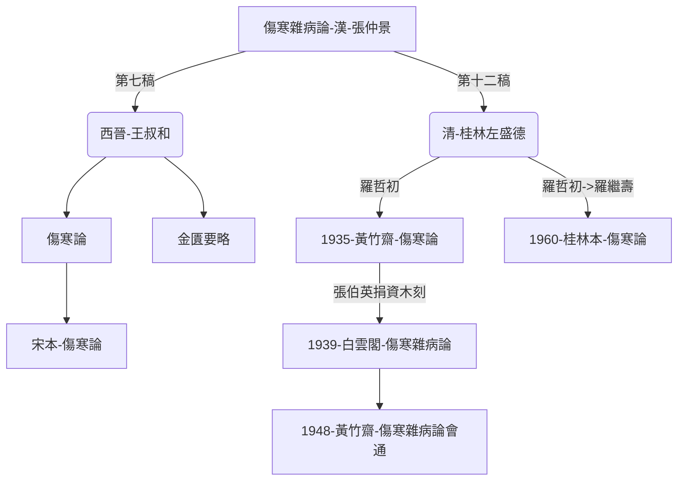

# 傷寒雜病論

**傷寒雜病論 版本介紹**

---

```mermaid
graph TB
A[傷寒雜病論-漢-張仲景] -->|第七稿| B(西晉-王叔和)
    B--> C[傷寒論]
    B --> D[金匱要略]
    C --> E[宋本-傷寒論]
    A -->|第十二稿| F(清-桂林左盛德)
    F -->|羅哲初| G[1935-黃竹齋-傷寒論]
    F -->|羅哲初->羅繼壽| H[1960-桂林本-傷寒論]
    G -->|張伯英捐資木刻| I[1939-白雲閣-傷寒雜病論]
    I --> J[1948-黃竹齋-傷寒雜病論會通]
    
```

1939白雲閣底本，1960桂林本、1948會通參校本

