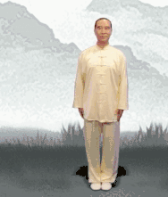
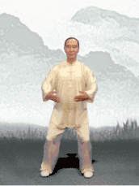
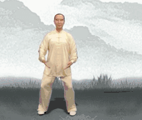
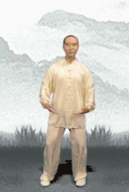
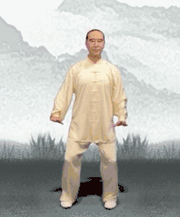
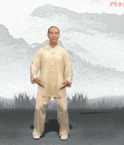
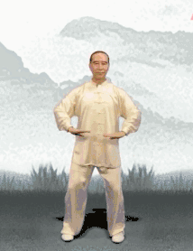
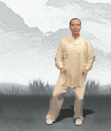
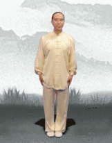

# 八段錦

[toc]

## 八段錦内功圖説

### 八段錦坐功圖訣

### 八段錦坐功八法

### 第一圖

第圖

第圖

第圖

第圖

第圖

第圖

### 第八圖

### 八段錦口訣

### 解要

## 國家體育總局·健身气功·八段锦

　　**起势：**练功先练腿，左脚开立，与肩同宽，微微下蹲，两掌呈半圆抱于腹前；

　　**接着调息：**吸呼几次，使身心平顺。国体版每个招式复原基本是这个站桩姿势。

### 　　**第一式：两手托天理三焦**

（实际速度2-3倍慢）

　　**【做法】**

　　两掌五指分开，腹前交叉，双腿伸直，两掌上托于胸前，内旋向上托起，掌心向上，抬头目视，然后手掌停一停，目视前方。膝关节微屈，两臂下落，两掌心向上捧于腹前。这样==一上一下为一次，共做六次==。

　　**【做功要点】**

　　一定要掌根用力上撑，配合着百会上领，身体气机就能往上升。同时手臂上托基本是平行于耳朵位置，使后背形成一个夹脊的动作，就是做到位了。

　　“两手托天”是往上提拉胸腹、拔伸腰背，这样系挂于脊柱和三焦上的五脏六腑都被提拉起来了，**三焦通畅，祛除雨水天气的寒湿浊气。**

　　同时夹脊的动作也挤压到了颈后肩井穴和后背的膏肓穴，整条督脉都感觉热乎乎的，因为阳气被瞬间提起来了。

### 　　**第二式：左右开弓似射雕**

（实际速度2-3倍慢）

　　**【做法】**

　　1、左脚向左开步，两掌向上交叉于胸前。两腿马步，就像左右开弓射箭一样，右掌拉至右胸前，左掌呈八字掌（大拇指和食指呈八字，其余三指曲后）向左推出，把弓拉到最圆，眼光盯着指尖。

　　2、然后重心右移，右手划弧，左脚回收，两掌捧于腹前并步站立。然后反方向来一次，共做3次。

　　**【做功要点】**

　　左右开弓不光能宣开整个僵硬的肩背。拉到最圆的时候食指指尖会微微发麻，这里是手阳明大肠经的起穴商阳穴，也抻拉了循行于肩颈和整条手臂的大肠经，**这个功法对于便秘腹胀的人很有用。**

### 　　**第三式：调理脾胃须单举**

（实际速度2-3倍慢）

　　**【做法】**

　　左手掌根上撑，上举至头左上方，右掌根下按。然后左臂下落于腹前，一左一右做三次。

　　**【做功重点】**

　　撑天按地的时候力在掌根，指尖方向要相对，才能充分抻拉到大肠经。

　　两臂一松一紧的上下对拉，牵拉和按摩了脾胃，对消化吸收好。同时也抻拉了两胁肝胆，宣发肝气，**常郁闷生气的人可以常做这个功法了。**

### 　　**第四式：五劳七伤往后瞧**

（实际速度2-3倍慢）

　　**【做法】**

　　两腿微屈挺膝，手臂于两侧伸直，掌心外旋向上，头尽量向后转，目视左斜后方，稍停。两臂内旋收回两侧，两腿微屈，目视前方。一左一右做三次。

### 　　**第五式：摇头摆尾去心火**

（实际速度3倍慢）

　　**【做法】**

　　1、右脚开步站立，两腿微屈，两掌经两侧上举，两腿半蹲为马步，两臂向双腿降落扶于膝关节上方。

　　2、身体重心右移，俯身经过右脚面，重心放低，由尾闾带动上体向左旋转，经过左脚面。然后身体重心后移，上体后摇由右向左向前旋转，身体立起。一右一左做三次。

　　**【做功重点】**

　　尽量不要打折扣做，身体摇转时使脖颈和尾闾尽量对拉伸长，速度柔和缓慢连贯。脖子全程不要硬着，下颌不刻意内收或扬起，使颈部肌肉尽量地放松伸长。如果费力就一右一左做两次，以后再慢慢增加次数。

　　经常上火、口腔溃疡、喉咙肿痛、爆痘的人多是虚火，头面飘虚火，中下焦常年寒湿，**常做这个动作，可以把上飘的虚火拽回丹田，温暖肾水。**

### 　　**第六式：两手攀足固肾腰**

（实际速度3倍慢）

　　**【做法】**

　　1、两腿挺膝站立，两臂向前向上举起，掌心向前，目视前方。两臂屈肘，两掌心向下，按至胸前，两掌反穿至背后，沿着脊背向下摩运至臀部，同时上体前屈，两掌沿腿至脚面，两膝挺直，目视前下方。

　　2、两掌前举上升，脊柱随之升起。一上一下为一次，共做6次。

　　**【做功重点】**

　　双手按摩腰背下肢后方时要稍微用力，因为你温煦按摩到的就是全身第一大阳经膀胱经，**想要一身阳气就必须调动起这条经络。**

　　向上挺身时需以臂带身一节节起来，这样才会充分抻拉到前后任督两脉，使阴阳都得到滋养。

### 　　**第七式：攒拳怒目增气力**

（实际速度2-3倍慢）

　　**【做法】**

　　左脚向左开步，脚蹬马步，两掌握拳于腰侧，大拇指在内，拳眼向上。左拳向前冲出，拳眼向上，怒目而视，左拳变掌，再旋腕握固成拳，收回腰处。一左一右做三次。

　　**【做功重点】**

　　这个功法细节挺多，比如脚趾抓地，握固冲拳，怒目圆睁的方法，**能使肝气畅达，末梢气血周流，全身上下都有劲儿。**

### 　　**第八式：背后七颠百病消**

（实际速度2倍慢）

　　**【做法】**

　　1、两脚跟提起，头上顶，稍停，目视前方。两脚跟下落，轻震地面。一起一落为一次，共做七次。

　　2、八段锦收式归拢在这了：最后两掌合于腹前，呼吸均匀，周身放松。

　　**【做功重点】**

　　脚跟起落，练人体平衡，起的时候要如平地拔起，脚趾抓地，提肛收腹，让六腑气机处于紧张状态。下落的时候就像山河地震，震动脊柱和督脉。

　　“背后七颠”是八段锦的收功，相当于引气归元，做完整套功法之后，重新梳理身体气机，不致于出现散乱。

　　**提醒：**初学的人动作还不熟练时，只要配合自然顺畅呼吸就好。不要刻意呼吸、大呼大吸，尽量不憋气、用腹式呼吸。随着动作打开和熟练，在动作里“找”呼吸，身体更能受用。

