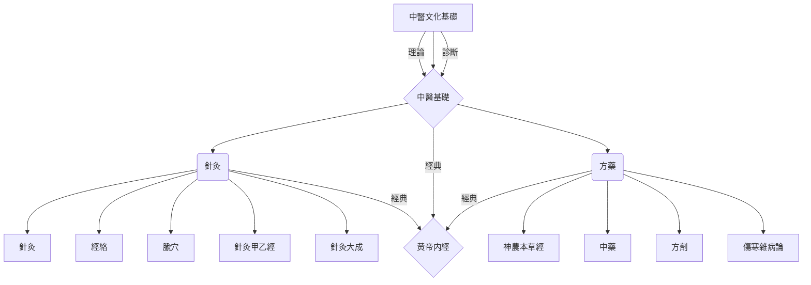

# 中醫名醫及著作

【】

[TOC]

## 名醫

### 秦漢及之前

- **黃帝内經** 素問 靈樞
- **難經**
- **神農本草經**

- 東漢·張仲景《**傷寒雜病論**》

### 兩晉

- 西晉·皇甫謐《**針灸甲乙經**》
- 西晉·王叔和《**脈經**》
- 

### 唐宋金元

- 唐·孫思邈 備急千金要方、千金翼方
- 成無己·傷寒論注本
-  
- 宋·太平惠民和劑局方
- 

### 明清

- 明·楊繼洲 **針灸大成**
- 柯韻伯《伤寒来苏集》
- 

### 近現代（1840-2000）

- 彭子益《圓運動的古中醫學》
  
- 蒲輔周 
  
- 劉渡舟
  《傷寒論十四講》1983年
  《傷寒論臨證指要》九十年代初
  
  > 先生属于“尊经派”，要求我详细阅读成无己的伤寒论注本，同时主要参考清朝伤寒大家柯韵伯的《伤寒来苏集》、尤在泾的《伤寒贯珠集》。其时先生的著作《伤寒论通俗讲话》已经出版发行——这部书同样是我学习的重点，书翻得纸边已经部分被“吃掉”。作为正式学习《伤寒杂病论》的学术准备与专业铺垫，我经历了大约一年时间。
  
- 胡希恕
  《傷寒的六經論治與八綱的關係》六十年代发表
  《脉学概论》
  
  > 胡老说：祖宗发明的围棋不仅是娱乐，也是医生看病不同阶段的一种演示，我自己跟自己下，考虑的是用药如用兵，怎么开局、怎么落子、布阵，这里头显尽机巧，是为轻灵一路；另一面，走坚实一路，步步为营，渐展威风。棋局经常会纷繁缭乱，但心绝不能乱。看病如下围棋，要有识有胆，胆识具备。
  
  ```
  伤寒论第31条经文：太阳病，项背强几几，无汗恶风，葛根汤主之。译成白话就是：感冒出现的表证，如果出现脖颈后背发僵不舒展，加上没有汗怕风的症状，用葛根汤治疗。
  就这17个字，胡老讲：葛根汤的组成即桂枝汤加麻黄、葛根，为何以葛根名汤？是张仲景为了突出“项背强几几”这一主要症状，再从葛根汤的用量上，葛根四两，麻黄三两，桂枝二两，依次主治项背强、无汗、恶风，与经文先后顺序一致。这是一层意思；
  第二层意思：冠以“太阳病”是提醒医家此病还处在感冒的表证阶段，类型可以是“伤寒”，也可以是“中风”。但太阳病见“恶风”，又颇像桂枝证，然桂枝证是“汗出”，此是“无汗”，何意？本条经文以“恶风”代替太阳病的恶寒，反映出表证有化热苗头（风为阳邪），但尚未形成热像；
  第三层意思：无汗与恶风相连，含义深邃，这是表证渐趋化热的动态描述。同时，首揭“太阳病”，煞尾用“葛根汤主之”，恰是太阳病将入阳明病（或者阳明里证外合太阳表证）的一个过渡阶段。
  总之，张仲景这17个字告诉医者：此三个症状，“项背强几几”是为突出主证而设，故列为一；“无汗”反映出病起于“伤寒”或者说属麻黄证，但病势在变化，已渐渐失去表“寒”之典型征象，而出现化热之“恶风”，想必张仲景在此动了一番脑筋，故起首曰“太阳病”，而不曰“伤寒”。这是经文的含义。
  运用到临床上，大凡项背僵直不柔和的病人，如颈椎病、颈性头痛、眩晕、背痛等等，都可以考虑用葛根汤为主加减治疗...... 
  一部《伤寒论》398条，基本上条条如此，老人家就是这样讲。
  ```
  
  
  
- 許振寰

- 李可

- 承淡安 針灸 

- 梁秀清  · 把脈如神

- 

- 南朱北喬

  - 朱良春

-  

- 錢伯煊老

  - 劉明達

- 


# 次序圖



## 中醫四大名著

- 《神農本草經》
- 《黃帝内經》
  《黃帝内經·素問
  《黃帝内經·靈樞
- 《難經》
- 東漢·張仲景《傷寒雜病論》
   《傷寒論》
   《金匱要略》


## 必讀

神農本草經 1.7W

==黃帝内經·素問== 10.5W

黃帝内經·靈樞 8W

難經 14.9W

傷寒雜病論
	傷寒論  注解
	金匱要略  方論


《濱湖脈學》明·李時珍 1.2W

《脈经》西晋太医令·王叔和 撰 19W

《鍼灸甲乙經》西晉·皇甫謐 14W

《針灸大成》·楊繼洲 24W

黃帝明堂經


## 擴展閲讀

周易

尚書

老子、莊子、道德經、周易參同契


《肘後備急方》·葛洪 三卷   100卷玉涵方——》3卷肘後備急方


千金要方

神農本草經讀

雷公炮製藥性解


溫病條辯

溫熱經緯

時病論


## B教材

###  上海科學技術出版社 8485年 第五版

- [x] **中醫基礎理論** 主编 印会河
- [x] **中醫診斷學** 主编 邓铁涛
- [x] 中藥學 主编 凌一揆
- [x] 方劑學 主编 许济群
- [x] 经络学 主编 李鼎
- [x] 腧穴学 主编 杨甲三
- [x] **針灸學** 主编 邱茂良
- [x] 针灸治疗学 主编 杨长森
- [ ] 推拿学 主编 俞大方
- [ ] 针灸推拿学 主编 石学敏
- [x] 各家针灸学说 主编 魏稼
- [ ] 

### 十三五

**中醫基礎理論** 
**中醫診斷學**
中藥學 
方劑學 

- [x] 经络腧穴学
**針灸學** 
**刺法灸法學**


