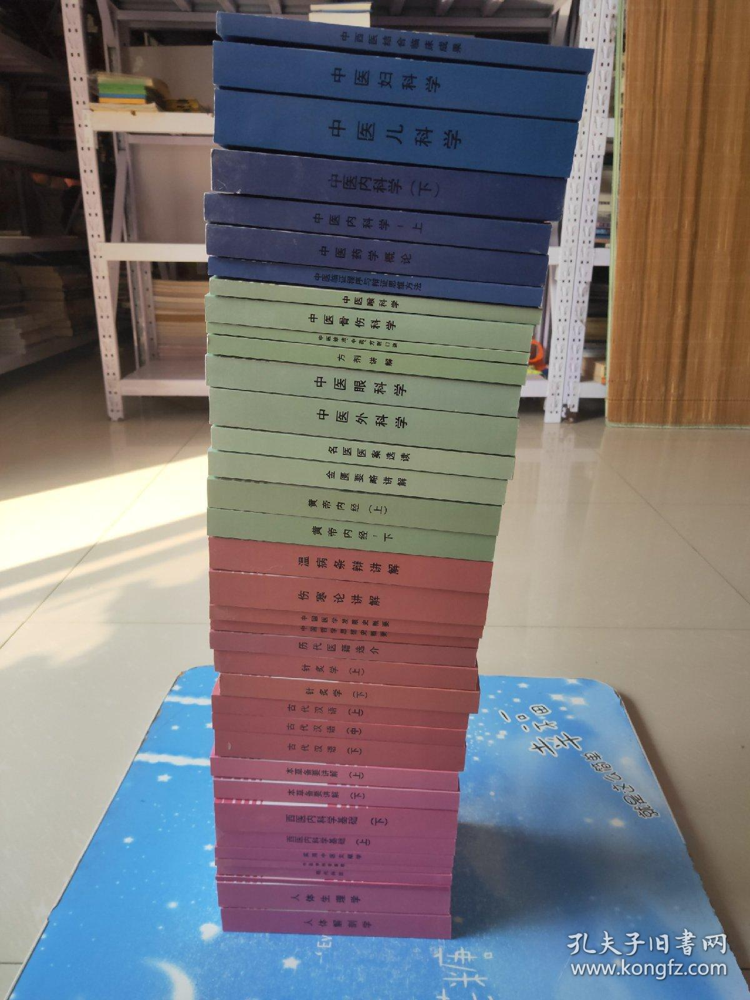

# 全國高等中醫藥院校規劃教材

[TOC]

## 院校

- 南京中醫 [南京中医药大学](http://www.njucm.edu.cn/)创建于1954年
- 北京中醫 [北京中医药大学](https://www.bucm.edu.cn/)始建于1956年，前身为北京中医学院
- 廣州中醫 [广州中医药大学](https://www.gzucm.edu.cn/)办学基础为创立于1924年的广东中医药专门学校。1956年经国务院批准成立广州中医学院，是新中国首批四所高等中医药本科院校之一。
- 上海中醫 [上海中医药大学](https://www.shutcm.edu.cn/)成立于1956年
- 成都中醫 [成都中医药大学](https://www.cdutcm.edu.cn)建校于1956年，是新中国最早建立的四所中医药高等院校之一。原名成都中医学院
- 河南中醫 [河南中医药大学](https://www.hactcm.edu.cn)创建于1958年
- 山東中醫 [山东中医药大学](https://www.sdutcm.edu.cn)创建于1958年
- 天津中医药大学 [天津中医药大学](https://www.tjutcm.edu.cn)始建于1958年，原名天津中医学院。2005年更名为天津中医药大学。
- 湖北中医药大学创建于1958年
- 长春中医药大学始建于1958年
- 福建中医药大学创建于1958年
- 

## 『第五版』 

84、85年

綠色皮

| 本科 | 學科名稱         | 發音 | 主編 | 適用 | 紙   | 電   |
| ---- | ---------------- | ---- | ---- | ---- | ---- | ---- |
| 1    | ~~醫古文~~ |      |      |      |      |      |
| 2    | 中國醫學史      |      |      |      |      |      |
| 3    | **中醫基礎理論** |      |      | 中醫針推 | ✔️ | ✔️ |
| 4    | **中醫診斷學**   |      |      | 中醫針推 | ✔️ | ✔️ |
| 5    | **中藥學**       |      |      | 中醫針推 | ✔️ | ✔️ |
| 6    | **方劑學**       | 方剂学 |      | 中醫針推 | ✔️ |      |
| 7    | 内經講義           |      |      |      |  | ✔️ |
| 8    | 傷寒論講義         |      |      |      |  | ✔️ |
| 9    | 金匱要略           |      |      |      |      | ✔️ |
| 10   | 溫病學           |      |      |  |      |      |
| 11   | 中醫各家學説     |      |      |      |  |  |
| 12   | 中醫内            |      |      |      |      |      |
| 13   | 中醫外            |      |      |      |      | ✔️ |
| 14   | 中醫兒            |      |      |      |      |      |
| 15   | 中醫婦           |      |      |      |      |      |
| 16   | 中醫眼            |      |      |      |      |      |
| 17   | 中醫耳鼻喉          |      |      |      |      |      |
| 18   | **中醫傷科學**  |      |      |      |      | ✔️ |
| 19   | **針灸學**       | 针灸学 |      |  | ✔️ |      |
| 20   | **經絡學**       |  |      | 中醫針推 | ✔️ | ✔️ |
| 21   | **腧穴學**       | shù腧穴学 |    | 中醫針推 | ✔️ |      |
| 22   | ~~**刺灸學**~~   | 刺法灸法 |      | 中醫針推 |  |      |
| 23   | **針灸治療學**   |      |      | 中醫針推 | ✔️ | ✔️ |
| 24   | 針灸毉籍選       |      |      |      |  | ✔️ |
| 25   | 各家針灸學說     |      |      |      | ✔ | ✔️ |
| 26   | **推拿學**       |      |      | 中醫針推 |      |      |
| 27   | 藥用植物學       |      |      |      |      |      |
| 28   | **中藥鑒定學**   |      |      |      |      |      |
| 29   | **中藥炮製學**   |      |      |      |      |      |
| 30   | ~~中藥藥劑~~   |      |      |      |      | ✔️ |
| 31   | ~~中藥藥理~~   |      |      |      |      |      |
| 32   | ~~中藥化學~~     |      |      |      |      |      |


## 『光明中醫』

光明中醫函授大學 主編  光明日報出版社 

【全37本 30种】


函大开始的时候将课程按重要程度分为考试课、考察课和自修课。考试课要求最高，考察课其次，自修课自学不考。

其中考试课包括10门：《古代汉语》、《口诀》、《伤寒论讲解》、《黄帝内经讲解》、《金匮要略讲解》、《温病条辨讲解》、《中医内科学》、《针灸学》、《中医妇科学》、《中医儿科学》

考查课包括8门：《本草备要讲解》、《中医药学概论》、《中医外科学》、《中医喉科学》、《中医眼科学》、《中医骨伤科学》、《中国医学发展史概要》、《中国哲学思想史概要》

自修课11门：《中医学科学原理》、《临证程序》、《名医医案选》、《现代科技》、《历代医籍选介》、《人体解剖学》、《实用中医文献学》、《人体生理学》、《中西医结合临床成果》、《西医内科学》、《中医科研课题设计的探讨》。

后来根据实践，调整了课程安排，并加入了《方剂讲解》课程。重点课程变成14门：《古代汉语》、《口诀》、《中医药学概论》、《本草备要讲解》、《方剂讲解》、《黄帝内经讲解》、《伤寒论讲解》、《金匮要略讲解》、《温病条辨讲解》、《中医内科学》、《中医外科学》、《中医妇科学》、《中医儿科学》、《针灸学》。

其中《古代汉语》主要是打下古文基础，为以后阅读更多的古代医籍做准备。《口诀》是整个中医诊治内容的浓缩版，能背诵口诀是合格中医的基本功。

[                                             图1](https://www.kfzimg.com/sw/kfz-cos/kfzimg/abcbaeaf/ab6113f1bca84115_b.jpg)


```
針灸學

中醫基礎
針灸學
針灸治療學
刺法灸法學
经络腧穴学

针灸秘验与绝招

灵枢经（准备新华字典）
甲乙经
针灸大成
```


## 『十二五』規劃教

二零一〇年六月 色皮

| 本科 | 學科名稱               | 主編   | 適用     | 紙   | 電   |
| ---- | ---------------------- | ------ | -------- | ---- | ---- |
| 1    | 中國醫學史             |        |          |      |      |
| 2    | 醫古文                 |        |          |      |      |
| 3    | **中醫基礎理論**       |        | 中醫     |      |      |
| 4    | **中醫診斷學**         |        | 中醫     |      |      |
| 5    | **中藥學**             |        |          |      |      |
| 6    | **方劑學**             |        |          |      |      |
| 7    | 内經選讀               |        |          |      |      |
| 8    | 傷寒論選讀             |        |          |      |      |
| 9    | 金匱要略               |        |          |      |      |
| 10   | 溫病學                 |        | 中醫     |      |      |
| 11   | 中醫各家學説           |        |          |      |      |
| 12   | **針灸學**             |        | 中醫針推 |      |      |
| 13   | **推拿學**             |        | 中醫針推 |      |      |
| 14   | 中醫養生學             |        |          |      |      |
| 15   | 中醫藥膳學             |        |          |      |      |
| 16   | 中醫食療學             |        |          |      |      |
| 17   | **中醫氣功學**         |        |          |      |      |
| 18   | **經絡腧穴學**         | 沈雪勇 | 針推     |      |      |
| 19   | **刺法灸法學**         |        | 針推     |      |      |
| 20   | **針灸治療學**         |        |          |      |      |
| 21   | 各家針灸學說           |        |          |      |      |
| 22   | 針灸毉籍選讀           |        |          |      |      |
| 23   | 實驗針灸學             |        |          |      |      |
| 24   | **推拿手法學**         |        | 針推     |      |      |
| 25   | **推拿功法學**         |        | 針推     |      |      |
| 26   | **推拿治療學**         |        | 針推     |      |      |
| 27   | **小兒推拿學**         |        |          |      |      |
| 28   | 臨床中藥學             |        |          |      |      |
| 29   | 中藥藥劑學             |        |          |      |      |
| 30   | 中藥鑒定學             |        |          |      |      |
| 31   | 中藥藥理學             |        |          |      |      |
| 32   | 藥用植物學             |        |          |      |      |
| 33   | 中藥炮製學             |        |          |      |      |
| 34   | 本草典籍選             |        |          |      |      |
| 35   | 中醫護理學基礎         |        |          |      |      |
| 36   | 中醫臨床護理學         |        |          |      |      |
| 37   | 中醫學概論             |        |          |      |      |
| 38   | 中醫學導論             |        |          |      |      |
| 39   | 中藥分析               |        |          |      |      |
| 40   | 中藥化學               |        |          |      |      |
| 41   | 中藥製藥工程原理與設備 |        |          |      |      |


## 『十三五』規劃教材 新世紀第四版

(全国中医药行业高等教育十三五规划教材，全国高等中医药院校规划教材) 新世紀第四版

二零一六年六月 棕色皮

| 本科 | 學科名稱         | 主編   | 適用     | 紙   | 電   |
| ---- | ---------------- | ------ | -------- | ---- | ---- |
| 1    | 中國醫學史       |        |          |      |      |
| 2    | 醫古文           |        |          | ✔️    |      |
| 3    | **中醫基礎理論** |        | 中醫     |      | ✔️    |
| 4    | **中醫診斷學**   |        | 中醫     |      | ✔️    |
| 5    | **中藥學**       |        |          |      | ✔️    |
| 6    | **方劑學**       |        |          |      | ✔️    |
| 7    | 内經選讀         |        |          |      |      |
| 8    | 傷寒論選讀       |        |          |      |      |
| 9    | 金匱要略         |        |          |      |      |
| 10   | 溫病學           |        | 中醫     |      |      |
|      |                  |        |          |      |      |
| 11   | *中醫内科學*     |        |          |      |      |
| *12* | *中醫外科學*     |        |          |      |      |
| *13* | *中醫婦科學*     |        |          |      |      |
| *14* | *中醫兒科學*     |        |          |      |      |
| *15* | **中醫骨傷科學** |        |          |      | *✔️*  |
| *16* | *中醫眼科學*     |        |          |      |      |
| *17* | *中醫耳鼻喉科學* |        |          |      |      |
| 18   | **中醫急診學**   |        |          |      |      |
| 19   | 中醫各家學説     |        |          |      |      |
|      |                  |        |          |      |      |
| 20   | **針灸學**       |        | 中醫針推 |      | ✔️    |
| 21   | **推拿學**       |        | 中醫針推 |      |      |
| 22   | 中醫養生學       |        |          |      |      |
| 23   | 中醫藥膳學       |        |          |      |      |
| 24   | 中醫食療學       |        |          |      |      |
| 25   | **中醫氣功學**   |        |          |      | ✔️    |
| 26   | **經絡腧穴學**   | 沈雪勇 | 針推     |      | ✔️    |
| 27   | **刺法灸法學**   |        | 針推     |      | ✔️    |
| 28   | **針灸治療學**   |        |          |      | ✔️    |
| 29   | 各家針灸學說     |        |          |      |      |
| 30   | 針灸毉籍選讀     |        |          |      | ✔️    |
| 31   | 實驗針灸學       |        |          |      |      |
| 32   | **推拿手法學**   |        | 針推     |      |      |
| 33   | **推拿功法學**   |        | 針推     |      |      |
| 34   | **推拿治療學**   |        | 針推     |      |      |
| 35   | **小兒推拿學**   |        |          |      |      |
|      |                  |        |          |      |      |
| 36   | 臨床中藥學       |        |          |      |      |
| 37   | 中藥藥劑學       |        |          |      |      |
| 38   | **中藥鑒定學**   |        |          |      | ✔️    |
| 39   | 中藥藥理學       |        |          |      |      |
| 40   | 藥用植物學       |        |          |      |      |
| 41   | **中藥炮製學**   |        |          |      | ✔️    |
| 42   | 本草典籍選       |        |          |      |      |
|      |                  |        |          |      |      |
| 43   | 中醫護理學基礎   |        |          |      |      |
| 44   | 中醫臨床護理學   |        |          |      |      |
|      |                  |        |          |      |      |
| 45   | 中醫學概論       |        |          |      |      |
| 46   | 中醫學導論       |        |          |      |      |
| 47   | 中醫學基礎       |        |          |      |      |
|      |                  |        |          |      |      |


| 碩士 | 學科名稱 | 主編 | 適用 | 紙 | 電   |
| ------------------- | ---- | ---- | ------------------- | ---- | ------------------- |
|  1  | **中醫基礎理論專論**   |      | 中醫學 |      ||
| 2    | **五運六氣概論**     |      | 中醫學 |      |      |
| 3 | 《针灸甲乙经》理论与实践 | | 中醫學 | | ✔️ |


## 『十四五』規劃教材

二零二一年六月 藍皮

| 本科 | 學科名稱         | 主編   | 適用     | 紙   | 電   |
| ---- | ---------------- | ------ | -------- | ---- | ---- |
| 1    | 中國醫學史       |        |          |      |      |
| 2    | 醫古文           |        |          |      |      |
| 3    | **中醫基礎理論** |        | 中醫     |      |      |
| 4    | **中醫診斷學**   |        | 中醫     |      |      |
| 5    | **中藥學**       |        |          |      |      |
| 6    | **方劑學**       |        |          |      |      |
| 7    | 内經選讀         |        |          |      |      |
| 8    | 傷寒論選讀       |        |          |      |      |
| 9    | 金匱要略         |        |          |      |      |
| 10   | 溫病學           |        | 中醫     |      |      |
| 11   | 中醫各家學説     |        |          |      |      |
| 12   | **針灸學**       |        | 中醫針推 |      |      |
| 13   | **推拿學**       |        | 中醫針推 |      |      |
| 14   | 中醫養生學       |        |          |      |      |
| 15   | 中醫藥膳學       |        |          |      |      |
| 16   | 中醫食療學       |        |          |      |      |
| 17   | **中醫氣功學**   |        |          |      |      |
| 18   | **經絡腧穴學**   | 沈雪勇 | 針推     |      |      |
| 19   | **刺法灸法學**   |        | 針推     |      |      |
| 20   | **針灸治療學**   |        |          |      |      |
| 21   | 各家針灸學說     |        |          |      |      |
| 22   | 針灸毉籍選讀     |        |          |      |      |
| 23   | 實驗針灸學       |        |          |      |      |
| 24   | **推拿手法學**   |        | 針推     |      |      |
| 25   | **推拿功法學**   |        | 針推     |      |      |
| 26   | **推拿治療學**   |        | 針推     |      |      |
| 27   | **小兒推拿學**   |        |          |      |      |
| 28   | 臨床中藥學       |        |          |      |      |
| 29   | 中藥藥劑學       |        |          |      |      |
| 30   | 中藥鑒定學       |        |          |      |      |
| 31   | 中藥藥理學       |        |          |      |      |
| 32   | 藥用植物學       |        |          |      |      |
| 33   | 中藥炮製學       |        |          |      |      |
| 34   | 本草典籍選       |        |          |      |      |
| 35   | 中醫護理學基礎   |        |          |      |      |
| 36   | 中醫臨床護理學   |        |          |      |      |
| 37   | 中醫學概論       |        |          |      |      |
| 38   | 中醫學導論       |        |          |      |      |
|      |                  |        |          |      |      |
|      |                  |        |          |      |      |
|      |                  |        |          |      |      |


